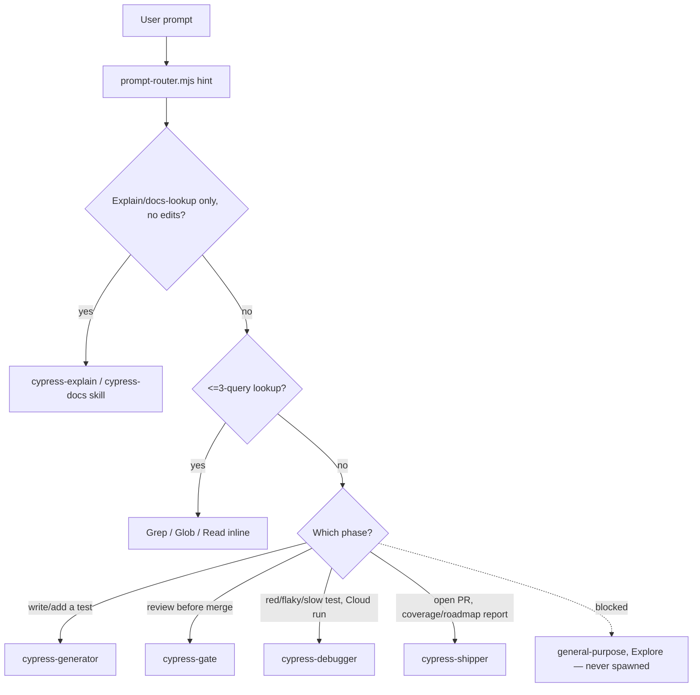

# Routing Map — 4 Agents + 2 Cypress Skills

## Scope gate — check before the table, not after

This table only applies once a prompt is confirmed to actually be a Cypress QA/test-authoring
task for `fhf-dashboards`. `prompt-router.mjs`'s hint is a regex match on raw prompt text —
advisory only, never proof of intent (it fires on any prompt that *mentions* routing vocabulary,
including one quoting or discussing this harness itself, e.g. "Jira tickets" inside a sentence
about what the harness does). If the actual request is something else — a different repo,
product-code compliance/legal work, harness architecture or meta-discussion — a fired hint is not
a mandate to spawn an agent. Confirm intent first; if it's out of scope, answer directly, use
`Plan`, or ask the user which repo/system this belongs to, instead of forcing it into one of the
4 agents below.

**Order: control-plane workflow when the request spans sprint/spec/coverage state → matching
Cypress skill (read-only Q&A only) → ≤3-query Grep/Glob/Read lookup → one of the 4 agents below.
No match → ask the user.** There is no command tier anymore — all 14
former slash-commands were folded into the 4 agents (see
`docs/adr/0003-agent-roster-consolidation.md`). The `prompt-router.mjs` hook injects a routing
hint per prompt from this same table; this file is the full map.

## Centralized QA control-plane route

Requests for current-sprint intake, Jira/Confluence/Teamwork Graph context, application-spec
freshness proposals, cross-lane implementation state, or the QA command-center dashboard use
`C:\Users\Leapfrog\fhf-harness-os\docs\framework\qa-control-plane.md` and
`C:\Users\Leapfrog\fhf-harness-os\scripts\harness\qa-command-center.mjs` inline. This is a portable
harness workflow, not a fifth agent.

Read-only Atlassian discovery is autonomous. Jira, Confluence, and application-spec writes are
approval-gated by `.claude/rules/jira-integration.md`. Once an approved item resolves to a single
implementation lane, route the implementation phase to `cypress-generator` for either Cypress
lane or to `fhf-backend-automation`'s own harness for API/DB work.

## Cypress skills (untouched — Cypress's own, not ours; see `CLAUDE.md`)

| Task | Skill |
|---|---|
| Explain / review test logic, no edits | `cypress-explain` |
| Cypress API, command, config, or behavior question | `cypress-docs` |

`cypress-author` self-stops for either FHF Cypress repo (see its `subskills/task.md`) and tells
the user to use `cypress-generator` instead — it does NOT silently write FHF specs. Still, route
any test-writing request to `cypress-generator` directly rather than waiting for `cypress-author`
to fire and redirect; it's a backstop, not the intended path. (2026-07-10: `cypress-author` used
to carry an injected `fhf-rules.md` that gave it enough FHF-specific knowledge to be a silent,
partial substitute for `cypress-generator` — skipping the reuse check, evidence-gathering, and
gate handoff. Neutralized; see `docs/adr/0004-neutralize-cypress-author-for-fhf.md`.)

## The 4 agents

| Task | Agent | Notes |
|---|---|---|
| Jira ticket / module name → a merged-ready spec (scenarios, evidence, config, commands, test) — either lane | `cypress-generator` | Handles GATHER → AUTHOR → BUILD internally; no separate ticket-routing or exploration step needed first |
| Pre-merge review, or "is this safe to merge" | `cypress-gate` | Runs all 8 phases, drives its own fix loop with `cypress-generator` (max 3 cycles) before returning a verdict |
| Red test, pasted error, flaky/slow suite, or a Cypress Cloud run URL | `cypress-debugger` | Root-causes, fixes, and writes the regression test in the same pass — needs the exact error + spec path, or the run URL |
| Open a PR, or a UI-coverage/automation-backlog/risk report, or document an API config | `cypress-shipper` | PR creation is the default mode; the other three are on-demand only — say which one you want |
| Planning / design question unrelated to Cypress specs | `Plan` | Task description only |

## Workflow tool — visible but not blockable (partially closed 2026-07-24, was fully open)

`block-generic-agents.mjs`'s `PreToolUse` matcher is `Task`-only (`.claude/settings.json`). The
`Workflow` tool spawns its internal `agent()` calls through its own mechanism, not `Task` — so
that specific wiring never fires for them. As of 2026-07-24 this hook is also wired to
`SubagentStart`, confirmed (via Claude Code docs) to fire for `Workflow`-spawned agents too, with
the real payload field `agent_type` (not `subagent_type`) — so a forbidden agent type spawned via
`Workflow` now surfaces a visible `WARNING` instead of nothing.

**This is visibility, not enforcement — confirmed via docs, not assumed:** `SubagentStart` does
not support blocking; exit 2 only shows stderr to the user, the subagent starts regardless. A
`Workflow` script that defaults to a forbidden `agentType` will now be *seen* doing so, but
nothing mechanically stops it. When authoring a workflow script for FHF work, **still always pass
`opts.agentType`** on every `agent()` call, set to one of the 4 agents above (or `Plan` for a
non-Cypress design question) — the warning is a safety net for when that discipline slips, not a
substitute for it. Same self-applied-not-fully-mechanical pattern as the Cursor/Copilot rows in
`harness-engineering.md` §9; see that doc for the full per-surface caveat.

## Forbidden (hook-blocked, zero tolerance)

`general-purpose`, `Explore` → use Grep/Glob/Read directly. The 13 retired agents
(`cypress-bug-hunter`, `cypress-cloud-investigator`, `cypress-e2e-automation`,
`cypress-explorer`, `cypress-performance-auditor`, `cypress-runner`,
`cypress-test-automation`, `cypress-ui-coverage-analyst`, `pr-creator`, `pre-merge-qa-gate`,
`qa-ticket-router`, `spec-generation-loop`, `test-design-reviewer`) → route to the 4-agent table
above instead; they no longer exist, do not try to spawn them. Same for any slash-command that
used to live in `.claude/commands/` — all 14 were folded into the 4 agents; see the ADR below
for exactly which agent absorbed which.

## Roster history

2026-07-10: collapsed 13 agents + 14 commands into 4 agents + 0 commands — too many names for a
solo-owner harness to route between, several were really one phase split across multiple files.
Full mapping and rationale: `docs/adr/0003-agent-roster-consolidation.md`. Earlier same-day cut
(5 redundant artifacts merged into survivors, before the roster size itself was identified as
the problem): `docs/adr/0002-roster-deduplication.md`.
