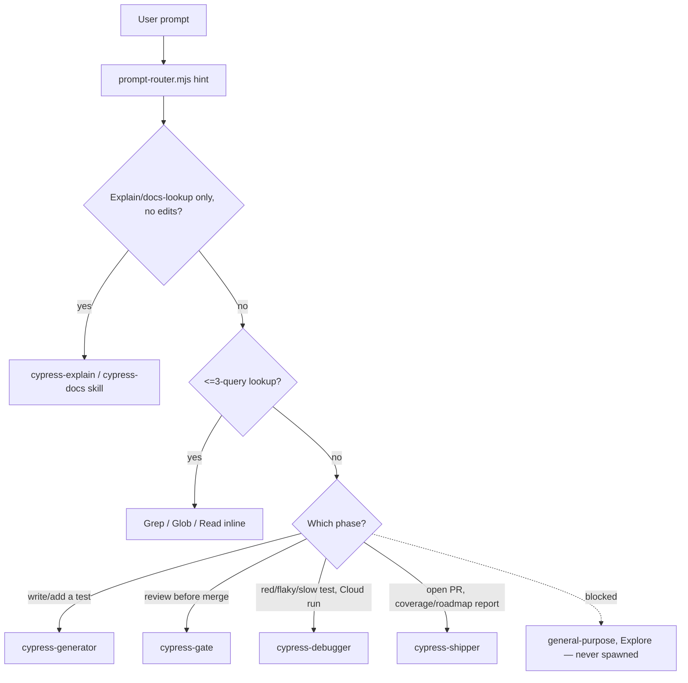

# Routing Map — 4 Agents + 2 Cypress Skills

**Order: matching Cypress skill first (read-only Q&A only) → ≤3-query Grep/Glob/Read lookup →
one of the 4 agents below. No match → ask the user.** There is no command tier anymore — all 14
former slash-commands were folded into the 4 agents (see
`docs/adr/0003-agent-roster-consolidation.md`). The `prompt-router.mjs` hook injects a routing
hint per prompt from this same table; this file is the full map.

## Cypress skills (untouched — Cypress's own, not ours; see `CLAUDE.md`)

| Task | Skill |
|---|---|
| Explain / review test logic, no edits | `cypress-explain` |
| Cypress API, command, config, or behavior question | `cypress-docs` |

`cypress-author` self-stops for either FHF Cypress repo (see its `subskills/task.md`) and tells
the user to use `cypress-generator` instead — it does NOT silently write FHF specs. Still, route
any test-writing request to `cypress-generator` directly rather than waiting for `cypress-author`
to fire and redirect; it's a backstop, not the intended path. (2026-07-10: `cypress-author` used
to carry an injected `fhf-rules.md` that gave it enough FHF-specific knowledge to be a silent,
partial substitute for `cypress-generator` — skipping the reuse check, evidence-gathering, and
gate handoff. Neutralized; see `docs/adr/0004-neutralize-cypress-author-for-fhf.md`.)

## The 4 agents

| Task | Agent | Notes |
|---|---|---|
| Jira ticket / module name → a merged-ready spec (scenarios, evidence, config, commands, test) — either lane | `cypress-generator` | Handles GATHER → AUTHOR → BUILD internally; no separate ticket-routing or exploration step needed first |
| Pre-merge review, or "is this safe to merge" | `cypress-gate` | Runs all 8 phases, drives its own fix loop with `cypress-generator` (max 3 cycles) before returning a verdict |
| Red test, pasted error, flaky/slow suite, or a Cypress Cloud run URL | `cypress-debugger` | Root-causes, fixes, and writes the regression test in the same pass — needs the exact error + spec path, or the run URL |
| Open a PR, or a UI-coverage/automation-backlog/risk report, or document an API config | `cypress-shipper` | PR creation is the default mode; the other three are on-demand only — say which one you want |
| Planning / design question unrelated to Cypress specs | `Plan` | Task description only |

## Workflow tool — self-applied, not hook-blocked (confirmed gap, 2026-07-21)

`block-generic-agents.mjs` only matches the `Task` tool (`.claude/settings.json` PreToolUse). The
`Workflow` tool spawns its internal `agent()` calls through its own mechanism, not `Task` — so
that hook never fires for them, and a workflow script left on defaults would use a generic
subagent type outside this roster entirely. When authoring a workflow script for FHF work,
**always pass `opts.agentType`** on every `agent()` call, set to one of the 4 agents above (or
`Plan` for a non-Cypress design question) — never leave it default. Same self-applied-not-
mechanical pattern as the Cursor/Copilot rows in `harness-engineering.md` §9; see that doc for the
full per-surface caveat.

## Forbidden (hook-blocked, zero tolerance)

`general-purpose`, `Explore` → use Grep/Glob/Read directly. The 13 retired agents
(`cypress-bug-hunter`, `cypress-cloud-investigator`, `cypress-e2e-automation`,
`cypress-explorer`, `cypress-performance-auditor`, `cypress-runner`,
`cypress-test-automation`, `cypress-ui-coverage-analyst`, `pr-creator`, `pre-merge-qa-gate`,
`qa-ticket-router`, `spec-generation-loop`, `test-design-reviewer`) → route to the 4-agent table
above instead; they no longer exist, do not try to spawn them. Same for any slash-command that
used to live in `.claude/commands/` — all 14 were folded into the 4 agents; see the ADR below
for exactly which agent absorbed which.

## Roster history

2026-07-10: collapsed 13 agents + 14 commands into 4 agents + 0 commands — too many names for a
solo-owner harness to route between, several were really one phase split across multiple files.
Full mapping and rationale: `docs/adr/0003-agent-roster-consolidation.md`. Earlier same-day cut
(5 redundant artifacts merged into survivors, before the roster size itself was identified as
the problem): `docs/adr/0002-roster-deduplication.md`.
