# QA AI Adoption — Strategy

**Owner:** Yagya (QA AI adoption lead)
**Stakeholders:** Chintan, Prachi, Puran
**Audience:** QA leadership and the manual QA team
**Companion pages:** [QA Harness](./qa-harness.md) — the how-to, on one page. This page
is the why, the sequence, and the reporting.

---

## 1. Objective

Move QA effort from repetitive manual execution toward AI-assisted authoring and automated
validation, without losing test quality on the way. Concretely: every manual QA uses Cursor or
Claude on real work, and new test coverage is authored alongside development rather than after it.

Expect throughput to dip while people learn. That dip is planned, not a failure signal — treat the
first two weeks per person as training cost.

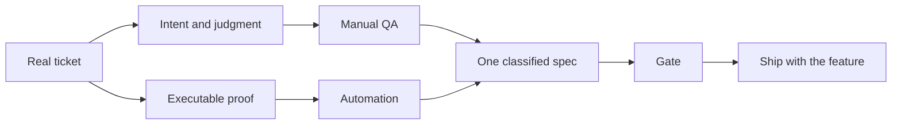

## 2. Objectives and how each is measured

Four agreed objectives. Progress is read from evidence, not asserted. Objective 1 is
implementation first, then evidence, then a measure. Do not quote a number before the evidence
exists.

### Objective 1 — Reduce testing effort

**Implementation.** The §8.1 loop: harness gathers from Jira, Confluence, source, and other
evidence; the sprint spec is written; scenarios are proved on Dev (manual or automation, whichever
gives confidence); the repeat that QA currently does in Dev2 is automation; sprint regression is
scoped from those tasks and run on demand.

**Evidence.** One release must supply three things or the calculator returns `UNKNOWN`: observed
person-minutes per frozen checklist activity, frozen scope, and an exact passed-run mapping.
`scripts/evidence/calculate-regression-effort.mjs` is fail-closed. Sprint 26.3.5 is `UNKNOWN`
because that release was not captured this way.

**Measure.** Baseline-release person-minutes versus a later assisted release, same frozen
checklist. Target is set only after that first baseline exists.

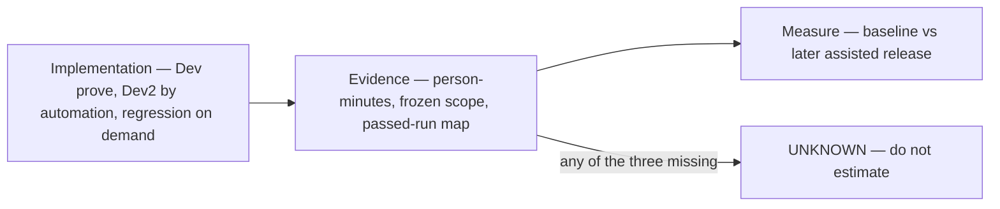

| #   | Objective                            | Measure                                                                                                               | Baseline                                                                      | Target                                                                  | Source                                                         |
| --- | ------------------------------------ | --------------------------------------------------------------------------------------------------------------------- | ----------------------------------------------------------------------------- | ----------------------------------------------------------------------- | -------------------------------------------------------------- |
| 1   | Reduce testing effort                | Implementation, then evidence, then measure — see above                                                               | `UNKNOWN`                                                                     | Set after the first baseline release                                    | `scripts/evidence/calculate-regression-effort.mjs`             |
| 2   | Increase automation coverage         | Module coverage state per lane                                                                                        | E2E 3 FULL / 8 PARTIAL / 3 NONE of 14 modules. Smoke 13 PARTIAL / 1 NONE      | No module at NONE in E2E or Smoke                                       | `docs/evidence/coverage-computed.json`                         |
| 3   | Shift effort to automated validation | Share of regression-checklist activities recorded as an exact automation replacement rather than residual manual work | `UNKNOWN` — same blocker as #1                                                | Majority of checklist activities automated                              | Same as #1                                                     |
| 4   | Backend / frontend parity            | Backend evidence state per module, against the E2E state for the same module                                          | Backend 3 PARTIAL / 11 NONE of 14 modules, vs E2E 3 FULL / 8 PARTIAL / 3 NONE | Backend module state not worse than E2E for the same module             | `docs/evidence/coverage-computed.json`, lane `backendEvidence` |

Objective 3 uses the same evidence as #1, so it stays `UNKNOWN` until that release is captured.
Targets for 2–4 are proposals until the next sync signs them off.

## 3. Standard workflow

Two layers. The **harness** is the outer loop — how work is designed and enforced. The **inner
standard** is what must be true at each step of that loop. How-to:
[`qa-harness.md`](./qa-harness.md). This section is the map.

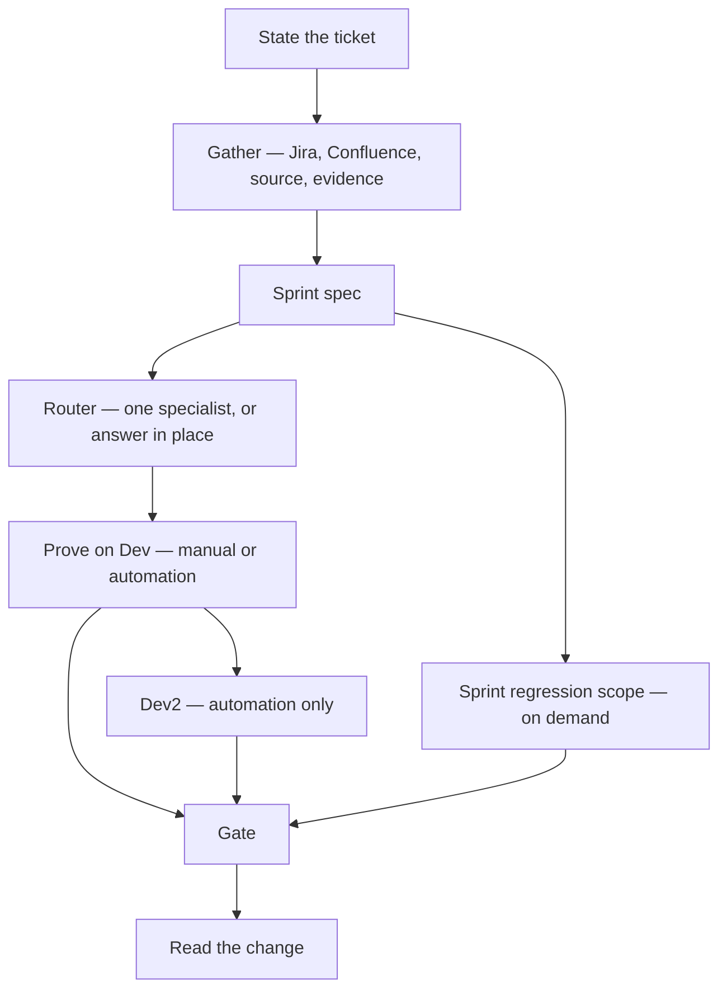

Hard limits sit on the harness, not in a second checklist: product source is read-only; Smoke is
GET-only and is not this sprint loop; every automation write (Cypress or pytest) freezes a task
manifest first; a refusal is the system working. BLOCK means fix.

### Inner standard — what each step must satisfy

| Harness step | Inner standard | Owner |
|---|---|---|
| Gather and sprint spec | Intent, actor, precondition, expected outcome. A scenario counts only when intent → implementation → assertion → evidence all trace. A broken link is `UNKNOWN`. Priority is customer / financial / control loss. | [`TESTS.md`](../framework/testing-standards/TESTS.md) §What counts as coverage |
| Router and authoring | State the ticket, never the agent. One specialist. Freeze the manifest before any automation write. | [`qa-harness.md`](./qa-harness.md) |
| Prove on Dev | Manual or automation, whichever gives confidence. Synthetic identity the lane owns; cleanup required. No shared row across lanes. | [`TESTS.md`](../framework/testing-standards/TESTS.md) §Lane contracts |
| Dev2 and on-demand regression | Same spec, automation. Smallest set that can observe *this* change. A narrowed run is never a release verdict. | [`execution-strategy.md`](../framework/execution-strategy.md) |
| Gate | Seven source-verifiable review questions. Eight false-greens block outright. One digest-bound verdict. | [`TESTS.md`](../framework/testing-standards/TESTS.md) §Review gate, §False-green controls |

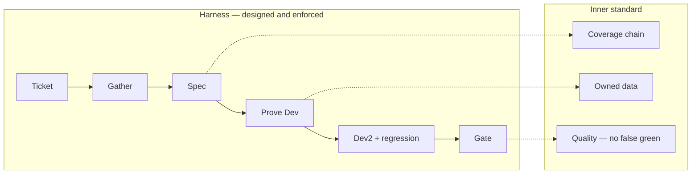

Do not invent a second functional strategy. Sprint work is this loop. A row in the table changes
only by changing its owning document.

### Complete spec — Recon

Loss Mitigation Recon is the pattern for what gather must produce. Source:
`Test-Case-Automation-Using-Claude-Agents/specs/modules/loss-mitigation/recon.yaml`. A sprint spec
is complete when all five are present — not when a ticket title is copied.

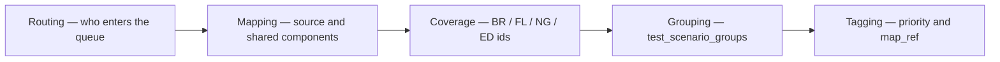

| Part | What Recon already has |
|---|---|
| **Routing** | Eligibility: repo status in `AT_AUCTION_AWAITING_INFO`, `AT_AUCTION_INFO_RECEIVED`, `PENDING_SALE`; active AutoIMS row; `DAMAGESREVIEWED IS NULL`. One repo instance; one Recon row per active auction location. DAG `recon_events_subscriber`. Tracker `RECON_DASHBOARD_TRACKER`. |
| **Mapping** | Source tables: `LM_DSHBRD_REPO_STATUS`, `COLLECTION_LOAN_SUMMARY_STATS`, `AUCTION_AUTOIMS_DATA`, `LETTER_SENT_STAT`. Shared components: table, LHS filter, date-field, email-widget, legend, RHS, events, auction-contact-card. |
| **Coverage** | Every scenario has an id and expected outcome: `BR-REC-*` (rules), `FL-REC-*` (flows), `NG-REC-*` (negatives), `ED-REC-*` (edges). Intent → implementation → assertion can be traced. |
| **Grouping** | `test_scenario_groups` — Eligibility and Lifecycle, Table Columns, Filters, Legend, Bulk, Export, Sort, widgets, RHS tabs, Auction Contact Card. Prove a group, not a random click. |
| **Tagging** | Priority on each rule (Critical / High / Low). Group `covers:` lists the ids. `map_ref` points at the shared component so inherited `RL-*` rules are not rewritten. |

That is the sprint spec. Manual or automation then proves one group on Dev. Automation holds Dev2
and the on-demand regression pack from the same groups.

---

## 4. Adoption blockers

What actually stops the §8.1 loop. Everything else is later.

| Stops | What it blocks |
|---|---|
| Specs still draft (5 of 41 usable for planning) | Gather → sprint spec. The agent infers the rule. |
| Missing `data-cy` hooks | Automation cannot hold the Dev2 repeat. |
| No shared test-data lifecycle | Mutation prove is bespoke every time. |
| Jira / other access fail-closed | Gather stops. Record UNKNOWN; do not paste a token. |
| No manual baseline | Objective 1 stays `UNKNOWN`. Do not quote effort-%. |

Not on this list: tool choice, model quality, a dedicated QA environment. Those do not block the
sprint loop.

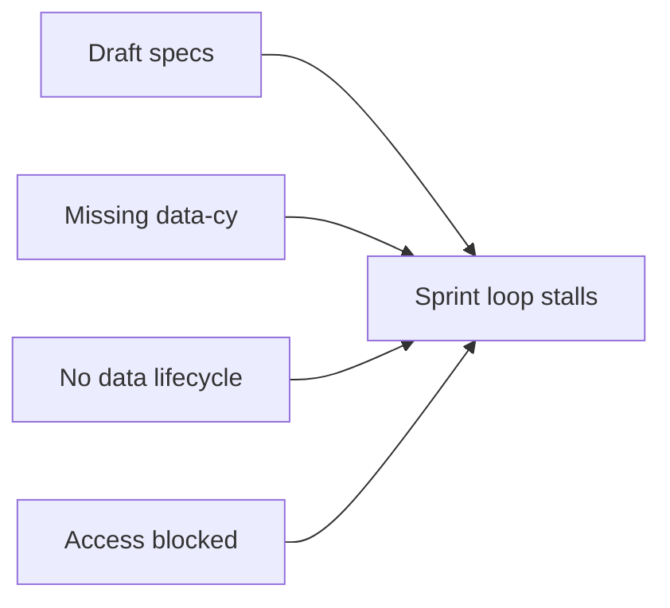

---

## 5. Why the harness rather than raw Cursor

Raw AI assistance on a financial-services QA codebase fails in specific, predictable ways: it
invents selectors, asserts on production data, edits application source, and retries a broken test
until it passes for the wrong reason. The harness exists to make those failures impossible rather
than discouraged — the guardrails are runtime hooks, not documentation.

That is also the adoption argument to a skeptical manual QA: you cannot break production with it,
so experiment freely.

### The guards, and what each one stops

This is also why generation rights are safe to hand to a manual QA who has never written a test.
Each row below is enforced at runtime; a refusal is the system working.

| Guard | What it stops |
| --- | --- |
| Product source is read-only | An agent "fixing" the application instead of the test |
| Smoke is GET-only | Any mutation, export, download, or send against production |
| UI mutations are Dev or QA, on owned synthetic data, cleaned up | Shared rows and cross-lane data collisions |
| Every automation write freezes a task manifest first | A write drifting onto code the approval never covered |
| One session, one job; one specialist at a time | Two agents authoring against the same files |
| Three tries at the same failure, then escalate | Retrying until a broken test passes for the wrong reason |
| Gate — source-verifiable review questions, false-green controls | A test that passes without testing anything |
| Evidence is a real run artifact | A structural inventory or a stub reported as a pass |
| Jira, Confluence, contract, and evidence writes are approval-gated | An agent updating a ticket or a page on its own initiative |

## 7. Rollout sequence

Ordered so each stage produces the evidence the next one needs.

| Stage                 | What happens                                                                                        | Done when                                                                                                              |
| --------------------- | --------------------------------------------------------------------------------------------------- | ---------------------------------------------------------------------------------------------------------------------- |
| 1. Workshop           | One-hour session, full QA team. Live demo, everyone leaves with a working setup                     | Every attendee ran `node .harness/verify.mjs` successfully                                                             |
| 2. Guided first task  | Each QA takes one real low-risk ticket through the full loop with support on call                   | Each person has one agent-authored spec reviewed by a gate                                                             |
| 3. Unassisted use     | Normal ticket work, AI-assisted by default. Questions go to a shared channel, not to Yagya directly | Questions shift from "how do I set up" to "how do I test X"                                                            |
| 4. Parallel authoring | Test suites authored alongside development, from the spec, before the build lands                   | At least one sprint where coverage ships with the feature                                                              |
| 5. Backend parity     | Backend automation team on the same workflow patterns, closing the module gap in objective 4        | Backend uses task manifests and gates as routine, not as an exception, and no module is backend-NONE where E2E is FULL |

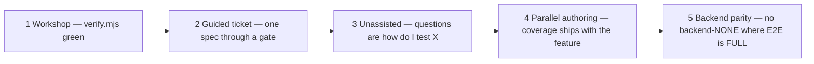

Stages 1–3 are the workshop plus roughly the following month. Stages 4–5 are the standing work
reported in the bi-weekly sync.

### Backend / frontend parity — what the gap actually is

Parity is not a tooling gap. Cypress and backend share one task protocol and one write map; what
backend lacks is coverage. Eleven of fourteen modules have no
recorded backend evidence, and three are partial — against three FULL and eight PARTIAL on E2E.

The workflow is the same loop in every lane: freeze one task manifest, then author only the selected
paths. Cypress E2E, Cypress Smoke, and backend pytest are refused without that manifest. Teach the
freeze once; do not treat backend as an extra step.

Sequence the catch-up in loan-lifecycle order, not by module size — so integration dependencies
land before the modules that depend on them. Funding and Post Funding are two of the three E2E
NONE modules. Loss Mitigation is the test-data pilot because its specs are already blueprint-ready.

```mermaid
flowchart LR
  F[Funding] --> PF[Post Funding]
  PF --> DR[Document Repository]
  DR --> CU[Custodian]
  CU --> TI[Titles]
  TI --> US[UniFi Servicing]
  US --> UC[UniFi Collections]
  UC --> LM[Loss Mitigation]
  LM --> IN[Insurance]
  IN --> AN[Ancillary]
  AN --> CH[Checks]
  CH --> CO[Complaints]
  CO --> CR[Call Reports]
```

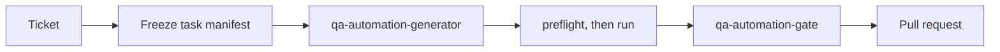

The kickoff agrees the model and names tickets. Everything else is sprint work.

## 8. Kickoff agenda

Two items to discuss. The rest of the invite is assignment after these are agreed.

| Agenda | Section | Done when |
|---|---|---|
| Define adoption strategy across Manual QA and Automation QA | §8.1 | Room agrees the sprint loop below |
| Walkthrough of QA Harness and current capabilities | §8.2 | Room has seen the workflow the harness enforces |

### 8.1 Define adoption strategy across Manual QA and Automation QA

**The one claim the room has to agree.** There is a single test-development loop for the sprint —
not a manual track and an automation track that meet before release. Manual QA and Automation QA
stop being two pipelines and become two contributions to the same artifact: judgment about what
must be true, and executable proof that it is. Manual verification is a step taken when it is the
fastest route to confidence, not a permanent job description.

The harness gathers from Jira, Confluence, source, and other evidence. That becomes the spec for
the current sprint task. Someone then proves the scenarios — **manual or automation, whichever
gives confidence**. Today, after functional test in Dev, QA repeats the same pass in Dev2. That
repeat is what automation takes. Sprint regression is scoped from those tasks and run **on demand**.
Walk Recon as the complete spec — routing, mapping, coverage, grouping, tagging — §3.

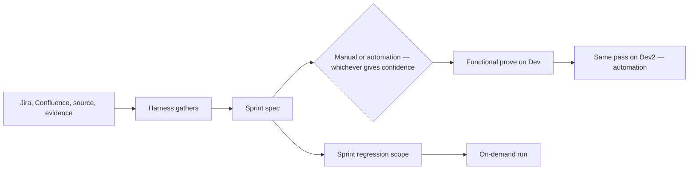

#### The current sprint, and where the loop attaches

Nothing in the two-week shape changes. What changes is the artifact the understanding is written
into, and who executes the second pass.

| Sprint activity today | What changes | Owner after |
| --- | --- | --- |
| Task assigned; understand the business intent; gather from Jira, Confluence, dev, PO | The gathering pass is run by the harness and corrected by the QA. The judgment stays human | Manual QA |
| Write test scenarios and test cases | Same act, different artifact — a classified spec with routing, mapping, coverage ids, grouping, tagging, executable by a person *or* an agent. Recon in §3 is the shape | Manual QA writes; generator consumes |
| Wait for development; test on Dev | Unchanged. Prove on Dev, manual or automation, whichever reaches confidence first | Whoever holds the spec |
| Repeat the same pass in Dev2 | This is the handover point. The repeat is generated from the spec, not re-walked | Automation |
| Report bugs; save evidence, test runs, TestRail, ticket updates | Unchanged as a requirement. Evidence must be a real run artifact and a gate verdict; Jira and Confluence writes stay approval-gated | Whoever proved it |
| Sprint regression before release | Scoped from that sprint's specs and run on demand, not re-walked by hand | Automation |
| Release note; production smoke | Unchanged. Smoke is GET-only and sits outside this loop | Manual QA |

Generation rights are safe to hand to someone who has never written a test because each standard
in that table is an enforced hook rather than guidance — the guards and what each one stops are
in §5.

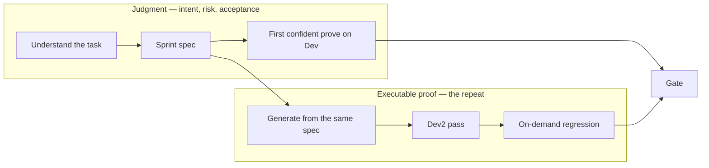

One spec. Do not re-test by habit in Dev2.

#### What actually changes for a manual QA

Three things, and none of them is "learn Cypress first".

1. **State the ticket, never the agent.** Routing picks the specialist; naming one is how the wrong
   lane gets opened.
2. **The spec is the deliverable.** A scenario counts only when intent → implementation →
   assertion → evidence trace. A broken link is `UNKNOWN`, not a pass.
3. **Read the change.** A confident summary is not proof. Nothing commits, merges, or approves on
   its own, and the person who asked for the work owns what it produced.

#### Skills, process, methodology, tooling — which of these actually moves

| Dimension | Verdict |
| --- | --- |
| Test design skill | Unchanged, and still the scarce part. Add spec authoring and reading a diff |
| Methodology | Unchanged. Risk-first priority — customer, financial, control loss |
| Sprint process | Shape unchanged. The Dev2 repeat and the regression re-walk stop being manual |
| Best practices | Same standards, enforced at runtime instead of reviewed after the fact |
| Tools | Cursor or Claude through the harness. Cypress and pytest are outputs of the loop, not prerequisites for joining it |

The process is fitted to this project's nature by the specs and the lane contracts, not by a
generic AI-testing playbook. That is why §3 walks Recon rather than a tutorial.

Done when the room agrees this loop — not a tooling debate.

### 8.2 Walkthrough of QA Harness and current capabilities

This is the workflow the harness already enforces. How-to: [`qa-harness.md`](./qa-harness.md).

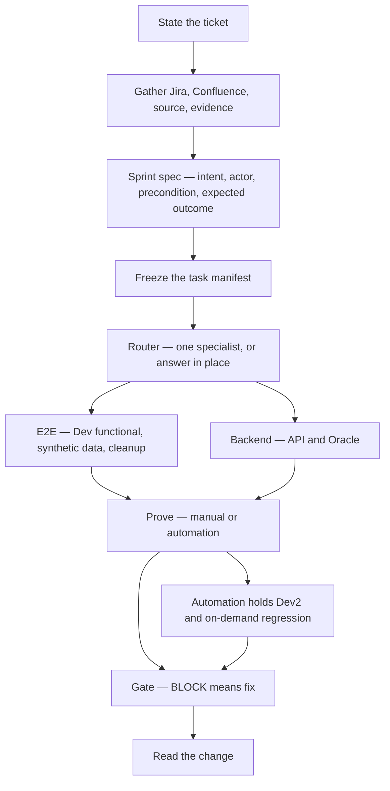

Hard limits stay on: product source is read-only; Smoke is GET-only and is not this walkthrough;
a refusal is the system working. Live demo is E2E on Dev, only if `verify.mjs` is green.

Done when everyone can name the next step after "state the ticket".

### 8.3 How QAs use Cursor/AI in day-to-day testing

Follow §8.1 and §8.2. State the ticket, never the agent. First week: write the sprint spec, prove
it on Dev, let automation take Dev2 and the on-demand regression scope. A refusal is the harness
working. You still read the change.

### 8.4 Initial pilot stories and use cases per QA

A pilot ticket is chosen to teach the loop, not to close the biggest gap. Those are different
tickets, and conflating them is the most common way a first attempt ends in a refusal the person
reads as the tool failing.

**Five selection rules.** A candidate must clear all five.

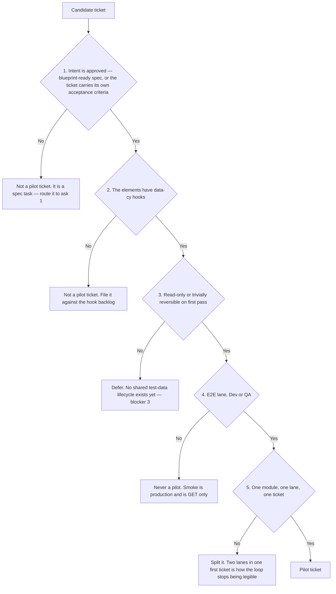

Rule 3 is the one people argue with. It is not caution for its own sake: there is no generic
`cy.seed*`/`cy.cleanup*` command, so a mutation scenario must carry a source-verified, bespoke setup
and cleanup path. That is a reasonable thing to ask of someone's fifth ticket and an unreasonable
thing to ask of their first.

**The slate — fill this in during the call.** One row per QA. A row is not done until columns 3, 4,
and 5 are filled; leaving a ticket unnamed is how stage 2 quietly does not happen.

| QA  | Job                 | Module | Ticket | First proof                                 | Pairs with |
| --- | ------------------- | ------ | ------ | ------------------------------------------- | ---------- |
|     | Manual / Automation |        | SERV-  | Approved scenario / E2E spec through a gate |            |
|     | Manual / Automation |        | SERV-  |                                             |            |
|     | Manual / Automation |        | SERV-  |                                             |            |
|     | Manual / Automation |        | SERV-  |                                             |            |
|     | Manual / Automation |        | SERV-  |                                             |            |

**Done when** every QA has a named ticket in that slate and a named person to pair with. Not when
the room agrees on which modules matter.

### 8.5 Training, documentation, and support plan

Documentation is in better shape than support is. Be honest about which is which — the gap is not
what people expect.

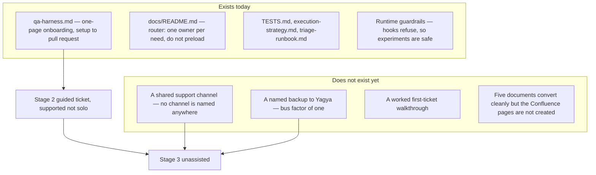

| Need                          | What exists today                                                                                                                                  | Gap                                                                                                                | Decision this call takes                                                                              |
| ----------------------------- | -------------------------------------------------------------------------------------------------------------------------------------------------- | ------------------------------------------------------------------------------------------------------------------ | ----------------------------------------------------------------------------------------------------- |
| Onboarding                    | [`qa-harness.md`](./qa-harness.md), one page, top to bottom. Setup, three lanes, four workflows, evidence, what to do when the assistant stops you | None. This is the single training document                                                                         | Confirm it is the only reading anyone is asked to do before the workshop                              |
| Hands-on training             | [`qa-harness.md`](./qa-harness.md) plus a green `verify.mjs` on a real ticket                                                                       | Covered by §10, merged in from the separate program page 2026-09-20                                                | Pair on the first ticket — stage 2, supported not solo                                                |
| Finding the right document    | `docs/README.md` is a router: read the one owner matching the task, never browse the tree                                                          | None. Routing is already the rule                                                                                  | Tell people the rule. Browsing the tree is how contradictory guidance gets quoted                     |
| Asking a question             | **Nothing.** Escalation resolves to "escalate to owner"; no channel, mailing list, or office hours is named in any document                        | §7 stage 3 already assumes "questions go to a shared channel, not to Yagya directly" — that channel does not exist | **Name the channel today.** It is a five-minute decision blocking a stage the plan already depends on |
| Support when someone is stuck | Yagya, by name, informally                                                                                                                         | Single point of failure. Every route into help is one person                                                       | **Name a backup**, ideally one Automation QA who will hit the same problems first                     |
| Published documentation       | Two pages registered in Confluence space `TE`; five convert cleanly and await creation, which is an approval-gated write blocked on ask 3          | This page is a declared documentation owner with no page ID — published nowhere                                    | Confirm ask 3 is still with Chintan, and warn the team before anyone edits a published page           |

**One warning that has to be said out loud before anyone sees a Confluence page.** Markdown in this
repository is the source; Confluence is a generated projection, and the publisher overwrites manual
edits on the next run. Every generated page carries a banner saying so. Someone will edit a
Confluence page and lose the work — telling them now is cheaper than the incident.

**Support model, once the channel exists.** Three tiers, matching the escalation rule already in
force: the error changed, or you escalate.

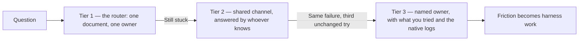

**Done when** the channel is named and the backup is named.

## 9. Risks

| Risk                                                         | Handling                                                                                    |
| ------------------------------------------------------------ | ------------------------------------------------------------------------------------------- |
| People try it once, hit a refusal, and quietly stop          | Stage 2 is supported, not solo. Guardrails are taught in the workshop, not discovered alone |
| Productivity dip read as tool failure                        | Named as expected in section 1 and at minute zero of the workshop                           |
| AI-authored tests that pass without testing anything         | Every spec goes through a gate. Gate verdicts are a tracked indicator, not a formality      |
| Adoption reported by tool-open rate rather than shipped work | Metric is about real tickets and shipped coverage. Never seat-license counts                |

## 10. Workshop, sync cadence, and logistics

Merged in on 2026-09-20 from a separate "Program, Workshop, and Sync Cadence" page that was tracked
on the engine branch, where `documentation.owners` never reached it. Its rollout table, risks, and
success-metric section duplicated §7, §9, and §2 of this page and were dropped; what follows is the
part that existed nowhere else.

### Workshop run sheet

One hour, full QA team, led by QA automation with a short segment from the engineering AI workflow
owner.

**Prerequisites, circulated the working day before.** Unprepared attendees consume roughly a third
of the session.

- The workspace root `FHF` cloned, with the lane checkouts inside it: `front-end-automation-e2e`,
  `front-end-automation-smoke`, `fhf-backend-automation`. See [`qa-harness.md`](./qa-harness.md) §
  "The repositories"
- Cursor or Claude Code installed and signed in
- Node available on PATH
- No credentials gathered; the harness never asks for any

| Time | Segment | Content |
| --- | --- | --- |
| 0:00–0:05 | Why | The dip is expected. Nothing done in this session can reach production |
| 0:05–0:15 | Live demonstration | One real ticket end to end: route, generate, gate, PR. No slides |
| 0:15–0:30 | Hands-on setup | Everyone runs `setup.mjs` then `verify.mjs`, at the workspace root. Nobody leaves this segment failing |
| 0:30–0:45 | Hands-on task | Everyone requests one test in the E2E lane and reads the result |
| 0:45–0:55 | Guardrails | Deliberately trip a hook by attempting to edit application source; show that the refusal is the system working |
| 0:55–1:00 | Next steps | Each person names the ticket they will take through stage 2, and where to ask questions |

**Leave-behind:** the onboarding page and one named low-risk ticket per attendee.

**Demonstration safety:** demonstrate in the E2E lane against Dev/QA. Do not demonstrate in the
Smoke lane; a live production checkout in front of an audience teaches the wrong habit.

### Bi-weekly adoption sync

QA and engineering leads, every two weeks, initially through October. Standing agenda, 30 minutes:

1. Adoption: who used AI-assisted workflows on real tickets since the last session, and who did not
2. Coverage: specs authored, gate verdicts, and what shipped alongside development
3. Friction: the primary blocker each person hit. This is the input that changes the harness
4. Primary metric against baseline, per §2
5. One decision per session, if any

Supporting indicators, tracked deliberately as indicators rather than targets to avoid gaming:

- Number of QAs with a passing `verify.mjs` in the last two weeks
- Ratio of gate PASS to BLOCK verdicts, and whether BLOCKs are corrected or circumvented
- Whether shared-channel questions concern setup or testing

Friction items become harness work: configuration, routing, workspace setup, and reusable skills.
The onboarding target is that a new QA requires the workshop and nothing further.

### Coordination

| Area | Scope |
| --- | --- |
| Engineering AI workflow | Align this page's structure and depth with the existing Frontend and Backend AI adoption documentation so the three read as one set |
| QA practice | Wider QA rollout: spec-driven development, parallel test-suite authoring, and coverage targets per module |
| Leadership reporting | Progress reported into the bi-weekly sync against the primary metric |

### Meeting logistics

Calendar invitations are sent from Outlook; this page records the agreed content only.

| Meeting | Attendees | Timing |
| --- | --- | --- |
| QA AI adoption workshop | Full QA team; engineering AI workflow owner | Monday, 10:00–11:00 Nepal time |
| QA AI adoption sync | QA and engineering leads | Every two weeks, 30 minutes, initially through October; slot confirmed with US participants before the first invitation |
