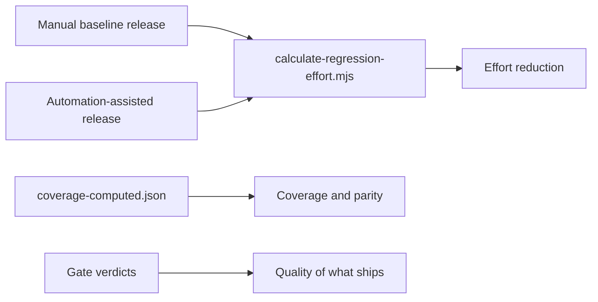
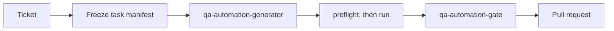

# QA AI Adoption — Strategy, Workshop, and Sync Cadence

**Owner:** Yagya (QA AI adoption lead)
**Stakeholders:** Chintan, Prachi, Puran
**Audience:** QA leadership and the manual QA team
**Companion pages:** [QA Harness](./qa-harness.md) — the how-to, on one page. This page
is the why, the sequence, and the reporting.

---

## 1. Objective

Move QA effort from repetitive manual execution toward AI-assisted authoring and automated
validation, without losing test quality on the way. Concretely: every manual QA uses Cursor or
Claude on real work, and new test coverage is authored alongside development rather than after it.

Expect throughput to dip while people learn. That dip is planned, not a failure signal — treat the
first two weeks per person as training cost.

## 2. Objectives and how each is measured

Four agreed objectives. Each is wired to a measurement that already exists in the repository, so
progress is read from evidence rather than asserted. Baselines below are from
`docs/evidence/coverage-computed.json`, generated 2026-08-13.

| # | Objective | Measure | Baseline | Target | Source |
|---|---|---|---|---|---|
| 1 | Reduce testing effort | Observed manual person-minutes for one frozen regression checklist, baseline release vs later assisted release | `UNKNOWN` — no manual baseline captured yet | Set after the first baseline release; do not quote a number before then | `scripts/evidence/calculate-regression-effort.mjs` |
| 2 | Increase automation coverage | Module coverage state per lane | E2E 3 FULL / 8 PARTIAL / 3 NONE of 14 modules. Smoke 13 PARTIAL / 1 NONE | No module at NONE in E2E or Smoke | `docs/evidence/coverage-computed.json` |
| 3 | Shift effort to automated validation | Share of regression-checklist activities recorded as an exact automation replacement rather than residual manual work | `UNKNOWN` — same blocker as #1 | Majority of checklist activities automated | Same as #1 |
| 4 | Backend / frontend parity | Backend evidence state per module, against the E2E state for the same module | Backend 3 PARTIAL / 11 NONE of 14 modules, vs E2E 3 FULL / 8 PARTIAL / 3 NONE | Backend module state not worse than E2E for the same module | `docs/evidence/coverage-computed.json`, lane `backendEvidence` |

**#1 and #3 are blocked on one thing, and it is not tooling.** The calculator is fail-closed: it
returns `UNKNOWN` for every metric unless a release supplies observed person-minutes per checklist
activity, frozen scope, and an exact passed-run mapping. Sprint 26.3.5 is `UNKNOWN` for this reason.
Until one release is captured with a full manual baseline, effort reduction cannot be reported at
all — and should not be estimated. Capturing that baseline is the single highest-value adoption
action available right now.

**Targets are proposals until the next sync signs them off.** The objectives are agreed; the
numbers are not. Do not report against a target this table marks as unset.

## 3. Candidate standard workflow — for review

**Status: proposed, not adopted.** Prachi owns workflow standardization; this is a starting draft to
review against, not a decision. Adopt, amend, or replace it.

The team named six areas a standard has to cover. All six are already defined and, in most cases,
hook-enforced — but across four documents, so nobody can point at "the standard". This table is that
pointer. It proposes no new rules; each row states a rule that is already in force today and the
document that owns it, so the review question is whether these are the right rules to standardize on
— not whether they exist.

| Area | Rule in force today | Owning document |
|---|---|---|
| Test generation | State the ticket, never the agent — routing picks exactly one specialist. Backend and combined work freezes a task manifest before anything is authored or run | [`qa-harness.md`](./qa-harness.md) §Choosing the workflow, §The four workflows |
| Coverage design | A scenario counts only when intent → application implementation → automation → assertion → execution evidence all trace. A broken link is labelled `UNKNOWN`, never inferred from a test name. Priority is by customer/financial/control loss, not by module size | [`TESTS.md`](../framework/testing-standards/TESTS.md) §What counts as coverage, §Planning order |
| Regression development | Run the smallest set that can observe a regression from *this* change, on every change. Selection may only ever narrow a run that would otherwise be full. Sprint boundary and pre-release are full runs, and a narrowed run is never a release verdict | [`execution-strategy.md`](../framework/execution-strategy.md) §Strategy in one sentence, §Trigger matrix, §The one invariant |
| Data setup | Every lane creates and cleans up its own synthetic identity. Lanes correlate by the API request contract, never by sharing a row. There is no generic seed/cleanup lifecycle — a mutation scenario is accepted only with a source-verified, workflow-specific setup and cleanup path | [`TESTS.md`](../framework/testing-standards/TESTS.md) §Lane contracts, §Correlation is by contract, not by record |
| Reviews | Seven source-verifiable questions before a test is accepted; an answer that is not source-verifiable leaves the row incomplete. One gate verdict, bound to a change digest so an unrelated edit cannot reuse an old PASS. BLOCK means fix, never override | [`TESTS.md`](../framework/testing-standards/TESTS.md) §Review gate; [`qa-harness.md`](./qa-harness.md) §Evidence and completion |
| Quality checks | Eight named false-green conditions block acceptance outright, among them skip-on-missing-state, swallowed exceptions, a stub asserted as a real workflow, an unowned shared-record mutation, order dependence, `testIsolation` treated as backend cleanup, and structural inventory reported as coverage | [`TESTS.md`](../framework/testing-standards/TESTS.md) §False-green controls |

**Where the standard lives, and where it is published — already decided, and already built.**
The meeting treated Confluence as an open question; the control plane settled it and implemented it.
`documentation.publishing.confluence` declares the authority as
`markdown-source-confluence-is-a-generated-projection`, publishes into space `TE` through
`scripts/harness/publish-docs-confluence.mjs`, and stamps every generated page with a banner stating
that edits made in Confluence are overwritten on the next run. Markdown in this repository is the
source; Confluence is a rendered copy for readers outside QA.

What is *not* done is registration. Only one page — [`qa-harness.md`](./qa-harness.md) — is listed in
`documentation.publishing.confluence.pages`. This page is a declared documentation owner but has no
Confluence page ID, so it is published nowhere. Registering it is a small config change plus one
approval-gated Confluence write.

**Known gaps in this draft.** Performance and other non-functional validation is out of scope
until the workflow above is routine — the phased position the team agreed. Effort reduction and the
manual-to-automated shift (objectives 1 and 3 above) remain unreportable until one release supplies
a manual baseline; that gap is a missing measurement, not a missing standard.

---

## 4. Adoption blockers — the QA-side list

**Status: input for Prachi's consolidated blocker list, not the whole of it.** This covers only what
can be evidenced from the repository today; process and people blockers are hers to add. Every row
cites a path so the review argues about the fact, not the impression.

Ordered by how hard each one blocks authoring. The first three stop an agent from producing correct
work at all; the rest limit what can be reported or gated.

| # | Blocker | What the evidence shows | Clears when |
|---:|---|---|---|
| 1 | Business context is not yet machine-consumable for most modules | 41 module spec files exist, but only five are blueprint-ready — `Loss Mitigation > Recon`, `Skip Trace`, `Assignment`, `Repo`, and `Titles > Remarketing Titles`. The index states the rest "appear scaffold-only and should not be treated as complete delivery blueprints" (`Test-Case-Automation-Using-Claude-Agents/specs/INDEX.md`) | A module has an approved spec covering intent, actor, precondition, and expected outcome. Without it an agent infers behavior, which is exactly how a plausible wrong assertion gets written |
| 2 | Frontend `data-cy` hooks are missing on elements tests must address | 34 open items in [`data-cy-hook-backlog.md`](../planning/data-cy-hook-backlog.md), one awaiting a product/security decision. Shared dropdowns, date pickers, export controls, and unconfigured `TanstackTable` mounts expose only generic or index-based identities | Frontend lands the requested stable contracts. This is a product-code dependency: no amount of AI quality writes a selector for an element that has none |
| 3 | No shared test-data lifecycle | There is no generic `cy.seed*`/`cy.cleanup*` command in either UI repository — only one module-specific `contactTabsCleanup`. The standard therefore accepts a mutation scenario only with a source-verified per-workflow setup and cleanup path ([`TESTS.md`](../framework/testing-standards/TESTS.md) §Current Cypress implementation) | Either a reviewed shared lifecycle exists, or every mutation scenario budgets bespoke setup and cleanup. Today it is the second, and that is the per-scenario cost driver |
| 4 | Backend coverage is far behind the UI lanes | `backendEvidence` is 11 NONE and 3 PARTIAL of 14 modules, against E2E 3 FULL / 8 PARTIAL / 3 NONE (`docs/evidence/coverage-computed.json`, generated 2026-08-13) | Objective 4 above. Sequence the catch-up in loan-lifecycle order, not by module size |
| 5 | Access grants are not compiled, and every capability fails closed | Eight capabilities are declared in the harness — source grounding, Jira read, Figma read, Cypress CLI, Cypress Cloud diagnostics, execution environment, backend API/Oracle, and TestRail read/report. Each resolves to `blocked-authentication` or `blocked-authorization` rather than degrading silently, so a missing grant surfaces as a stop, not a wrong answer | The team submits the access list named in the meeting's action items. Note that this is by design: a blocked capability is recorded UNKNOWN and never reported as a pass |
| 6 | No manual baseline has been captured, so effort reduction is unreportable | `calculate-regression-effort.mjs` is fail-closed and returns `UNKNOWN` without observed person-minutes, frozen scope, and an exact passed-run mapping. Sprint 26.3.5 is `UNKNOWN` for this reason (section 2, objectives 1 and 3) | One release is captured with a full manual baseline. This remains the single highest-value adoption action available |
| 7 | Production smoke cannot gate deploys | 13 of 40 smoke specs never start within the run budget, so wiring a post-deploy gate today would produce a green verdict from a partial run — the false-green pattern the standard prohibits ([`execution-strategy.md`](../framework/execution-strategy.md) §Trigger 8 is blocked) | Every configured spec starts or fails the orchestration gate with a reason, and the run records the deployed application version. Until then smoke is scheduled diagnostic evidence |
| 8 | The declared documentation source repository has no remote | The control plane names FHF as the documentation `sourceRepository` and points ten of its eleven `documentation.owners` at paths inside this tree — but the FHF workspace has **no git remote**, and `/docs/` sits in `.git/info/exclude`. Three files under `docs/` are tracked; the rest, including this page, are a single uncommitted copy on one machine. Two sprint records were already nearly lost to `git clean -fdx` ([`regression-effort/README.md`](../evidence/regression-effort/README.md)) | The declared source repository gets a remote. Relocating the documents would be the wrong fix — it breaks `documentation.owners`, the publisher `sourceRepository`, and every relative link this tree resolves today |

**The QA environment concern, stated precisely.** The meeting agreed a shared Dev environment should
not hold up adoption, and that is right — it blocks nothing above. What it does cost is regression
*confidence*: a full run at a sprint boundary is a baseline only if the environment did not change
underneath it, so an unexplained failure needs an environment check before it is read as a product
signal. That is a triage cost, not an adoption blocker, and it is the correct place to leave it.

**What is deliberately not on this list.** Model quality, prompt technique, and tool choice. None of
them appear in the evidence as the thing standing between the team and broader adoption — rows 1 to 3
do, and all three are dependencies on product code and product knowledge rather than on AI.

---

## 5. What this needs from leadership

Five open asks. Each one is blocked on a decision, a grant, or a write this harness is not permitted
to make, and each names the evidence rather than the impression. They stay on this list until they
are granted.

| # | Ask | Owner | Why it cannot come from QA |
|---:|---|---|---|
| 1 | Named product-side owners for blockers 1 to 3 | Chintan | Spec maturity, the `data-cy` hook backlog, and the absent test-data lifecycle are dependencies on product knowledge and frontend capacity. QA can document all three and has; it cannot land a selector for an element that has none, nor approve a business rule |
| 2 | One release designated to capture a manual baseline | Chintan and Prachi | The effort calculator is fail-closed. Without one release of observed person-minutes against a frozen checklist, objectives 1 and 3 report `UNKNOWN` indefinitely and adoption gets judged on impressions |
| 3 | Confluence credentials and page-create permission in space `TE` | Chintan | The publisher creates and fills pages on an authorized run, and five are registered and verified. Credentials are environment-only by policy, so the grant is the whole remaining step |
| 4 | An organization-owned private repository for the documentation payload | Chintan | ADR-0018 records this as its one open item. Private is a requirement, not a preference: the tree names internal hostnames, Cypress Cloud project identifiers, and commit SHAs |
| 5 | A short section in the backend automation repository naming the central boundary | Prachi, with that repository's owner | ADR-0021 federated backend authoring rules there, correctly. But the pointers run one way: this plane points into that repository twice and nothing points back, so a contributor who opens it directly sees no sign that manifest-scoped writes, an evidence contract, or a gate exist. Its `CLAUDE.md` is outside `allowedWriteRoots`, so the harness is refused the write by design and cannot fix this itself |

### Ask 1 in detail — what each owner would receive first

"Owners for the top three blockers" is easy to agree to and never staff. Each one below names the
kind of owner, the first slice, and what QA does the day it lands. Sized to be startable, not to be
a programme.

| Blocker | Owner needed | First slice | Unblocks |
|---|---|---|---|
| Spec maturity | A product SME per module, to approve intent, actor, precondition, and expected outcome | **Funding and Post Funding**, in that order | These two are the first two modules in loan-lifecycle order *and* two of the three modules with no E2E coverage at all. An approved spec is what lets coverage be authored rather than inferred |
| `data-cy` hooks | Frontend capacity — a developer, not a decision | **SH-16, SH-08, SH-02**, in that order | Shared components, so one fix serves every module that mounts them. SH-16 has zero `data-cy` and its state is observable only through a framer-motion transform; SH-08 leaves every unconfigured table exposing visual row indexes; SH-02 makes dropdown identity unscopeable when fields coexist |
| Test-data lifecycle | A reviewed design decision, plus whoever owns Dev/QA data | **One pilot workflow in Loss Mitigation** | Its Recon, Skip Trace, Assignment and Repo specs are already blueprint-ready and the module is E2E PARTIAL, so it is the one place a lifecycle can be designed against approved intent and reused rather than invented per scenario |

Three findings in the hook backlog are **not** frontend work and should not be handed to a developer:
the unreachable Missing Titles dealer route, the Re-Registration duplicate checkbox identities, and
the Post-Funding infraction status plus Titles move-to-main-queue access gating. Each needs a product
or RBAC decision before any hook requirement exists. Routing them as code is how they stall.

The remaining 11 shared and 19 module-specific hook items are not urgent in the same way. The three
above are chosen because they are shared: leverage first, then breadth.

### Questions that are settled

Re-opening these costs a sync and changes nothing.

- **A dedicated QA environment.** Agreed as valid and agreed not to block adoption. Its real cost is
  regression confidence at the sprint baseline, which is a triage cost: check the environment before
  reading an unexplained failure as a product signal.
- **Performance and non-functional validation.** Phased in after the workflow above is routine.
- **Where documentation lives and how it is published.** Markdown is the source, Confluence is a
  generated projection, and the publisher overwrites manual edits. Section 3 records this. What is
  still needed is telling the team before someone edits a published page and loses the work.
- **Tooling and model choice.** Nothing in the evidence identifies these as the constraint.

### Reporting discipline

Two claims to avoid, because both invite a correction later.

Do not report an effort-reduction figure. The calculator returns `UNKNOWN` without a manual baseline,
and Sprint 26.3.5 is `UNKNOWN` for that reason. "We cannot report this yet, and ask 2 is what fixes
it" is a stronger position than an estimate that has to be withdrawn.

Do not describe the documentation payload as safe. It is versioned and pushed, which it was not
before, but it sits on a branch of a personal account until ask 4 is granted.

---
## 6. Why the harness rather than raw Cursor

Raw AI assistance on a financial-services QA codebase fails in specific, predictable ways: it
invents selectors, asserts on production data, edits application source, and retries a broken test
until it passes for the wrong reason. The harness exists to make those failures impossible rather
than discouraged — the guardrails are runtime hooks, not documentation.

That is also the adoption argument to a skeptical manual QA: you cannot break production with it,
so experiment freely.

## 7. Rollout sequence

Ordered so each stage produces the evidence the next one needs.

| Stage | What happens | Done when |
|---|---|---|
| 1. Workshop | One-hour session, full QA team. Live demo, everyone leaves with a working setup | Every attendee ran `node .harness/verify.mjs` successfully |
| 2. Guided first task | Each QA takes one real low-risk ticket through the full loop with support on call | Each person has one agent-authored spec reviewed by a gate |
| 3. Unassisted use | Normal ticket work, AI-assisted by default. Questions go to a shared channel, not to Yagya directly | Questions shift from "how do I set up" to "how do I test X" |
| 4. Parallel authoring | Test suites authored alongside development, from the spec, before the build lands | At least one sprint where coverage ships with the feature |
| 5. Backend parity | Backend automation team on the same workflow patterns, closing the module gap in objective 4 | Backend uses task manifests and gates as routine, not as an exception, and no module is backend-NONE where E2E is FULL |

Stages 1–3 are the workshop plus roughly the following month. Stages 4–5 are the standing work
reported in the bi-weekly sync.

### Backend / frontend parity — what the gap actually is

Parity is not a tooling gap. The backend lane has the same specialists, the same gate, and the same
evidence contract as the UI lanes; what it lacks is coverage. Eleven of fourteen modules have no
recorded backend evidence, and three are partial — against three FULL and eight PARTIAL on E2E.

The difference in the workflow is one extra step: backend and combined work must freeze a task
manifest before anything is authored or run, because a write outside the selected paths is refused.
That step is the thing to teach; the rest is identical to the UI loop people already learn in the
workshop.

Sequence the catch-up in loan-lifecycle order, not by module size — Funding, Post Funding, Document
Repository, Custodian, Titles, UniFi Servicing, UniFi Collections, Loss Mitigation, Insurance,
Ancillary, Checks, Complaints, Call Reports — so integration dependencies land before the modules
that depend on them.

## 8. Workshop run sheet — Monday, 10:00, 60 minutes

Attendees: full QA team + Puran. Led by Yagya.

**Prerequisites, sent the Friday before.** People arriving unprepared cost a third of the session.
- All four checkouts cloned (`front-end-automation-e2e`, `front-end-automation-smoke`,
  `fhf-backend-automation`, `FHF`)
- Cursor or Claude Code installed and signed in
- Node available on PATH
- No credentials gathered — the harness never asks for any

| Time | Segment | Content |
|---|---|---|
| 0:00–0:05 | Why | The dip is expected. Nothing you do in this session can reach production |
| 0:05–0:15 | Live demo | One real ticket, start to finish: route → generate → gate → PR. No slides |
| 0:15–0:30 | Hands-on setup | Everyone runs `node .harness/setup.mjs` then `node .harness/verify.mjs`. Walk the room. Nobody leaves this segment red |
| 0:30–0:45 | Hands-on task | Everyone asks for one test in the E2E lane and reads what comes back |
| 0:45–0:55 | Guardrails | Deliberately trip a hook — try to edit application source. Show that the refusal is the system working |
| 0:55–1:00 | Next steps | Each person names the ticket they will take through stage 2. Where to ask questions |

**Leave-behind:** the onboarding page, and one named low-risk ticket per attendee.

**Demo safety:** demo in the E2E lane on Dev/QA. Do not demo in the Smoke lane — a live production
checkout in front of an audience is how someone learns the wrong habit.

## 9. Bi-weekly adoption sync

Attendees: Chintan, Yagya, Prachi, Puran. Every two weeks, initially through October.

Standing agenda, 30 minutes:
1. Adoption: who used AI-assisted workflows on real tickets since last time, and who did not
2. Coverage: specs authored, gate verdicts, what shipped alongside development
3. Friction: the top blocker each person hit — this is the input that changes the harness
4. Objectives 1–4 against their baselines (section 2), including any target still unset
5. One decision per session, taken from the open asks in section 5 while any remain

Supporting indicators to track — deliberately not targets, to avoid gaming:
- Number of QAs with a green `verify.mjs` in the last two weeks
- Ratio of gate PASS to BLOCK verdicts, and whether BLOCKs are being fixed or worked around
- Whether questions in the shared channel are setup questions or testing questions

Friction items become harness work: configuration, routing, worktree setup, reusable skills. The
onboarding target is that a new QA needs the workshop and nothing else.

## 10. Coordination

- **Puran** — align this page's structure and depth with the existing Frontend and Backend AI
  adoption documentation before publishing to Confluence, so the three read as one set.
- **Prachi** — wider QA rollout: spec-driven development, parallel test-suite authoring, coverage
  targets per module.
- **Chintan** — reports into the bi-weekly sync against the section 2 objectives.

## 11. Risks

| Risk | Handling |
|---|---|
| People try it once, hit a refusal, and quietly stop | Stage 2 is supported, not solo. Guardrails are taught in the workshop, not discovered alone |
| Productivity dip read as tool failure | Named as expected in section 1 and at minute zero of the workshop |
| AI-authored tests that pass without testing anything | Every spec goes through a gate. Gate verdicts are a tracked indicator, not a formality |
| Adoption reported by tool-open rate rather than shipped work | Metric is about real tickets and shipped coverage. Never seat-license counts |
