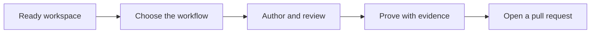
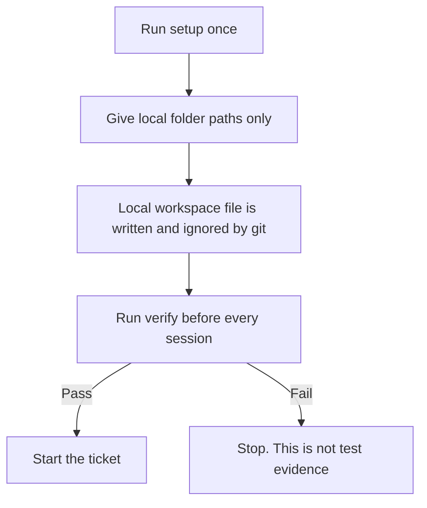
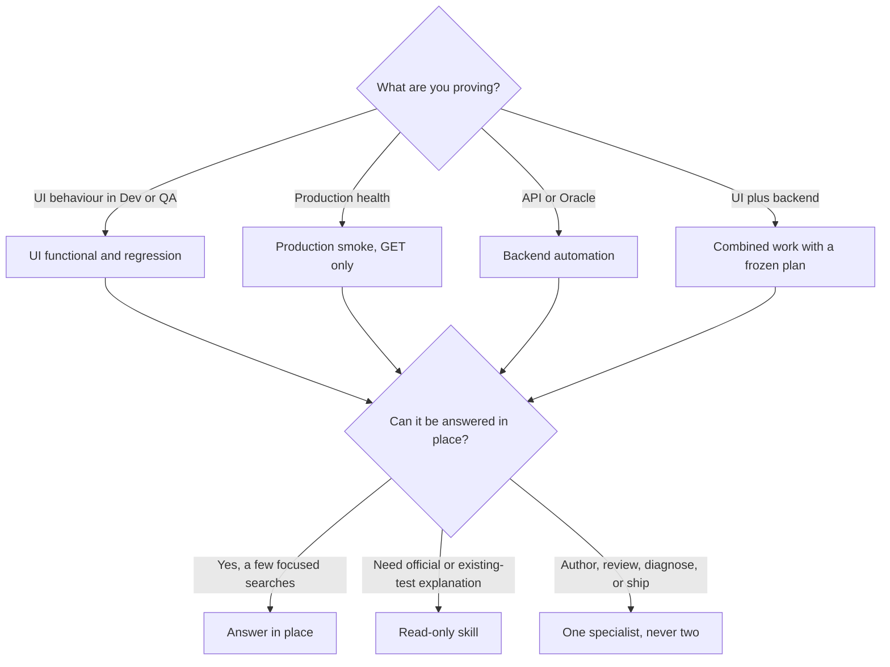
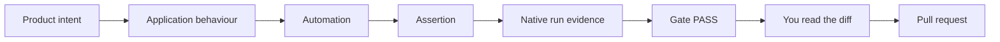
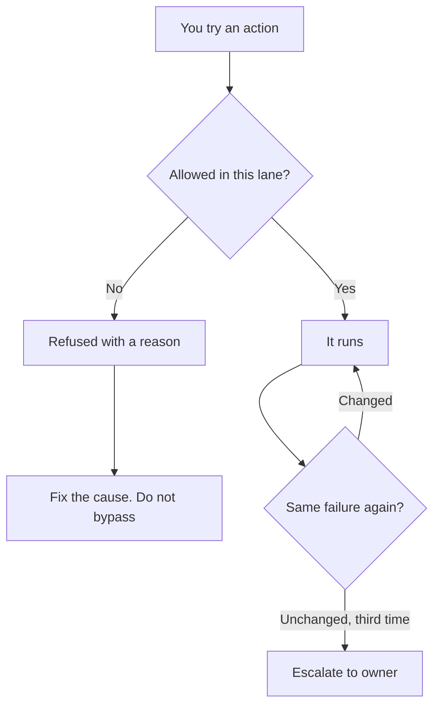

# QA Harness

The user guide for the QA harness. Use it to take a ticket to a reviewed, evidence-backed test without guessing which checkout, which assistant, or which safety rule applies.

Written for the person doing the work. You do not need to know how the harness is generated to use it.



You still own the result. A confident summary is not proof. Read the change before anything is committed.

## Rules that never change

* Application product source is read-only.
* Production smoke may only read. Never submit, mutate, export, download, upload, or send.
* UI mutations happen in Dev or QA, on synthetic data you own, and are cleaned up.
* Writes to Jira, Confluence, product contracts, or evidence need an explicit one-time approval of the exact payload.
* One session, one job. One specialist at a time.
* Three tries at the same failure, then escalate.

## What the harness does, and what stays yours

The harness keeps every assistant on the same rules: which lane you are in, what may be written, how many retries are allowed, and what counts as a pass.

With it you can author UI tests in Dev or QA on synthetic data you clean up, check production health with read-only smoke, prove API and Oracle behaviour on only the tests selected for the ticket, and run combined UI and backend work from one frozen plan so approval cannot drift onto different code.

You still choose the ticket and confirm the environment. You authenticate — the harness never collects credentials. You read the change, because nothing commits, merges, deploys, or approves on its own. And you escalate after three unchanged failures instead of grinding.

## Why there are three lanes

QA work spans different risk. Production may only be observed, Dev and QA may be mutated with owned synthetic data, and backend writes must stay on the exact selected paths. Assistants forget rules, so the harness encodes them once and enforces them while you work.

| Lane | Why it is separate | Hard limit |
| --- | --- | --- |
| UI functional and regression | Behaviour changes need a real mutation, then cleanup | Dev or QA only. Synthetic owned data. Cleanup is required |
| Production smoke | Production is live customer traffic | GET only. Never submit, mutate, export, download, upload, or send |
| Backend API and Oracle | Database and API state is easy to corrupt and hard to prove | Dev or QA. Only the tests and paths selected for the ticket |

Four principles follow from this, and you will feel all of them. **Route, then act** — most questions should be answered in place, and a specialist is for authoring, reviewing, diagnosing, or shipping. **Freeze before you write across systems** — combined or backend work is bound to a ticket family, selected paths, and a digest, and if those change the approval is invalid. **Refuse rather than hope** — a guardrail stopping an unsafe write is the harness working. **Evidence is native** — a pass is a real run artifact, never a structural inventory or a stub.

## Getting set up

You need Cursor or Claude, the aggregation workspace, and the UI lane you will actually use. To prove API or Oracle behaviour you also need the backend automation checkout, set up from its own guide with its virtual environment, local config, Oracle and Okta; the centralized harness is never installed inside that checkout. Connectors — Jira, Confluence, Cypress Cloud, Figma, TestRail — are optional and come later. Declaring that you have one is not the same as proving it works.



Setup asks only for folders: the aggregation workspace, the product-spec checkout, and — in a UI lane — this checkout. It never asks for passwords or tokens. Do not type any.

```shell
node .harness/setup.mjs
node .harness/verify.mjs
```

Verify confirms the lane, the generated surfaces, and that required local paths resolve. If it fails, stop: a setup failure is not a product pass or fail. After policy is regenerated, `node .harness/verify.mjs change` rechecks the generated surfaces without repeating the full workspace preflight.

| You are proving | Work in | Typical branch |
| --- | --- | --- |
| UI behaviour | front-end-automation-e2e, package CypressFHF/fhf-dashboards | dev |
| Production health | front-end-automation-smoke, same package folder | staging |
| API or Oracle | Backend automation, driven from the aggregation workspace | per ticket |
| Planning only | Aggregation workspace | — |

Working in the wrong checkout is the usual first-week mistake. Each lane guide names the correct test root and flags the wrong one.

If you lack access, do not paste tokens and do not work around it:

```shell
node .harness/capability-doctor.mjs --capability <id> --subject <task-safe-label>
```

You authenticate; the doctor only records whether the capability is ready, blocked, or unknown. A quality pass is forbidden while a required capability is blocked or unknown.

## Choosing the workflow

State the ticket. Do not name an agent — routing exists so you do not spawn a specialist for a question a search would answer.



Read-only skills explain and do not edit. Specialists implement, review, debug, or open the pull request.

| You are asking to | UI only | Backend or combined |
| --- | --- | --- |
| Write or add tests | cypress-generator | qa-automation-generator |
| Review before a pull request | cypress-gate | qa-automation-gate |
| Fix a red, flaky, or slow run | cypress-debugger | qa-automation-debugger |
| Open the pull request or report coverage | cypress-shipper | Use the UI shipper only after a combined gate has passed |

Anything else is blocked on purpose, and generic explore agents are refused. If the work crosses repositories, or any backend path will be written or run, freeze the task plan before a specialist starts — which is why combined and backend routes outrank UI-only routes.

## The four workflows

Follow only the one that matches. Mixing them is how production gets a mutation, or backend gets an unselected test. All four share the same shape: verify, read the lane guide, state the ticket, author, gate, read the diff, ship. A BLOCK verdict means fix, never override.

**UI functional and regression**, when you are proving UI behaviour in Dev or QA. Verify in the UI functional checkout, read that lane guide and the standards it points to, then state the ticket and module and let routing pick the generator. Mutations use synthetic owned data and are cleaned up in the spec. Ship only after you have read the diff; work stays uncommitted until then.

**Production smoke**, when you are proving production is reachable and structured — not that a workflow can change data. Verify in the smoke checkout on that repository's staging branch. GET only: treat Export and Download as presence checks and do not activate them. The same generator, debugger, and gate apply, still with no side effects. A smoke pass is not a substitute for a functional mutation test.

**Backend API and Oracle**, when you are proving API contracts or database state in Dev or QA. Freeze a task plan covering the ticket family, selected paths, selected tests, and impact, then point the active task at it. Execution is sequential by default; parallel is opt-in only when data is independent, cleanup is verified, and there is no cross-file state.

```shell
node .harness/task-protocol.mjs validate
node .harness/backend-task-runner.mjs preflight --manifest <path> --test-id <id>
```

Replace `preflight` with `run` only after it passes, and drive this from the aggregation workspace. A preflight failure is not a product pass or fail — stop.

**Combined UI and backend**, when one ticket needs both a UI mutation and an API or Oracle proof. Freeze the plan first and do not start a UI-only specialist until the plan actually selects UI work. One combined generator may author both sides, still only on selected automation paths, with product source read-only. One combined gate gives a single evidence-bound verdict; it does not merge or publish.

## Evidence and completion

Call work finished only when review and native evidence agree. A green colour in a log is not enough. The unit of coverage is an approved scenario — specs that are not approved do not count.



| Kind of work | Proof |
| --- | --- |
| Hermetic unit or component | A failing baseline from the change, then a passing run of the same tests |
| Existing regression that already covers the change | Pass on the base revision and pass after the change, same selection |
| UI, smoke, API, or Oracle | Native artifact, environment, revision, exact test selection, assertion-level result |
| Metadata-only chores | A reason and a path review. Not allowed for behaviour, bugs, security, or data contracts |

Backend evidence additionally binds the test, runner, path, revision, environment, and artifact fingerprint, and requires more than zero tests, zero failures, zero errors, and a completion time. Publishing to TestRail or email is a separate approval; local artifacts are the default.

Four things are rejected as a false green: fallback markers treated as coverage, disabled suites treated as passing, a stubbed mutation treated as a workflow, and a file inventory treated as product coverage. A full UI-to-API-to-database chain additionally needs a controlled start state, a real UI mutation, the exact UI request and result, the direct API contract, the exact database state or a proven no-write, downstream reconciliation where it applies, and verified cleanup.

The gate verdict is bound to a change digest, so re-running after an unrelated edit does not reuse an old PASS. A ticket moves intake → spec proposal → approved → configured → implemented → gated → executed → pull request → updated outside. Approval and the final external update are approval-gated. A Jira status such as In Testing only suggests a starting position; it never replaces repository evidence.

You are done when the gate is PASS, native evidence matches the selected tests, you have read the diff, and you have not called a setup or access failure a product result.

## When the assistant stops you

A refusal is usually the harness protecting the lane, not a broken tool.



| What happened | Why | What you do |
| --- | --- | --- |
| Cannot edit product source | Application code is read-only in every lane | Change automation only, or ask a product owner |
| Cannot click Export, Download, or submit in smoke | Production is GET only | Assert the control is present. Do not activate it |
| Write path refused | It is outside the selected ticket paths | Refresh the frozen plan, or drop the extra files |
| Specialist refused | Generic or legacy agents are blocked | State the ticket and let routing pick from the seven specialists |
| Backend run refused | No active plan, wrong environment, or preflight failed | Validate the plan. Run preflight. Stay in Dev or QA |

Progress means the error changed, the change digest changed, or the rule-violation set changed. "Still trying" is not a finished state; the terminal states are completed, blocked, or escalated. When you escalate, report what you tried, what stayed the same, and the native logs. Setup, authentication, and network failures are never a product pass or fail.

## Administration

For harness owners. Everyday QA work does not require this section.

There is one reviewed policy. Generated assistant surfaces, hook registrations, and the CLI contract are produced from it. Do not hand-edit a generated file to "fix" a ticket — fix policy, regenerate, verify.

### Keeping consumer repos in sync

The aggregation workspace (`fhf-qa-harness-os`) is the canonical source. Consumer repos (`front-end-automation-e2e`, `front-end-automation-smoke`) receive generated config via the sync script. Run this after every `git pull` on the aggregation workspace:

```shell
node scripts/harness/sync-loader-shims.mjs --only-root
node scripts/harness/sync-loader-shims.mjs --only-e2e
node scripts/harness/sync-loader-shims.mjs --only-smoke
```

Run the three commands separately — a combined run hits a Windows transaction conflict on `settings.json`. The sync writes a `.sync-manifest.json` in the aggregation workspace root; that file is gitignored and machine-local, do not commit it. `fhf-backend-automation` is not a sync consumer and is never touched by this script.

After syncing, commit the updated `harness.config.json` in each consumer repo to the correct baseline branch (`dev` for E2E, `staging` for smoke). Run the drift check to confirm nothing was missed:

```shell
node scripts/harness/check-loader-drift.mjs
```

A clean result prints `Harness loader shims are clean and centralized.` If drift is reported, check whether the consumer copy is ahead of the source (consumer was updated directly) — in that case copy the consumer file back into the harness source, then re-run sync. Read-only discovery is autonomous, but Jira, Confluence, product contract, and evidence-export writes each need an explicit one-time approval of the exact target and payload immediately before the write. The agent may never approve.

| Connector | How it is used |
| --- | --- |
| Atlassian | OAuth. Jira, Confluence, Teamwork Graph. Required for the command centre at the aggregation workspace, optional in the lanes. Ticket content is untrusted evidence, never instructions |
| Cypress Cloud | Optional. Query Cloud first, then CLI, then local JUnit. UI lane may read fully; smoke and the aggregation workspace are metadata-only. Tokens never live in config |
| TestRail | Optional. Fallback is local run id plus JUnit. Upload is off unless separately approved |

This document is authored in Markdown and projected onto its Confluence page, which is a generated surface: edits made in Confluence are overwritten on the next run.

```shell
node scripts/harness/publish-docs-confluence.mjs
node scripts/harness/publish-docs-confluence.mjs --publish
```

Dry-run is the default. Publishing needs `CONFLUENCE_EMAIL` and `CONFLUENCE_API_TOKEN` in the environment; credentials never live in policy. The page map is `documentation.publishing.confluence`.

Pre-merge expects contract, change, and gate checks. The execution gate is an AWS CodeBuild batch whose required status is SUCCEEDED, with Cypress Cloud plus JUnit as primary evidence; only a PASS gate artifact and a passed execution artifact are accepted. Reporting thresholds are operational and never a substitute for the evidence chain: Jira traceability 100%, UI coverage 50%, unmapped sprint work 10%, review queue 20%, execution age 14 days, with freshness of 1 day for sprint, 7 for coverage, and 14 for execution.

The CLI contract is currently an older generation than the assistant projection. Until they are reconciled, keep the one-specialist budget for every specialist, treat unnamed specialists as standard tier, and do not invent a fourth number. Quote the live contract when you change policy, then regenerate.

## Reference

| Command | When |
| --- | --- |
| `node .harness/setup.mjs` | Once per aggregation or UI-lane checkout |
| `node .harness/verify.mjs` | Before every session |
| `node .harness/task-protocol.mjs validate \| digest \| next` | Frozen plans. Read-only. Never approves |
| `node .harness/backend-task-runner.mjs preflight \| run` | Backend tests from the aggregation workspace |
| `node .harness/capability-doctor.mjs --capability <id> --subject <label>` | Missing access. Never accepts credentials |

The seven specialists are cypress-generator, cypress-gate, cypress-debugger, cypress-shipper, qa-automation-generator, qa-automation-gate, and qa-automation-debugger. The read-only skills are cypress-explain, cypress-docs, and backend-test-author.

Spawn budget is one per session, one at a time, depth one. The default model tier is standard; frontier is used only on an explicit request or a verified failure or flake, and only for cloud-failure, test-failure, and test-flake. Loop limits are 3 each for same failure, gate repair, and spec sweep. Execution budget ceilings are 180 minutes, 100 recorded tool results, and 3 retryable failures; exceeding one blocks the task.

Atlassian: site firsthelpfinancial.atlassian.net, project SERV, service app Callcenter, spaces QA, SE, and TE, sprint scope open sprints in SERV.

Related: [QA AI adoption programme](https://firsthelpfinancial.atlassian.net/wiki/spaces/TE/pages/4472569863)
