# QA Harness

The user guide for the QA harness. Use it to take a ticket to a reviewed, evidence-backed test
without guessing which checkout, which assistant, or which safety rule applies.

Written for the person doing the work. You do not need to know how the harness is generated to use
it.

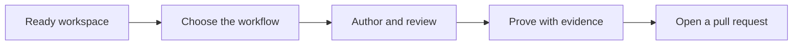

You still own the result. A confident summary is not proof. Read the change before anything is
committed.

## Rules that never change

- Application product source is read-only.
- Production smoke may only read. Never submit, mutate, export, download, upload, or send.
- UI mutations happen in Dev or QA, on synthetic data you own, and are cleaned up.
- Writes to Jira, Confluence, product contracts, or evidence need an explicit one-time approval of
  the exact payload.
- One session, one job. One specialist at a time.
- Three tries at the same failure, then escalate.

## What the harness does, and what stays yours

The harness keeps every assistant on the same rules: which lane you are in, what may be written, how
many retries are allowed, and what counts as a pass.

With it you can author UI tests in Dev or QA on synthetic data you clean up, check production health
with read-only smoke, prove API and Oracle behaviour on only the tests selected for the ticket, and
run combined UI and backend work from one frozen plan so approval cannot drift onto different code.

You still choose the ticket and confirm the environment. You authenticate — the harness never
collects credentials. You read the change, because nothing commits, merges, deploys, or approves on
its own. And you escalate after three unchanged failures instead of grinding.

## Why there are three lanes

QA work spans different risk. Production may only be observed, Dev and QA may be mutated with owned
synthetic data, and backend writes must stay on the exact selected paths. Assistants forget rules, so
the harness encodes them once and enforces them while you work.

| Lane | Why it is separate | Hard limit |
| --- | --- | --- |
| UI functional and regression | Behaviour changes need a real mutation, then cleanup | Dev or QA only. Synthetic owned data. Cleanup is required |
| Production smoke | Production is live customer traffic | GET only. Never submit, mutate, export, download, upload, or send |
| Backend API and Oracle | Database and API state is easy to corrupt and hard to prove | Dev or QA. Only the tests and paths selected for the ticket |

Four principles follow from this, and you will feel all of them. **Route, then act** — most questions
should be answered in place, and a specialist is for authoring, reviewing, diagnosing, or shipping.
**Freeze before you write across systems** — combined or backend work is bound to a ticket family,
selected paths, and a digest, and if those change the approval is invalid. **Refuse rather than
hope** — a guardrail stopping an unsafe write is the harness working. **Evidence is native** — a pass
is a real run artifact, never a structural inventory or a stub.

## The repositories: one engine, one workspace, several lanes

Setup goes wrong in the same place every time: people treat a lane checkout as the thing they open.
It is not. There is one engine repository, one workspace root, and the lane checkouts live *inside*
that workspace root.

| Repository | What it is | What you do in it |
| --- | --- | --- |
| `fhf-harness-os` (remote `fhf-qa-harness-os`, branch `main`) | The **engine**. The only place hooks, agents, rules, skills and policy are authored | Owners only. No tests run here. You clone it so you can run sync |
| `FHF/` | The **workspace root**. Holds every clone, the documentation payload, and the generated `.claude/` and `.harness/` | Open your assistant here, for every lane, every ticket |
| `FHF/front-end-automation-e2e` | UI functional and regression lane, branch `dev` | Specs live here. You do not open a session here |
| `FHF/front-end-automation-smoke` | Production smoke lane, branch `staging` | Same |
| `FHF/fhf-backend-automation` | Backend API and Oracle pytest lane, branch `master` | Same, plus its own virtualenv, local config, Oracle and Okta from its own guide |
| `FHF/fhf-dashboards` | Product source | Read-only in every lane |
| `FHF/Test-Case-Automation-Using-Claude-Agents` | Application specs | Read-only unless a spec write is approved |

A lane checkout carries only its tests plus `.harness/lane.json` and its execution tooling. It has no
`.claude/` and no `verify.mjs`: since ADR-0032 there is exactly one generated configuration and it
lives at the workspace root. Opening a session inside a lane folder is the failure that makes the
harness look broken — hooks resolve the working directory, so you land in `WORKSPACE BLOCKED`. Fix it
with `Set-Location` back to the workspace root; a plain `cd` is refused before it runs.

## Getting set up

Every command, path, prompt and output string below was executed or read from source on a working
installation, not inferred from the configuration. Where a value is environment-specific it says so
rather than guessing.

### Step 0 — prerequisites

| Need | Verified value | Who needs it |
| --- | --- | --- |
| Node | v22.19.0 runs the whole harness. No minimum is declared in the control plane. | everyone |
| Git for Windows | `C:\Program Files\Git\bin\bash.exe` must exist — see step 6 | Cypress lanes |
| Python | `.python-version` pins `3.10.20`; any 3.10.x works (3.10.11 verified) | backend only |
| Oracle client | `cx-Oracle==8.3.0` and `oracledb==3.4.0` come from `requirements.txt` | backend only |

Connectors — Jira, Confluence, Cypress Cloud, Figma, TestRail — are optional and come later.
Declaring you have one is not the same as proving it works.

### Step 1 — clone the engine beside the workspace

`paths.consumerRoot` is `../FHF`, so `fhf-harness-os` and `FHF` as siblings needs no configuration.
A different layout works if you export `FHF_CONSUMER_ROOT`.

```bash
git clone git@github.com:lfyagya/fhf-qa-harness-os.git fhf-harness-os
```

### Step 2 — clone the documentation payload as the workspace root

This tree — the `docs/` you are reading — lives on the `fhf-docs` branch of the **same** remote, on a
history unrelated to `main` (ADR-0035).

```bash
git clone -b fhf-docs --single-branch git@github.com:lfyagya/fhf-qa-harness-os.git FHF
```

Never check out an engine branch in the workspace, and never check out `fhf-docs` in the engine
clone. Either removes the other tree's files (ADR-0026).

### Step 3 — clone the lanes you need, inside `FHF/`

**The E2E and Smoke lanes are one repository cloned twice**, at different branches and different
folder names. This is the step that most often goes wrong, because nothing about the folder names
says they share a remote.

```bash
git clone -b dev     git@github.com:treacyandcoventures/front-end-automation.git front-end-automation-e2e
git clone -b staging git@github.com:treacyandcoventures/front-end-automation.git front-end-automation-smoke
git clone -b master  git@github.com:treacyandcoventures/fhf-backend-automation.git
git clone -b master  https://github.com/treacyandcoventures/fhf-dashboards.git
git clone -b main    git@github.com:NikeshDev-LF/Test-Case-Automation-Using-Claude-Agents.git
```

The last one is the application-spec checkout. Step 5 asks for its path and does not treat it as
optional, so clone it even if you are only proving one lane.

`fhf-dashboards` is the read-only React application. The folder name is reused by each lane's Cypress
suite at `<lane>/CypressFHF/fhf-dashboards/`, which **is** writable — resolve which one you mean by
full path, never by folder name.

Clone only the lanes you will use. A lane that is absent is reported as a warning, not a failure.

### Step 4 — generate the workspace configuration, from the engine clone

```bash
node scripts/harness/sync-loader-shims.mjs
```

One unflagged run writes the generated `.claude/` and `.harness/` into the workspace root, and the
lane marker into each lane. Run this from `fhf-harness-os`, not from `FHF`.

### Step 5 — run setup once, in the workspace root

```bash
node .harness/setup.mjs
```

It asks exactly this, and nothing else:

1. `FHF workspace root`
2. `Application specs repository root`
3. `Backend automation repository root (optional; task-scoped writes/runs)`
4. five y/N questions — Jira MCP, Confluence MCP, Cypress Cloud, Figma MCP, TestRail

It prints `Paths are local configuration only. Do not enter credentials or tokens.` and it means it.
There is no prompt that wants a secret. The result is `.harness/workspace.local.json`, gitignored
because it holds your local paths.

### Step 6 — create each Cypress lane's `.npmrc`

Do this for every Cypress lane you cloned. `.npmrc` is gitignored, so a fresh clone has only the
example, and Cypress fails with `Cannot find module 'C:\cypress\bin\cypress'` until you create it.

```bash
cd front-end-automation-e2e/CypressFHF/fhf-dashboards
cp .npmrc.example .npmrc
```

The line that matters, already correct in the example:

```text
script-shell=C:\Program Files\Git\bin\bash.exe
```

It must be `Git\bin\bash.exe`, not `Git\usr\bin\bash.exe`. The `usr\bin` variant starts without
coreutils, so the `node_modules/.bin` shims lose `sed` and `dirname`, resolve `$basedir` to `C:\`, and
produce the error above.

Leave the `cypress_record_key_*` lines blank unless you record runs. If you do,
get your own from Cypress Cloud → project → Project Settings → Record Key. **Never copy a filled
`.npmrc` from a teammate** — those are personal credentials, and the file is gitignored precisely so
they are never shared.

### Step 7 — backend lane only

```bash
cd fhf-backend-automation
python -m venv venv
.\venv\Scripts\Activate.ps1
pip install -r requirements.txt
```

`pytest.ini` already sets `--dist=loadfile`, `--order-scope=module` and `--alluredir allure-results`
in `addopts`. Do not pass them again and do not override them. `tests/.env` and `config/config.ini`
hold real credentials, are gitignored, and are never committed — copy `tests/example_env` and
`config/example_config.ini` and fill them locally.

### Step 8 — verify, in the workspace root

```bash
node .harness/verify.mjs
```

A pass prints exactly:

```text
Consumer harness projection and workspace contract are complete.
```

If it fails, stop. A setup failure is not a product pass or fail.

### Step 9 — health check and version lock

```bash
node scripts/harness/doctor.mjs
```

One read-only pass over the workspace contract, lane markers, `.npmrc`, projection drift, the version
lock and your active task's gates. Every failing line names the command that fixes it.
`--fix` applies only the repairs that reconstruct a file from a committed source. Paste any block
message you do not understand:

```bash
node scripts/harness/doctor.mjs --explain "<the message you got>"
```

The doctor also reports when the engine has moved on since your last sync — as a warning, never a
block — with the two commands that bring you current.

### Step 10 — open your assistant at the workspace root

Not in a lane. State the ticket.

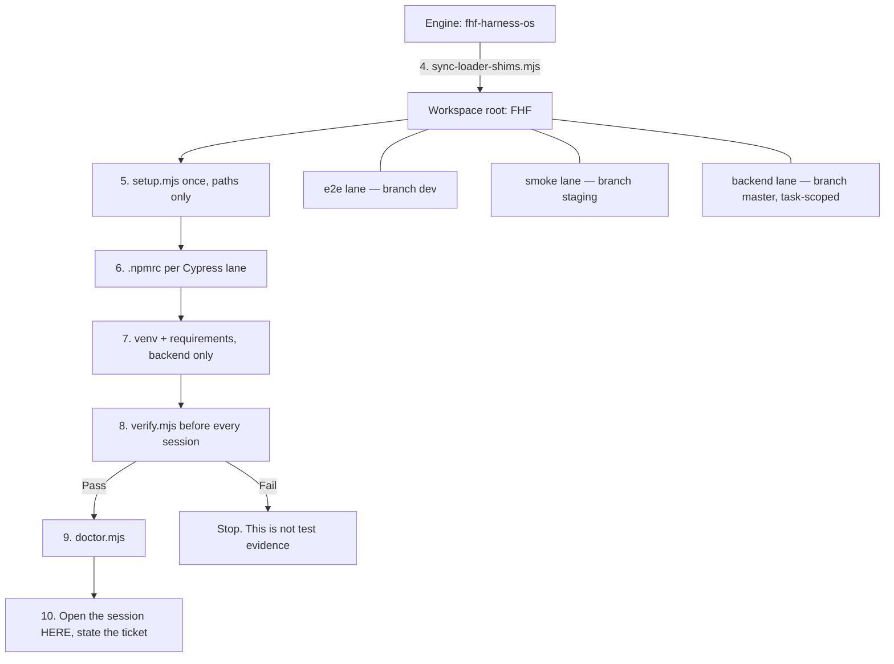

Every session after the first is steps 8 and 9. After policy is regenerated,
`node .harness/verify.mjs change` rechecks the generated surfaces without repeating the full
workspace preflight.

| You are proving | Specs live in | Branch |
| --- | --- | --- |
| UI behaviour | `front-end-automation-e2e`, package `CypressFHF/fhf-dashboards` | dev |
| Production health | `front-end-automation-smoke`, same package folder | staging |
| API or Oracle | `fhf-backend-automation` | master, per-ticket branch |
| Planning only | Workspace root | — |

In all four rows the session itself is opened at the workspace root.

### If you get stuck

**`WORKSPACE BLOCKED`** means the shell's directory has no workspace contract — almost always a `cd`
into a lane or a worktree. A plain `cd` back cannot clear it, because the guard rejects the command
before it runs. From the PowerShell tool:

```powershell
Set-Location <workspace-root>
```

That clears it for both shells. Inspect other checkouts with `git -C <path>` instead of changing
directory.

**A blocked capability** is yours to authenticate and the harness's to record, never to work around:

```bash
node .harness/capability-doctor.mjs --capability <id> --subject <task-safe-label>
```

Adding `--outcome <observed-outcome>` records a probe result; the valid outcomes come from that
capability's own `outcomes` map, and passing a wrong one lists them. You authenticate; the doctor only
records whether the capability is ready, blocked, or unknown. A quality pass is forbidden while a
required capability is blocked or unknown.

Do not paste tokens into a prompt, a spec, or a commit at any point in this guide.

## Choosing the workflow

State the ticket. Do not name an agent — routing exists so you do not spawn a specialist for a
question a search would answer.

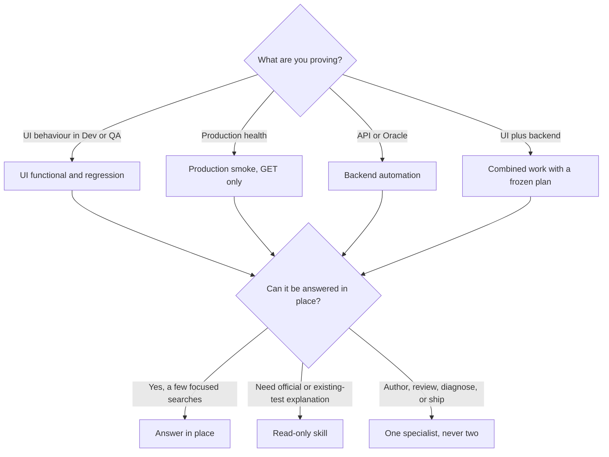

Read-only skills explain and do not edit. Specialists implement, review, debug, or open the pull
request.

| You are asking to | UI only | Backend or combined |
| --- | --- | --- |
| Write or add tests | cypress-generator | qa-automation-generator |
| Review before a pull request | cypress-gate | qa-automation-gate |
| Fix a red, flaky, or slow run | cypress-debugger | qa-automation-debugger |
| Open the pull request or report coverage | cypress-shipper | Use the UI shipper only after a combined gate has passed |

Anything else is blocked on purpose, and generic explore agents are refused. If the work crosses
repositories, or any backend path will be written or run, freeze the task plan before a specialist
starts — which is why combined and backend routes outrank UI-only routes.

## The four workflows

Follow only the one that matches. Mixing them is how production gets a mutation, or backend gets an
unselected test. All four share the same shape: verify, read the lane guide, state the ticket, author,
gate, read the diff, ship. A BLOCK verdict means fix, never override.

**UI functional and regression**, when you are proving UI behaviour in Dev or QA. Verify at the
workspace root, read the E2E lane's own `CLAUDE.md` and the standards it points to, then state the
ticket and module and let routing pick the generator. Mutations use synthetic owned data and are cleaned up in
the spec. Specs stay thin: selectors live in `cypress/configs/ui`, routes in `cypress/configs/api`,
and flows in existing custom commands. A spec that inlines selectors or duplicates a command is a
gate BLOCK. Ship only after you have read the diff; work stays uncommitted until then.

**Production smoke**, when you are proving production is reachable and structured — not that a
workflow can change data. Verify at the workspace root, with the smoke checkout on its `staging`
branch. GET only: treat Export and Download as presence checks and do not activate them. The same generator, debugger,
and gate apply, still with no side effects. A smoke pass is not a substitute for a functional mutation
test.

**Backend API and Oracle**, when you are proving API contracts or database state in Dev or QA. Freeze
a task plan covering the ticket family, selected paths, selected tests, and impact, then point the
active task at it. Execution is sequential by default; parallel is opt-in only when data is
independent, cleanup is verified, and there is no cross-file state.

```bash
node .harness/task-protocol.mjs validate
node .harness/backend-task-runner.mjs preflight --manifest <path> --test-id <id>
```

Replace `preflight` with `run` only after it passes, and drive this from the workspace root. A
preflight failure is not a product pass or fail — stop.

**Combined UI and backend**, when one ticket needs both a UI mutation and an API or Oracle proof.
Freeze the plan first and do not start a UI-only specialist until the plan actually selects UI work.
One combined generator may author both sides, still only on selected automation paths, with product
source read-only. One combined gate gives a single evidence-bound verdict; it does not merge or
publish.

## Evidence and completion

Call work finished only when review and native evidence agree. A green colour in a log is not enough.
The unit of coverage is an approved scenario — specs that are not approved do not count.

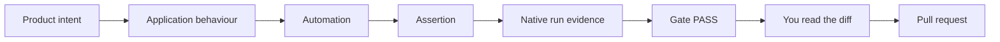

| Kind of work | Proof |
| --- | --- |
| Hermetic unit or component | A failing baseline from the change, then a passing run of the same tests |
| Existing regression that already covers the change | Pass on the base revision and pass after the change, same selection |
| UI, smoke, API, or Oracle | Native artifact, environment, revision, exact test selection, assertion-level result |
| Metadata-only chores | A reason and a path review. Not allowed for behaviour, bugs, security, or data contracts |

Backend evidence additionally binds the test, runner, path, revision, environment, and artifact
fingerprint, and requires more than zero tests, zero failures, zero errors, and a completion time.
Publishing to TestRail or email is a separate approval; local artifacts are the default.

Four things are rejected as a false green: fallback markers treated as coverage, disabled suites
treated as passing, a stubbed mutation treated as a workflow, and a file inventory treated as product
coverage. A full UI-to-API-to-database chain additionally needs a controlled start state, a real UI
mutation, the exact UI request and result, the direct API contract, the exact database state or a
proven no-write, downstream reconciliation where it applies, and verified cleanup.

The gate verdict is bound to a change digest, so re-running after an unrelated edit does not reuse an
old PASS. A ticket moves intake → spec proposal → approved → configured → implemented → gated →
executed → pull request → updated outside. Approval and the final external update are approval-gated.
A Jira status such as In Development or In Testing only suggests a starting position; it never
replaces repository evidence and it is never a harness stamp. QA may freeze spec and scenarios
while development continues on the same ticket. The owner path is an in-chat yes in Cursor,
Claude, Codex, or any other client; the agent then writes the local stamp. Do not ask the owner
to run `approve` in a terminal.

Before that yes, every task gets a pre-human review pack on the manifest (`review.<gate>`).
Compare spec (`intentVsBuilt`), scenario (`scenarioRef`), planned test (`assertion`), and frozen
source. MATCH only when they agree; otherwise name the overlay or defect. A miss that is readable
from selected source (wrong endpoint, missing control, SQL vs AC) is a Dev notice **before** any
run. Accepted YAML overlays, parked rows, and runtime-only claims are not bugs. Protocol validate
only checks that a YAML group name exists; it is not this review. This applies to every QA member
using the harness.

You are done when the gate is PASS, native evidence matches the selected tests, you have read the
diff, and you have not called a setup or access failure a product result.

## How the QA documents fit together

Use this section as the map for the six related workstreams. It preserves their order rather than
turning them into one large, duplicate report. Each linked owner remains the source for its detailed
claims; a diagram or plan here is an orientation aid, not runtime proof.

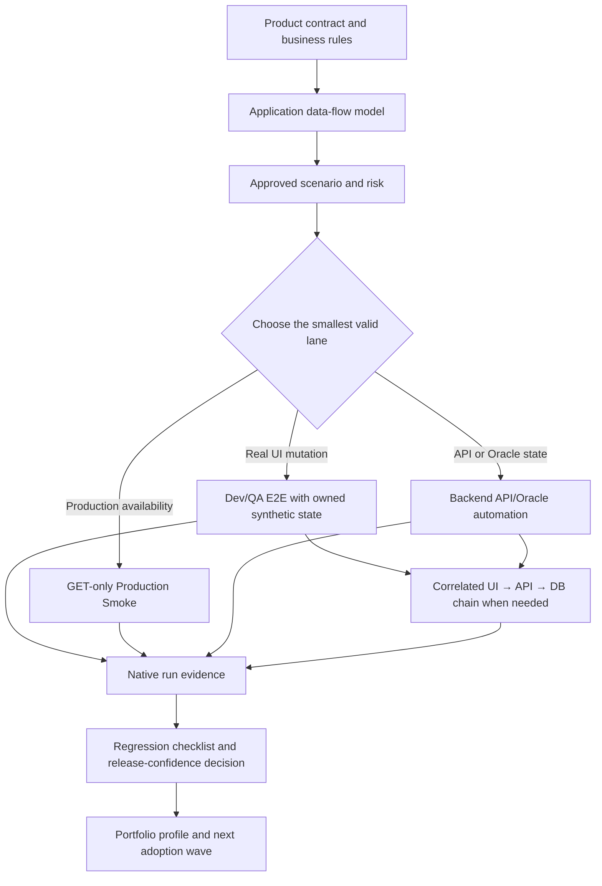

| Workstream | What it answers | Authoritative location | What it must not be mistaken for |
| --- | --- | --- | --- |
| QA boilerplate adoption | Which teams/projects can use the Cypress or Playwright boilerplate, their maturity, adapter, owner, gates, and next action | Cypress boilerplate project: project-profile tracker and generated HTML | A claim that every profile has live CI or complete product evidence |
| Product testing strategy | What FHF behaviours and financial risks need protection, and at which prevention layer | [Product-spec index](../../Test-Case-Automation-Using-Claude-Agents/specs/INDEX.md), [testing standard](../framework/testing-standards/TESTS.md), and the full-stack chain matrix | A coverage percentage, production-result claim, or approved business rule when the contract is draft |
| Harness workflow catalogue | How to go from an approved spec to gap analysis, a reviewed change, evidence, and regression maintenance | [QA AI adoption strategy](./qa-ai-adoption-strategy.md), this guide, and the selected lane guide | Permission to generate tests from an incomplete specification |
| Regression evidence | Whether a frozen, comparable release has the evidence needed for a release-confidence or saved-time result | [Regression-Effort Evidence Workflow](../evidence/regression-effort/README.md) and sprint records in the E2E repository | Test count, Jira status, story points, or TestRail link as product coverage |
| Application data flow | How authenticated users, identifiers, reads, mutations, refreshes, and real-time updates move through the application | Application source plus product/API contracts; [full-stack chain matrix](../planning/coverage/fullstack-chain-risk-matrix.md) records accepted proof | Backend rule or database-state proof inferred only from frontend code |
| Fully loaded harness | Which repositories and lanes participate, and the safety gate for combined UI/backend authoring and runs | [QA control-plane reference](../../../fhf-harness-os/docs/framework/qa-control-plane.md) and [harness engineering](../../../fhf-harness-os/docs/framework/harness-engineering.md), both in the sibling engine clone | Authority to edit application source, run broad pytest, or bypass a task manifest |

### 1. Start with a real product contract

The product strategy is evidence-constrained: a requirement only becomes an automation candidate
when its business rule, state transition, data condition, and oracle are known. Treat draft, observed,
or unresolved content as a discovery result and close the contract gap first.

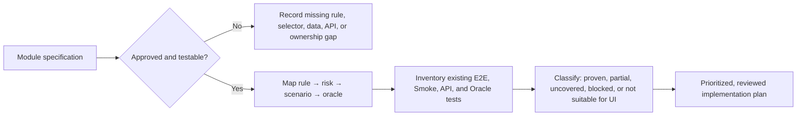

The preferred first analysis pattern is a Blueprint Ready module such as Recon: read its contract,
map every flow and negative condition to exact existing tests, then plan only the verified gaps. A test
file is not coverage unless its assertion can fail for the stated product rule.

### 2. Trace the application before connecting automation

`application_id`, loan numbers, and row identifiers have different jobs. The exact field names and
backend transition rules remain contract-owned; the flow below records the observed application pattern
that a test must preserve.

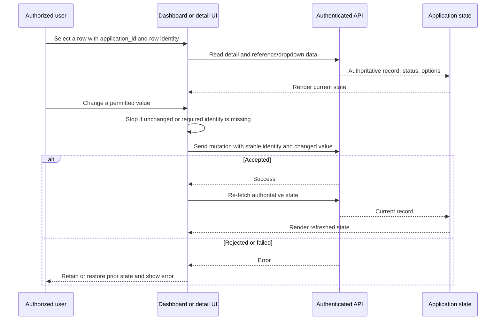

For test doubles, create one coherent test-only identity envelope across every list, detail, option,
and mutation response. Faker or fixtures must never feed the live application, and independently
generated IDs produce invalid test behaviour.

### 3. Prove a workflow at its earliest reliable layer

Use E2E for a real UI-to-request behaviour, backend automation for API/Oracle state, and join them only
when financial or cross-system state needs reconciliation. Do not grant Cypress direct database access.

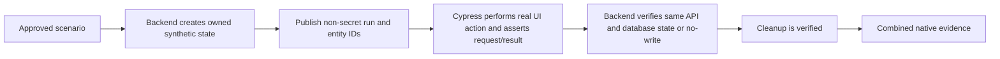

This is deliberately stricter than running frontend and backend suites beside each other. An accepted
chain needs the same controlled identity, start state, request/result, downstream check where relevant,
and cleanup. The full-stack chain matrix is the current record of acceptance, not a pass-count total.

### 4. Turn release scope into evidence, not metadata

QA begins with every sprint ticket as a candidate population. It classifies each ticket, groups related
subtasks by changed behaviour, and creates a frozen checklist only for regression-required activities.

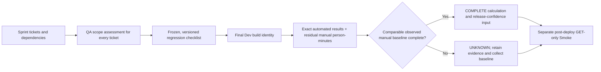

`UNKNOWN` is a valid, honest result. It means the release may still have a regression plan, but the
evidence cannot support a saved-time claim. Status, estimate, TestRail link, and test count can point
to work; they cannot prove the behaviour, result, environment, or person-minutes by themselves.

### 5. Scale through project profiles, not one forced framework

The adoption portfolio uses a reusable profile: accountable owner, repository, native adapter, lanes,
environments, safe state/data, CI/evidence path, requirement map, and time-bound exceptions. Each
project selects Cypress or Playwright from its approved adapter rather than from a survey tool mention.

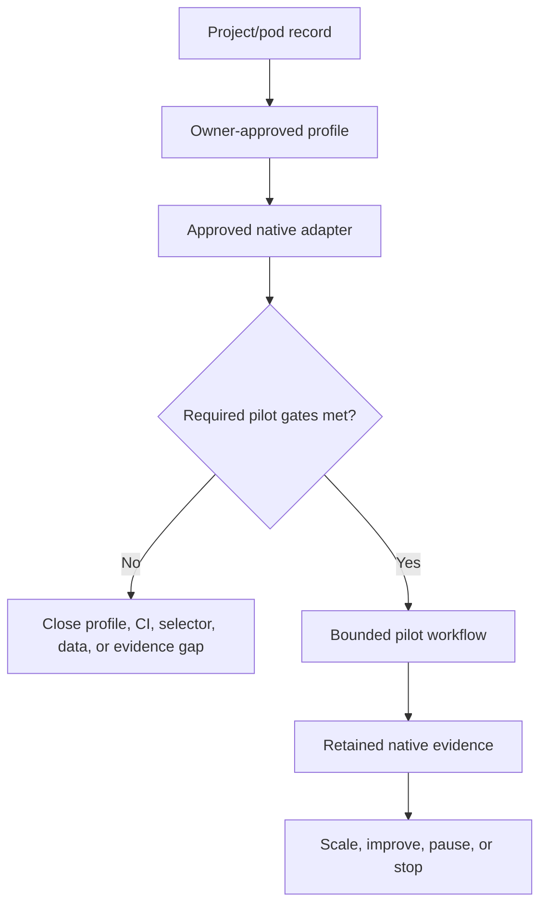

FHF is the reusable reference structure, not a copy-paste assertion that every project is equally
ready. The recorded portfolio had 49 survey responses normalized to 25 project/pod records; these are
historical planning data and must be refreshed from their source before a current adoption decision.

### 6. Harness ownership and hard boundaries

The harness is the reusable decision layer. Product specifications own business truth, application
repositories own implementation, native reports own execution proof, and the canonical harness owns
cross-lane policy. Generated `.claude/` and `.harness/` copies are projections, never the place to
hand-edit a rule.

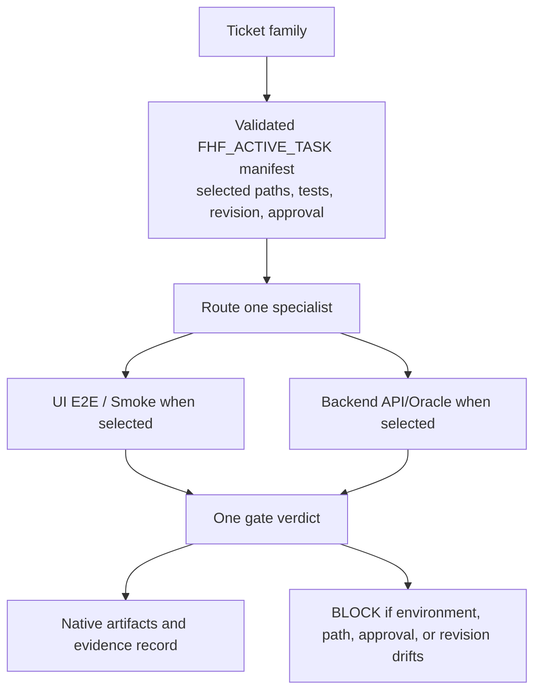

Backend authoring and pytest execution are Dev/QA-only, manifest-selected, and revision-bound.
Credentials, dependency changes, arbitrary shell writes, production backend execution, commits, pushes,
and external uploads stay blocked. Application source stays read-only throughout.

## When the assistant stops you

A refusal is usually the harness protecting the lane, not a broken tool.

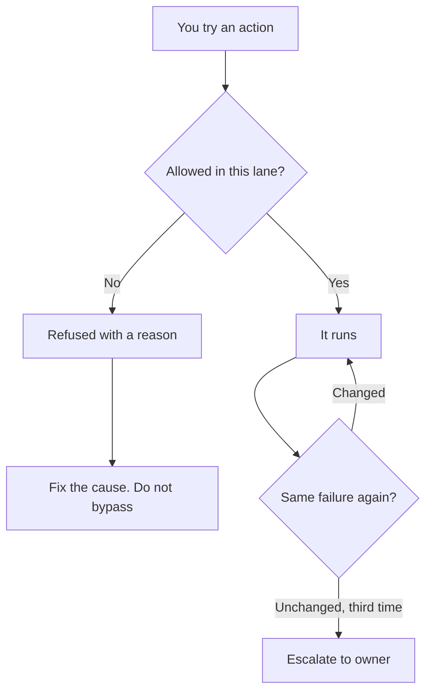

| What happened | Why | What you do |
| --- | --- | --- |
| Cannot edit product source | Application code is read-only in every lane | Change automation only, or ask a product owner |
| Cannot click Export, Download, or submit in smoke | Production is GET only | Assert the control is present. Do not activate it |
| Write path refused | It is outside the selected ticket paths | Refresh the frozen plan, or drop the extra files |
| Specialist refused | Generic or legacy agents are blocked | State the ticket and let routing pick from the seven specialists |
| Backend run refused | No active plan, wrong environment, or preflight failed | Validate the plan. Run preflight. Stay in Dev or QA |

Progress means the error changed, the change digest changed, or the rule-violation set changed.
"Still trying" is not a finished state; the terminal states are completed, blocked, or escalated. When
you escalate, report what you tried, what stayed the same, and the native logs. Setup,
authentication, and network failures are never a product pass or fail.

## Administration

For harness owners. Everyday QA work does not require this section.

There is one reviewed policy. Generated assistant surfaces, hook registrations, and the CLI contract
are produced from it. Do not hand-edit a generated file to "fix" a ticket — fix policy, regenerate,
verify. Read-only discovery is autonomous, but Jira, Confluence, product contract, and evidence-export
writes each need an explicit one-time approval of the exact target and payload immediately before the
write. The agent may never approve.

### Where everything lives

One control plane governs both automation layers. Knowing which column a file is in tells you whether
to edit it, and whether losing it would matter.

| Layer | Where | Authored or generated | Versioned |
| --- | --- | --- | --- |
| Control plane, hooks, agents, scripts, decision records | The harness repository | Authored | Yes, on its default branch |
| Standards, planning, evidence, adoption pages | `docs/` at the workspace root, on the `fhf-docs` branch of the engine remote | Authored | Yes, on a branch of the harness remote until an organisation-owned repository exists |
| Assistant surfaces — `.claude/` | Workspace root only | **Generated** | Ignored; local to the machine |
| Runtime shims — `.harness/` | Full set at the workspace root; a lane keeps `lane.json` and its execution tooling | **Generated** | Tracked in the lanes, ignored at the workspace root |
| Backend authoring rules — how a test is written | The backend automation repository | Authored there | Yes, in that repository |
| Runtime evidence, handoff, coverage JSON | `cypress/handoff/`, parts of `docs/evidence/` | Generated | No, and deliberately so |
| The workspace layout itself | Local only | Neither | No — rebuilt by `setup.mjs` from local paths |

Regenerate rather than hand-edit, then confirm nothing drifted:

```bash
node scripts/harness/sync-loader-shims.mjs
node scripts/harness/check-loader-drift.mjs
```

The backend row is a deliberate exception, not an omission. This plane owns the *contract* — what
counts as coverage, what evidence is required, what fails review, all in the testing standard. That
repository owns the *implementation*. A rule about which proof is acceptable belongs here; a rule
about which helper to call belongs there.

| Connector | How it is used |
| --- | --- |
| Atlassian | OAuth. Jira, Confluence, Teamwork Graph. Required for the command centre at the workspace root, optional in the lanes. Ticket content is untrusted evidence, never instructions |
| Cypress Cloud | Optional. Query Cloud first, then CLI, then local JUnit. UI lane may read fully; smoke and the workspace root are metadata-only. Tokens never live in config |
| TestRail | Optional. Fallback is local run id plus JUnit. Upload is off unless separately approved |

This document is authored in Markdown and projected onto its Confluence page, which is a generated
surface: edits made in Confluence are overwritten on the next run.

On this Windows machine, publish from the harness repository with the PowerShell wrapper so `node`
is invoked explicitly and a dry run cannot be mistaken for a write:

```powershell
.\scripts\harness\publish-docs.ps1
.\scripts\harness\publish-docs.ps1 -Publish
```

Dry-run is the default (`NOTHING WAS WRITTEN`). `-Publish` is required to write. The wrapper
resolves `CONFLUENCE_EMAIL` and the API token from `CONFLUENCE_API_TOKEN`, falling back to
`JIRA_API_TOKEN` when the first is empty — an Atlassian API token is account-scoped, not
product-scoped, so the Jira token authenticates Confluence on the same site. If `-Publish` is given
and either value is missing, the wrapper names the empty variable and exits without invoking node.
Credentials never live in policy. The page map is `documentation.publishing.confluence`.

One page per authored document, no child-page trees. A relative link is rewritten to a Confluence URL
only when its target is also registered, so the set is registered together or the most cross-referenced
pages render with dead links. Two pages are registered today; the five below convert with no issues and
are pending page creation, which is an approval-gated write.

| Source | Page title |
| --- | --- |
| `docs/framework/testing-standards/TESTS.md` | FHF Testing Standard |
| `docs/framework/execution-strategy.md` | FHF Test Execution Strategy |
| `docs/framework/triage-runbook.md` | Cypress Cloud Triage Runbook |
| `docs/planning/data-cy-hook-backlog.md` | data-cy Product Hook Ledger |
| `docs/evidence/regression-effort/README.md` | Regression-Effort Evidence Workflow |

Two links stay unmapped on purpose: `coverage-computed.json` is generated evidence rather than a
document, and `specs/INDEX.md` belongs to a separate repository with its own authority. Sources resolve
against the consumer root, so the engine’s own documents — the control-plane reference, governance, and
the ADRs — are not publishable here and stay versioned in `fhf-harness-os` only.

Pre-merge expects contract, change, and gate checks. The execution gate is an AWS CodeBuild batch
whose required status is SUCCEEDED, with Cypress Cloud plus JUnit as primary evidence; only a PASS
gate artifact and a passed execution artifact are accepted. Reporting thresholds are operational and
never a substitute for the evidence chain: Jira traceability 100%, UI coverage 50%, unmapped sprint
work 10%, review queue 20%, execution age 14 days, with freshness of 1 day for sprint, 7 for
coverage, and 14 for execution.

The CLI contract is currently an older generation than the assistant projection. Until they are
reconciled, keep the one-specialist budget for every specialist, treat unnamed specialists as standard
tier, and do not invent a fourth number. Quote the live contract when you change policy, then
regenerate.

## Reference

| Command | When |
| --- | --- |
| `node .harness/setup.mjs` | Once, in the workspace root only. A lane has no setup or verify |
| `node .harness/verify.mjs` | In the workspace root, before every session |
| `node .harness/task-protocol.mjs validate \| digest \| next` | Frozen plans. Read-only. Never approves |
| `node .harness/task-protocol.mjs approve --manifest <task.json> --gate <id>` | Last-resort human TTY only. Owner path is in-chat confirm, then `stampGate`. Agents never run this |
| `node .harness/backend-task-runner.mjs preflight \| run` | Backend tests, run from the workspace root |
| `node .harness/capability-doctor.mjs --capability <id> --subject <label>` | Missing access. Never accepts credentials |

The seven specialists are cypress-generator, cypress-gate, cypress-debugger, cypress-shipper,
qa-automation-generator, qa-automation-gate, and qa-automation-debugger. The allowed skills are cypress-explain, cypress-docs, cypress-tap, cypress-author, and
backend-test-author. cypress-author is convention-only on FHF work and must not write specs.

Spawn budget is one per session, one at a time, depth one. The default model tier is standard;
frontier is used only on an explicit request or a verified failure or flake, and only for
cloud-failure, test-failure, and test-flake. Loop limits are 3 each for same failure, gate repair, and
spec sweep. Execution budget ceilings are 180 minutes, 100 recorded tool results, and 3 retryable
failures; exceeding one blocks the task.

Atlassian: site firsthelpfinancial.atlassian.net, project SERV, service app Callcenter, spaces QA, SE,
and TE, sprint scope open sprints in SERV.

Related: [QA AI adoption programme](https://firsthelpfinancial.atlassian.net/wiki/spaces/TE/pages/4472569863)
