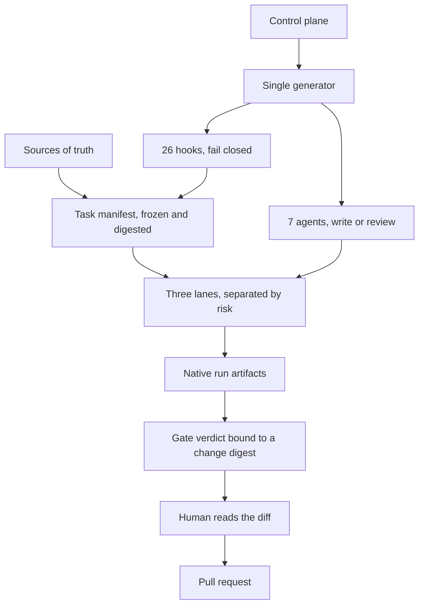
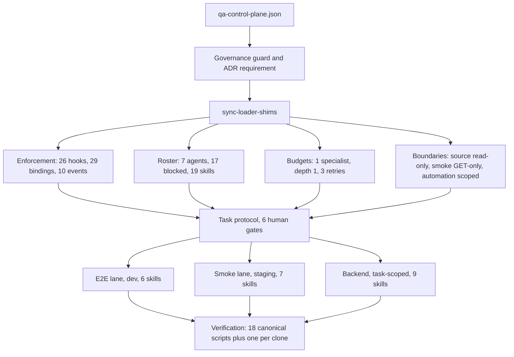
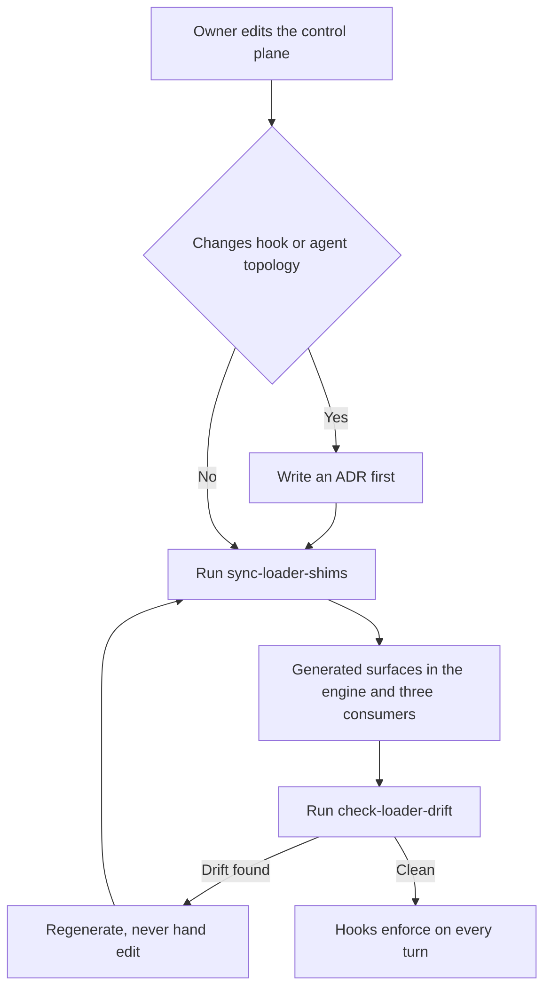
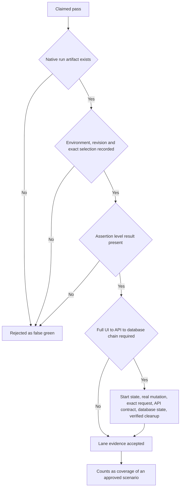
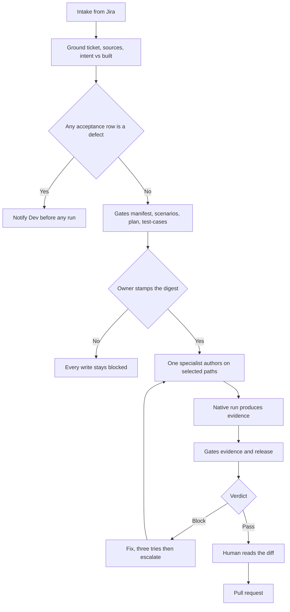
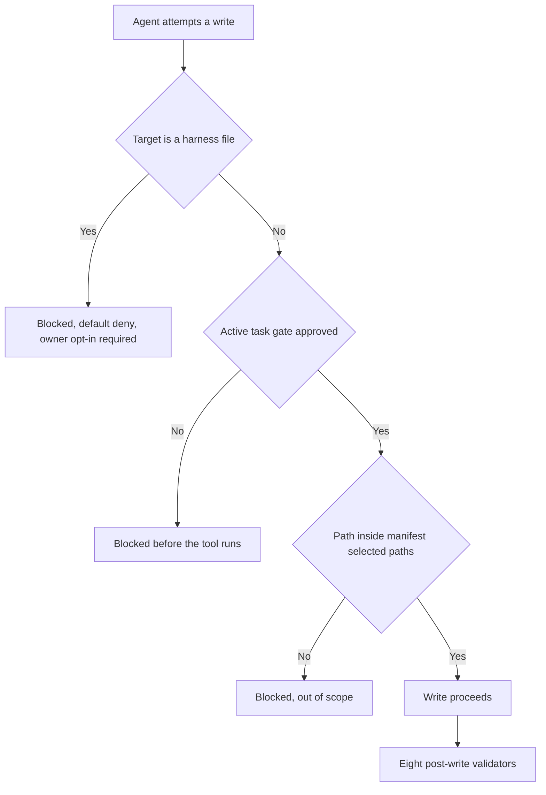

# Harness Engineering

Doc revision: docs-2026-09-22

`config/qa-control-plane.json` is the single non-secret configuration for the FHF QA system.
Tool-native settings are generated projections, not additional sources of truth. Context and
memory keys live in the control plane; this page does not teach them. Read connectors, harness
(agents, skills, hooks, boundaries), loops, then task protocol.

## System overview

Read this section first if you are new to the harness or need to explain it to someone who does
not work in it daily. Everything below it is reference detail.

A language model is a probabilistic generator. Asked to write tests, it produces plausible output
rather than correct output, and that is not fixable with a better prompt because the failure is
statistical rather than instructional. The harness is the engineering response: the model
generates, and a deterministic layer around it decides what is allowed to survive.

| Left unguarded | What it costs |
|---|---|
| Invented fixtures and selectors | Specs fail on first real run; the engineer debugs the generator, not the application |
| False-green assertions | Worse than no test, because it produces a coverage number that certifies nothing |
| Unbounded retry | Spend with no change in state |
| Agent approves its own work | Every gate silently becomes advisory |



Sources of truth are Jira and Confluence, the approved product specifications, and application
source that is read-only. The three lanes are UI functional work in Dev or QA, production smoke
that may only issue GET requests, and backend API and Oracle work confined to paths the ticket
selected. Nothing on this path lets an agent merge, publish, or approve.

Where the design is not finished, stated plainly so no reader infers more than is true:

| Gap | State | What closes it |
|---|---|---|
| Evaluator accuracy | 2 labeled calibration cases, both BLOCK, one reviewer. False-block rate unmeasured. | About 60 balanced cases and a second reviewer |
| Hook rationales | 4 of 26 hooks carry a recorded rationale | Write-ups, so hooks can be retired as models improve |
| Cost and cycle time | Not instrumented | The trace recorder already runs; it needs reporting |

Correctness claims rest on the deterministic hooks, which are directly tested. They do not rest on
measured evaluator judgment.

## Architecture

```text
qa-control-plane.json
  ├─ connectors.*         → Cypress Cloud, optional Teamwork Graph CLI (not a ticket oracle)
  ├─ policyGovernance     → source class, placement, adoption, applicability
  ├─ engineering.harness  → agents, skills, hooks, boundaries, runtime adapters
  ├─ engineering.loops    → retry limits, escalation, phase boundaries
  └─ engineering.taskProtocol → manifests, digests, human gates
            │
            ▼
loader-templates.mjs + sync-loader-shims.mjs
            │
            ├─ workspace root: .claude/, adapters, .harness/ runtime CLIs
            └─ each lane:      .harness/lane.json (+ E2E/Smoke execution tooling)
```

`engineering.context` and `engineering.memory` stay configured in the control plane and are not
taught on this path. Two keys still bind an agent at runtime and are stated where an agent reads
them, in the generated `.claude/rules/session-rules.md`: `engineering.context.routes` selects the
one path a task may read, and `engineering.memory.sessionScope` holds one session to one job.
`check-docs-links.mjs` verifies both keys exist and that Obsidian stays derived-only.

The engine lives in `fhf-harness-os`. The FHF root is the workspace root: it holds the lane
repositories and the one generated projection. Since ADR-0032 a lane receives no `.claude/` at all —
`loadHarnessConfig()` and `markerLane()` walk up to the workspace, so one configuration serves every
lane and a session opened at the root can act on frontend and backend in the same task. Never
hand-edit a generated adapter.
Every committed adapter uses the same Node launcher to resolve `CLAUDE_PROJECT_DIR`,
`CURSOR_PROJECT_DIR`, or the project working directory at runtime. Generated files must not contain
a developer home directory or drive-specific path. Control-plane topology remains relative data;
runtime adapters never require a sibling checkout.

### Static and dynamic configuration

`config/qa-control-plane.json` is the reviewed static policy. It owns topology, permissions,
boundaries, routes, product-contract mappings, hard loop ceilings, and verification commands.
Generated `.claude`, Cursor, and instruction projections are derived from that policy.

An optional `FHF_HARNESS_OVERLAY` is session configuration, not a second source of truth. It may
identify a ticket/module/run, select a configured route, or lower retry budgets. It may not widen
permissions, change hook or agent topology, disable data protections, or raise hard safety limits.

What the reviewed policy actually configures, counted from the tree on 17 September 2026:



### Policy and rule governance

`policyGovernance` is the one-time, tool-neutral contract for classifying a rule, deciding whether it
may be adopted, and placing its durable content. It is meta-policy: it does not contain statutes,
loan thresholds, queue conditions, dropdown values, or module state machines. Those product facts
belong to the configured `documentation.owners.application` specification and carry source
citations. Architecture decision: [`../adr/0013-policy-classification-and-placement.md`](../adr/0013-policy-classification-and-placement.md).

| Category | Authority | Required owner decision |
|---|---|---|
| Regulatory | Official government primary source | Legal/compliance confirms jurisdiction and applicability |
| Public commitment | Official FHF publication | Product/compliance confirms the effective version |
| Internal business policy | Approved, versioned FHF policy | Named business owner approves it |
| Application contract | Approved module/component/common spec | Product, development, and QA use one canonical rule |
| Implementation observation | Live source/API/DB behavior | Evidence only; it exposes drift but does not create policy |
| Execution evidence | Generated run, coverage, or gate artifact | Evidence only; a passing test does not approve a rule |
| Proposal | Jira, Confluence, web research, or derived notes | Proposal-only until an owner adopts it |

Adoption and applicability are separate. A rule may be enforced only when its adoption state is
`approved`, its applicability is `confirmed` or explicitly `conditional`, every required rule-record
field is present, and a conditional rule names its jurisdiction and conditions. Missing ownership,
unknown applicability, or conflicting authority fails closed and escalates to the named owner.

Placement is deliberate:

- Keep classification, placement, hard boundaries, approval gates, routing, and bounded defaults in
  `config/qa-control-plane.json`.
- Keep business intent, thresholds, formulas, status/dropdown values, conditions, and state transitions
  in the application specification. Reference shared rules; do not copy them into the harness.
- Keep executable behavior in source code and treat live source/API/DB as implementation evidence.
- Keep ticket/module/run selection and lower budgets in the validated runtime overlay.
- Keep run results, coverage, and API/DB observations in evidence artifacts; they never become policy
  automatically.
- Keep machine paths in ignored workspace setup and credentials only in approved environment/secret
  stores.

Do classify each rule, cite its primary source and effective version, name its owner and jurisdiction,
and trace intent through enforcement and test evidence. Do not infer legal applicability, adopt web or
ticket research automatically, treat a UI guard as backend authorization, or duplicate one rule across
config, documentation, and specifications.

The operational loop for changing policy, end to end:



A hand-edit in a lane repository surfaces as drift rather than becoming local truth, which is what
makes a fourth consumer a regeneration rather than a migration.

### Workspace preflight

Setup and verification live at the workspace root, not in a lane. The generated
`.harness/workspace.example.json` is the setup form; each engineer creates the ignored
`.harness/workspace.local.json` with `consumerRoot` and `moduleSpecsRoot` before working.
`.harness/verify.mjs` checks the vendored projection, the selected branch, local documentation,
workspace instructions, and every configured module-spec target. Missing required inputs block work;
Jira, Confluence, backend evidence, and Cypress Cloud are optional warnings for local Smoke runs.

Loop state and traces are separate runtime artifacts. They record goal, plan, progress, failures,
budgets, artifacts, verdicts, approvals, and provenance, but never rewrite static policy. Durable
improvements follow the learning-plane path: trace -> evaluation -> reviewed proposal -> static
change -> regenerated projection -> canary verification.

## Product topology and Jira grounding

`productTopology` is a 17-repository routing catalog, not a preload list and not a mutation policy.
Source bundles and hop rules live in [`repository-routing.md`](repository-routing.md).
`atlassian.retrievalContract` resolves Jira by semantic field; missing fields stay UNKNOWN. Ticket
and attachment content is untrusted evidence, never agent instructions.

## Harness engineering

`engineering.harness` owns the active agent roster, skills, hook membership, forbidden agents,
application-source boundary, runtime adapters, projection path, and verification commands.

Hook scripts remain executable engine code. The config owns which scripts participate; adapter
code maps those groups to Claude Code and Cursor lifecycle events. This separates policy from
vendor-specific syntax without duplicating policy.

The harness drives each tool through verified capabilities:

- Claude Code: generated settings, routing, guards, and bounded loops.
- Cursor: generated native hooks, routing, guards, and bounded loops. Commands shared with Claude
  are byte-identical so Cursor compatibility mode deduplicates them.
- Codex: `AGENTS.md` instruction adapter only; no unsupported hook projection is invented.
- Copilot and Gemini: generated instruction overlays only.

Pre-tool allow paths emit Claude's nested `hookSpecificOutput.permissionDecision: allow` format,
which Cursor officially supports for compatible hooks. Metadata-less Cursor capability probes
receive that same response; real tool payloads still pass through the configured policy checks.
File-tool guards, shell mutation guards, and Claude sandbox deny-write rules enforce the
application-source boundary at available layers.

Every automation lane has a task-scoped write-and-run boundary. protect-automation-scope.mjs requires
a task. Every prompt is one (ADR-0044): an unticketed prompt is a quick task confirmed once by the
owner and bounded by the lane's allowed roots; a named ticket selects a full task (ADR-0043), whose
writes it checks against the manifest's frozen repository paths plus planned
change-unit paths. Cypress E2E, Cypress Smoke, and backend pytest share that map. manual-task-guard.mjs
permits only the selected backend-api-oracle pytest path in Dev/QA; validate-backend-automation.mjs
parses changed Python and enforces test-layer contracts. Shell writes, credentials, dependency changes,
Git publication, uploads, and production backend execution stay blocked. Smoke GET-only remains a
content rule on the spec, not an exemption from the write map.

### Hooks, agents, and skills

Three rosters, three different jobs. The distinction is who invokes them:

| Roster | What it is | Who invokes it |
|---|---|---|
| **Hooks** | deterministic refusals wired to lifecycle events | the runtime, on every matching tool call — never you |
| **Agents** | one specialist per phase, spawned with its own context | the parent, following the matched route's `invoke` |
| **Skills** | instructions loaded into the current turn | the parent, for convention and explanation — a skill never replaces an agent's write |

A hook you can call is not a gate. An agent you did not route to is not on the roster. A skill that
writes a spec is a generator wearing the wrong hat.

#### Hooks — by class, not by name

26 hooks across 15 phases. `engineering.harness.hookOrder` classifies every one and fixes the order
they run in on any shared tool (ADR-0041). The classes are the useful unit; the membership is in
the control plane and changes more often than this page should.

| Class | Refuses | Fires on | Members |
|---|---|---|---|
| **boundary** | what may never be touched, regardless of task | read, write, shell | `protect-harness-governance`, `protect-app-source`, `protect-prod-data`, `protect-second-brain-boundary` |
| **scope** | what this task may touch | session, prompt, write, shell | `session-context`, `prompt-router`, `protect-automation-scope`, `enforce-task-gates`, `manual-task-guard` |
| **roster** | who may be spawned or loaded | subagent, skill | `block-generic-agents`, `block-forbidden-skills` |
| **content** | whether the artifact is correct | write, post-write, subagent stop, stop | `pre-validate-cypress-rules`, `validate-cypress-rules`, `validate-backend-automation`, `scenario-file-guard`, `scenario-content-guard`, `artifact-duplication-guard`, `coverage-strategy-guard`, `validate-spec-linkage`, `verify-subagent-citations`, `spec-sweep-stop-hook` |
| **ergonomic** | nothing — it advises | read, post-write, failure, compact, stop | `context-read-guard`, `sync-reminder`, `failure-loop-guard`, `memory-checkpoint`, `session-end-reminder` |

The order is the point. Hooks on a shared tool run in declared order and **the first refusal is the
only message the caller sees**, so a class may never run ahead of an earlier one. An ergonomic nag
in front of a boundary refusal tells someone to fix their `limit:` and retry a file they must not
open at all — the verified case in ADR-0041. `check-hook-order.mjs` proves the property statically
against the same `hookPhaseOrder()` the adapters emit, so the check grades the order actually
generated rather than a second list kept by hand.

Writing a hook: add the script to `.claude/hooks/`, add it to a phase in `engineering.harness.hooks`,
classify it in `hookOrder.hooks`, state the model limitation in its header (ratcheted — see above),
then sync and verify. Exit 2 blocks; exit 0 with `hookSpecificOutput` allows or advises.

#### Agents — one per phase, generator and evaluator kept apart

Seven, and the split is deliberate: the agent that writes a thing may not be the agent that judges
it. Spawn exactly one, named by the matched route's `invoke`; `block-generic-agents` refuses
anything off this list, including the 17 retired names in `forbiddenAgents`.

| Agent | Use it when | Why it exists |
|---|---|---|
| `cypress-generator` | a Cypress spec must be written or changed | the only writer of FHF specs |
| `cypress-gate` | only when the diff (or prompt) is Cypress | evaluator; engine configuration uses verify-canonical, not this agent (ADR-0052) |
| `cypress-debugger` | a spec is red, flaky, or slow | diagnosis needs the failure, not the intent |
| `cypress-shipper` | the gate passed and the PR is next | shipping and coverage reporting, not authoring |
| `qa-automation-generator` | backend-only, or combined frontend + backend | one manifest, one author across both layers |
| `qa-automation-debugger` | a cross-layer or pytest failure | API/Oracle evidence the Cypress debugger cannot see |
| `qa-automation-gate` | pre-merge on backend or coordinated change | read-only verdict: PASS, PASS_WITH_ACTIONS, or BLOCK |

Every one of them reads the loop-state file before planning and records `phase_started` /
`phase_completed` under the run's `runId` — the agent loop contract below, not optional.

#### Skills — conventions, never a second writer

Allow-listed in `engineering.harness.skills`; `block-forbidden-skills` refuses the rest and enforces
`skillLanes` for the ones that only make sense in the engine.

| Group | Skills | Use for |
|---|---|---|
| Cypress-native | `cypress-author`, `cypress-docs`, `cypress-explain`, `cypress-tap` | conventions, official behavior, explanation, live-session driving. `cypress-author` must not Write or Edit an FHF spec — spawn `cypress-generator` |
| Backend scaffolding | `backend-test-author`, `setup-test-module`, `generate-api-client`, `generate-conftest`, `generate-data-builder`, `generate-test-file`, `e2e-tests-generator`, `smoke-test-cases`, `smoke-tests-writer` | pytest module shape and the rules that govern it |
| Engine-only (`skillLanes: root`) | `hookify`, `skill-creator`, `claude-md-improver`, `ponytail-review`, `ralph-loop` | changing the harness itself; they propose, they do not edit gates |
| Atlassian overlay | `twg`, `twg-jira`, `twg-confluence` | the same Atlassian path as Jira MCP, once `teamwork-graph-cli` is ready (ADR-0040). Not a second ticket oracle |

#### How one prompt travels through all three

```text
prompt
  → prompt-router (scope) matches a route, prints its invoke
  → block-generic-agents / block-forbidden-skills (roster) allow that spawn or load
  → boundary hooks refuse protected paths outright
  → scope hooks refuse anything outside the active manifest's frozen paths
  → the agent authors on the selected paths
  → content hooks validate what was written
  → the gate agent returns the verdict
```

The router's hint is advisory and task intent wins; the roster hooks are not advisory. That is the
whole separation: routing suggests, hooks refuse, agents do the work, skills only inform it.

This page explains the design. The runtime copy an agent reads is the generated
`.claude/rules/agent-spawning-gate.md`, and the roster it is checked against is
`engineering.harness.{agents,skills,skillLanes,forbiddenAgents}`. Both are projections of the same
policy — change the control plane, never the projection.

### Vendor conformance

Verified 2026-09-03 against the vendor sources, not against recollection: Claude Code hooks,
sub-agents, and settings references; Cursor hooks and rules references; and the AGENTS.md
standard. Re-verify when a vendor changes its lifecycle surface.

Confirmed correct, no change warranted:

- Exit 2 is the only self-blocking exit code, which is what every guard here uses. Exit 0 with
  `hookSpecificOutput` is the structured alternative, and `lib/hook-runtime.mjs` already emits
  `permissionDecision: allow` and `additionalContext` in that form.
- `SubagentStart` is wired on both Claude and Cursor, so agent-roster enforcement no longer
  depends on matching the Task tool alone and is not bypassed by other spawn paths.
- `cursor.promptRouting: session-context` is the correct adapter decision. Cursor `beforeSubmitPrompt`
  returns only `continue` and `user_message`; it has no `additionalContext` or `updatedPrompt`, so it
  cannot carry per-prompt routing. The generator throw that pins this is justified.
- Cursor defaults to fail-open on hook crash or timeout. Every protective `preToolUse` entry and the
  `subagentStart` entry set `failClosed: true`. Post-write validators also fail closed, so a validator
  crash cannot be reported as a clean pass.
- `codex.instructionFile: AGENTS.md` with `hookCapability: instruction-only` matches the standard:
  plain Markdown, no frontmatter, no hook surface, nearest-file precedence.
- Cursor rules ship as `.mdc`. Plain `.md` in `.cursor/rules/` is ignored by Cursor.
- Agent `maxTurns` is pinned by `engineering.harness.agentRuntime` and checked before projection.
  Backend and cross-layer agents preload `backend-test-author` through native `skills` frontmatter;
  projection fails when either guarantee drifts from policy.

Known divergence from available vendor capability, recorded rather than silently accepted:

- `updatedInput` on `PreToolUse` can correct a tool call instead of rejecting it. Every guard here
  blocks; none repair.
- The hook `if` field can pre-filter a command before the script runs. Not used; all filtering is
  in-script.

Newly governed and enforced:

- `qualityAssurance.tagTaxonomy` owns the Cypress hierarchy: TYPE plus MODULE plus FEATURE plus
  BEHAVIOR on `describe` (directly or through `SUITE_TAGS`), and STATUS on every `it`.
  `validate-cypress-rules.mjs` consumes that policy for both lanes in addition to the Smoke critical
  cap and quarantine metadata.
- `qualityAssurance.frontendTestData` owns allowed and forbidden data sources, isolation, and
  cleanup. Cypress builders and evaluators consume it; persistent E2E mutation retains the stronger
  synthetic-owned identity, known-baseline, exact-result, prohibited-outcome, and verified-cleanup
  requirements.
- `engineering.taskProtocol.crossRepositorySeam` makes ADR-0024's first step executable. When a
  manifest selects frontend and backend automation, each participating change unit records the same
  `{ endpoint, correlationKey }`, or an explicit `NOT_APPLICABLE` with evidence. Task validation
  rejects omission, malformed linkage, and mismatched seams.
### Teamwork Graph CLI

`connectors.teamworkGraphCli` is the same Atlassian overlay as MCP `teamworkGraph`, not a second
ticket system (ADR-0040). The harness allow-lists `twg`, `twg-jira`, and `twg-confluence` with the other
skills. Listing them does not make them ready. Each machine still runs the official
`agentsMd` install, `twg setup`, and `twg doctor`, then records `teamwork-graph-cli`. Until that
capability is ready, agents keep `jira-ticket-read` as the ticket oracle. Bitbucket setup stays
optional; this org's automation PRs are GitHub.

### Cypress Cloud diagnostics

`connectors.cypressCloud` owns one read-only evidence chain: Cloud MCP → Cloud CLI → local JUnit.
The CLI uses the official `@cypress/cloud` package, reads each lane's project ID from its existing
`cypress.config.js`, uses OAuth locally, and accepts CI authentication only through the external
`CYPRESS_CLOUD_TOKEN` environment variable. Tokens never belong in the harness config or command
line.

E2E permits full read diagnostics, including Test Replay when needed. Smoke and the workspace root
are metadata-only: run/spec/test lists are allowed, while replay and screenshot downloads are
blocked because they can put live production records into model context and the local replay cache.
`FHF_ALLOW_PROD_DATA=1` remains the explicit owner-controlled session opt-in.

## Loop engineering

`engineering.loops` owns every bounded retry limit:

- repeated failure escalation;
- generator/evaluator repair cycles;
- Stop-hook spec sweep retries;
- owner approval at phase boundaries.

Loops are proposal-only. They never self-approve, merge, or determine release quality. A loop
terminates as `completed`, `blocked`, or `escalated`; it does not invent a fourth strategy after
the configured limit.

### Agent loop contract

Every roster agent participates in the same loop under one `runId` (ADR-0025). The contract has two
halves and both are required — an agent that only records produces a log, and an agent that only
reads cannot be measured.

- **Read first.** Before planning, an agent reads the active loop-state file. Absent means first
  pass. Present and matching the active `runId` means `verdicts`, `failures`, `lastProgressAt`, and
  `repairCycles` are inputs: the agent states what changed since that cycle and never re-applies an
  action the state records as attempted without effect. An identical repeat is the escalation
  signal, not a retry.
- **Record throughout.** Evaluators record `gate_verdict`. Every other phase records
  `phase_started` and `phase_completed` with a `phase` from `engineering.loops.phases`
  (`generation`, `debug`, `ship`, `gate`, `sweep`), validated by the recorder. `progress` is true
  only when the pass changed a file or produced new evidence.

`repair_started` and `repair_completed` stay reserved for repair cycles, because
`repairOutcomesFromTrace` derives convergence from those two types — labelling first-pass work as
repair would corrupt the metric.

### Conformance with the published loop pattern

Lulla et al., *Loop Engineering: Building Blocks, Adoption, and Impact* (August 2026), studied 36,710
repositories and found 217 running autonomous agent loops in production. They name six building
blocks. Audited against this harness on 2026-09-16:

| Building block | Here |
|---|---|
| Triggered runs | 15 wired hook phases — the loop starts on an event, not a send |
| Machine-checkable stop conditions | `engineering.loops` limits; terminal states `completed`/`blocked`/`escalated` |
| Persistent state files | loop state + trace files, `runId`-scoped |
| Verifier sub-agents | `cypress-gate`, `qa-automation-gate`, `verify-subagent-citations`, plus code verifiers |
| Budgets | `executionBudget` hard ceilings, recorder-enforced, `budget_exceeded` on breach |
| Escalation points | owner-action stop; `escalated` is a terminal state, not a failure mode |

All six are present. The paper's central finding is that *"almost none of the repositories commit the
state files the discourse prescribes"* — the block this harness has had since ADR-0025, and the one
that makes a loop resumable rather than merely repetitive.

One dimension was genuinely missing and is now added: `executionBudget.hardCeilings.maxTokens`.
Wall-clock time and recorded tool results bound a run's *shape*, not its *spend*. It is an optional
field rather than a required one — adding it to `requiredFields` would invalidate every manifest
written before today — and `tokenEnforcement` is `advisory-until-a-runtime-reports-usage`, because a
ceiling nothing measures is decoration.

### Runtime evaluation evidence

The evaluator does not use a committed repair-outcome fixture. Gate agents record `gate_verdict`,
`repair_started`, and `repair_completed` events with `.harness/record-loop-event.mjs`. The canonical
`eval-harness.mjs` discovers ignored loop-trace files under the configured workspace and lane roots,
groups events by `runId`, and measures convergence only for runs that actually entered repair.
Missing traces remain `unavailable`, never zero or a fabricated pass.

Convergence is gated on `thresholds.minimumRepairSamples`, not on the first recorded outcome. Below
that floor the rate is reported and marked UNKNOWN without failing the gate.

Gate calibration is a separate human-review workflow:

```text
node scripts/harness/calibrate-gate.mjs collect --trace <loop-trace.jsonl>
node scripts/harness/calibrate-gate.mjs status
node scripts/harness/calibrate-gate.mjs label --id <case> --human-pass <pass|fail> --human-score <0..1> --reviewer <name> --rationale <text>
```

Collection imports only machine-scored gate verdicts. It never fills human fields automatically.
Corpus status, 17 September 2026: two labeled `BLOCK` cases, one reviewer — not a measurement.
False-block rate is unmeasured until PASS cases and a second reviewer exist.

What a claimed pass has to clear before it counts as coverage:



Four things are rejected as a false green: fallback markers treated as coverage, disabled suites
treated as passing, a stubbed mutation treated as a workflow, and a file inventory treated as
product coverage.

## Task protocol

This page is the single home for **current** gate and sync behavior. One `fhf-harness/task/v1`
manifest freezes the selected ticket projection, digests, repository SHAs/paths, intent-vs-built
classification, graph slice, impact, runners, and proof modes.

Human approval is six ordered stamps (`manifest` → `scenarios` → `plan` → `test-cases` →
`evidence` → `release`). The former `spec` gate is absorbed into `manifest` (ADR-0039 Accepted).
Each stamp is `{ approvedBy, approvedAt, digest }`. Humans approve with
`node .harness/task-protocol.mjs approve --manifest <task.json> --gate <id>` from a real terminal;
agents cannot. Legacy `approvedDigest` still satisfies `plan` only. Bound-field changes invalidate
the matching stamp. Write and Cypress/pytest hooks fail closed on the earliest missing stamp.
Do not route FHF work through the global `lane` CLI.



Proof modes: hermetic tests may use RED/GREEN or same-test base/pass; Cypress, Smoke, API, Oracle,
and third-party require native artifacts. Every planned task declares `plan.executionBudget` in the
approval digest; a `budget_exceeded` event is a finding, never a reason to loosen assertions.

## Runtime flow

```text
prompt
  → ground task manifest
  → select runner and optional specialist
  → execute through pre/post guards
  → collect native evidence
  → repair within configured limit
  → next step or owner escalation
```

The guards are refusals, not annotations: a `PreToolUse` hook exits non-zero and the tool never runs.



Generator and evaluator remain separate. Cypress-only routes use `cypress-generator` /
`cypress-gate` / `cypress-debugger` / `cypress-shipper`. Backend or combined FE/BE routes use
`qa-automation-generator` / `qa-automation-debugger` / `qa-automation-gate`.

## Change protocol

1. Change `config/qa-control-plane.json` for policy, topology, task protocol, runners, harness, or loops.
2. Change hook/script code only for executable behavior.
3. Run `node scripts/harness/sync-loader-shims.mjs`.
4. Run `node scripts/harness/verify-canonical.mjs` from this repo.
5. Do not commit generated or agent-authored work without owner review.

`verify-canonical.mjs` runs every entry in `engineering.harness.verify.canonical` and exits
non-zero on the first failure (~30s); `--list` prints the set without running it. Add a check by
adding it to the control plane, not to a second list here. A check lands green or it does not
land: wiring a check into `canonical` while the thing it grades is still wrong makes every later
commit fail for a reason unrelated to that commit.

`.githooks/pre-commit` runs that same command. It is versioned, so a fresh clone gets it, but it
is inert until enabled once per clone:

```bash
git config core.hooksPath .githooks
```

`engineering.harness.verify` is split on purpose:

- `canonical` — `scripts/harness/*` checks that exist only in `fhf-harness-os`.
- `consumer` — `node .harness/verify.mjs`, at the workspace root and in an `--only-baseline` clone. A lane has none.

### Sync targets

Sync writes the full projection to the workspace root, `.harness/lane.json` to every lane, and
E2E/Smoke execution tooling to those two lanes. `--only-baseline` (`FHF_BASELINE_TARGET`) is the
separate standalone case: a clone-ready consumer that receives the root projection plus its own
`README.md`, `ARCHITECTURE.md`, `CONTRIBUTING.md`, and `docs/README.md`, so it works without this
repository. The lanes are not that; they are folders inside a workspace.

Roots resolve from `FHF_CONSUMER_ROOT`, then `paths.consumerRoot`; sync and drift additionally
honour `FHF_SYNC_TARGET_ROOT` as a more-specific override. Lane roots resolve from their `rootEnv`,
then `paths.lanes.<lane>.root`. Checkout locations belong in the ignored setup file or the
environment, never in committed policy. Sync refuses a target whose generated file was hand-edited
rather than merely stale; port the fix into the canonical source here and re-run, and reach for
`--force` only to discard a target-side edit deliberately.

### Hook rationale ratchet

Every hook in `.claude/hooks/` must state the model limitation it compensates for, ratcheted
against `.claude/hooks/rationale-baseline.json` and enforced by `check-docs-links.mjs`. A hook
that cannot name its limitation is a hook nobody can retire.

`check-docs-links.mjs` validates control-plane integrity and documentation owners.
`check-loader-drift.mjs` verifies named generated files only. `test-hooks.mjs` verifies runtime
behavior. `test-adapter-contract.mjs` checks adapter projection and loop wiring.

Read next: [`repository-routing.md`](repository-routing.md) — which sources a ticket may use.
