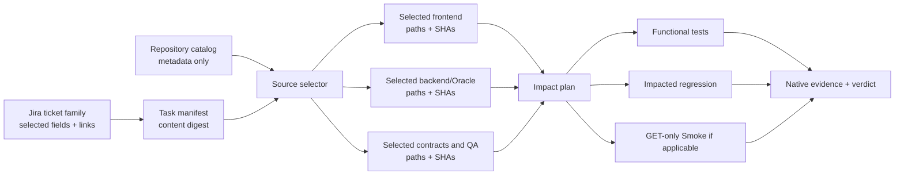

# FHF QA Control Plane

The control plane is the AI-independent operating layer across FHF product, contract, frontend,
backend, and automation repositories. It centralizes read-only Atlassian context, task-scoped source
selection, repository-derived evidence, proposed application-spec changes, QA impact routing, and a
portable command-center report. The product topology is routing metadata only. Write/run authority
comes separately from the active task manifest and is currently limited to selected frontend and
backend automation paths; application source remains read-only.

Architecture decision: [`../adr/0005-centralized-qa-control-plane.md`](../adr/0005-centralized-qa-control-plane.md)

Canonical configuration: `config/qa-control-plane.json`
Runner: `scripts/harness/qa-command-center.mjs`
Consumer evidence: `paths.consumerRoot` + `paths.evidenceDir` from `config/qa-control-plane.json`

## Operating contract

1. Select only the capabilities required by the task, then run `node .harness/capability-doctor.mjs --capability <id> --subject <task-safe-label>`. Jira, Figma, Cypress, environment, backend, and TestRail readiness follows the same bounded probe/retry/escalation loop. OAuth issue Browse/Read access or a safe sanitized-export fallback is required before ticket grounding; do not request or store credentials.
2. Read Jira, Confluence, and Teamwork Graph through the client's Atlassian MCP connection.
3. Fetch every page of the configured sprint JQL. A partial page is rejected by the runner.
4. Keep the raw MCP result outside version control; never include credentials.
5. Save optional Teamwork Graph and Confluence enrichment using the generated snapshot contract.
6. After explicit consent to export sanitized evidence into the FHF workspace, run
   `qa-command-center.mjs refresh --input <page1.json,page2.json> --graph <graph.json>
   --confluence <pages.json> --consent <single-use-reference>`.
7. Review `spec-delta-proposals.md`; module assignments marked `review` are not facts. For a
   ticket selected from that queue, call Teamwork Graph context and inspect its parent/linked
   work items or pages before proposing a module or spec target.
8. Ask for explicit approval before editing an application-intelligence spec, Jira, or Confluence.
9. Route approved implementation to the correct repository and its native architecture.
10. Record lifecycle evidence with the `workflow` command.
11. Regenerate coverage and rebuild the command center after implementation or execution.

## Task-scoped SDLC

The selected Jira family becomes one runtime task manifest; repositories do not get separate control
planes or duplicate task artifacts.



The initial context contains task intent, selected ticket metadata, and repository catalog records.
It does not contain repository trees, source files, full Jira history, attachment bodies, all product
specifications, or the Obsidian vault. Source expands one graph hop at a time only for a matched
call/import, API or Oracle contract, linked development item, declared topology edge, or QA impact.
Every expansion reason is frozen in the task manifest.

Approval binds to the selected ticket projection, acceptance criteria, repository SHAs/paths, graph
slice, change DAG, impact scope, runners, and proof modes. A change to any bound field invalidates the
approval digest. Cypress, Smoke, API, Oracle, and third-party flows require native execution evidence;
they cannot claim RED/GREEN from a synthetic Git replay.

For backend authoring or execution, set FHF_ACTIVE_TASK to the absolute validated manifest path.
File hooks allow only fhf-backend-automation paths selected by both grounding.repositories and
plan.changeUnits. Shell hooks allow only the exact backend-api-oracle pytest path selected in
plan.tests, and only when that test records Dev or QA. Application source, credentials, dependency
changes, Git publication, external uploads, and production backend execution remain protected.

The FHF root also vendors a tool-independent backend runner. Use
`node .harness/backend-task-runner.mjs preflight --manifest <absolute-task.json> --test-id <id>`
and replace `preflight` with `run` only after the plan is correct. It independently validates the
manifest, approval digest, repository SHA, exact selected and planned test path, Dev/QA environment,
credential-file presence without reading credentials, and dirty-path scope. It runs pytest
sequentially by default and emits `fhf-harness/test-evidence/v1` bound to the test ID, exact path,
runner, revision, environment, JUnit SHA-256, non-zero collection count, zero failures/errors, and
completion time. It does not update the manifest or upload TestRail/Allure/email results.

Sequential execution is intentional for the current backend automation suite. `xdist --dist=loadfile`
keeps tests from one file on one worker but does not prove cross-file ordering or state isolation.
Parallel execution remains opt-in until the selected files use independent data, verified cleanup,
no cross-file state, and an explicit run plan. Python application repositories keep their own native
pytest configuration; the central runner selects an exact repository or nested package rather than
imposing the backend-automation pytest conventions on every Python repository.

## Commands

```text
node scripts/harness/qa-command-center.mjs self-test
node scripts/harness/jira-access-doctor.mjs --ticket SERV-12345
node scripts/harness/jira-access-doctor.mjs --ticket SERV-12345 --outcome readable
node scripts/harness/capability-doctor.mjs --capability jira-ticket-read --subject SERV-12345
node scripts/harness/capability-doctor.mjs --capability figma-design-read --subject <approved-figma-reference>
node scripts/harness/capability-doctor.mjs --capability testrail-read-report --subject <case-or-report-reference>
node scripts/harness/qa-command-center.mjs contract
node scripts/harness/qa-command-center.mjs snapshot --input <jira-page.json> --consent <reference>
node scripts/harness/qa-command-center.mjs workflow --ticket SERV-12345 --stage configured --status completed --evidence <path-or-url> --consent <reference>
node scripts/harness/qa-command-center.mjs build --consent <reference>
node scripts/harness/qa-command-center.mjs refresh --input <page1.json,page2.json> --graph <graph.json> --confluence <pages.json> --consent <reference>
node scripts/harness/generate-coverage.mjs --consent <reference>
node scripts/harness/eval-harness.mjs [--trace <loop-trace.jsonl>]
node scripts/harness/calibrate-gate.mjs collect --trace <loop-trace.jsonl>
node scripts/harness/calibrate-gate.mjs status
node scripts/harness/task-protocol.mjs contract
node scripts/harness/task-protocol.mjs validate --manifest <task.json>
node scripts/harness/task-protocol.mjs digest --manifest <task.json>
node scripts/harness/task-protocol.mjs next --manifest <task.json>
node scripts/harness/backend-task-runner.mjs preflight --manifest <absolute-task.json> --test-id <id>
node scripts/harness/backend-task-runner.mjs run --manifest <absolute-task.json> --test-id <id>
```

`snapshot` validates and normalizes sprint data. `build` combines the current snapshot with
coverage, execution, and chain-risk evidence. `refresh` performs both. Multiple comma-separated
input files represent paginated Jira results; the final page must carry `isLast: true`.
`contract` prints the portable MCP interchange shape without writing a file.
Snapshot/build/refresh/workflow and coverage generation require an
explicit evidence-export consent reference and refuse to run unless all runtime outputs are ignored
by the consumer repository. The snapshot stores an allowlisted issue projection; descriptions,
assignees, raw Graph objects, Confluence bodies, account IDs, and cloud IDs are not persisted.
`workflow` updates one ticket stage. Approval-gated stages reject completion without
`--approval <reference> --target <exact-target> --payload-hash <sha256>` and reject reused approval
references.

Lock files record their owner PID and fail closed. If a process terminates while holding a lock,
verify that PID is no longer running before explicitly removing the reported stale lock file.

## Complete configuration

`config/qa-control-plane.json` owns:

- Atlassian project, JQL, field IDs, allowed Confluence spaces, and connector policy.
- Jira semantic-field discovery, ticket-family expansion, attachment/comment trust boundaries, and
  contributor evidence order.
- A 17-repository product topology with roles, entry paths, source bundles, declared edges, and
  progressive-loading limits.
- Task manifests, approval digests, dependency DAGs, deterministic next steps, and proof modes.
- Cross-repository runner templates for frontend unit, Java, Python, backend API/Oracle, Cypress E2E,
  production Smoke, and product-contract validation.
- E2E and Smoke package roots and target branches.
- Approval policy and the ordered nine-stage ticket lifecycle.
- Freshness limits and measurable gates for traceability, unmapped work, review backlog,
  execution age, and Cypress UI Coverage.
- Module aliases, Jira Module prefixes, application-spec targets, and prioritization weights.
- Context, memory, harness, and bounded-loop engineering under `engineering`.
- Documentation ownership and source precedence.

The config contains no credentials, OAuth tokens, account IDs, or Atlassian cloud IDs.

Product coverage for the black-box backend lane is acceptance-criterion, endpoint/error-contract,
and Oracle-state coverage, not Python line coverage of the automation helpers. `pytest-cov` belongs
only in an owning Python service when its native tests measure that service implementation. The
central workspace records those native results through `python-service-test`; it never translates a
pytest-cov percentage from fhf-backend-automation into product coverage.

The existing fhf-backend-automation CI still requires repository-level alignment: keep tracked
`pytest.ini` in version control instead of overwriting it from Secrets Manager, separate pytest from
TestRail/email publication, and use the central manifest runner or an equivalent CI gate for exact
selection and evidence. Those changes belong to a clean backend branch because the current checkout
contains active feature work; the centralized harness does not rewrite them during projection.

Documentation changes start with `documentation.owners`. Update or delete; do not create a second
report for the same concern. `scripts/harness/check-docs-links.mjs` validates owners and links.
The `engineering.memory` policy permits Obsidian indexing for retrieval, but never fact write-back
or precedence over repository evidence.

`engineering.harness.adapters` maps this tool-neutral policy to verified runtime capabilities.
Claude Code and Cursor receive generated lifecycle enforcement. Codex, Copilot, and Gemini receive
instruction adapters only where no verified equivalent hook contract exists; the harness records
that capability gap instead of generating unsupported configuration.

## Ticket lifecycle

Every current-sprint ticket is represented in `qa-workflow-state.json` across:

`intake → specProposal → approved → configured → implemented → gated → executed → pr →
externallyUpdated`

Jira status provides an initial derived position. Local workflow evidence can refine each stage
with `pending`, `in_progress`, `completed`, `blocked`, or `skipped`. Completing a stage requires
the prior stage to be completed or skipped. `approved` and `externallyUpdated` require a recorded,
single-use approval reference bound to the ticket, stage, exact target, and payload hash. Jira status
is contextual only; it never substitutes for repository evidence or approval.

## Source precedence

Live application source, backend source, actual API responses, and DB evidence outrank Jira or
Confluence prose. Jira and Confluence explain intent and history; they do not silently rewrite
current-state specifications. Teamwork Graph relationships improve classification, but an
ambiguous relationship remains in the review queue.

## Routing

- Product question: approved module contract plus current frontend implementation; expand to API or
  Oracle only when an exact call, endpoint, or object requires it.
- Frontend change: product contract, `fhf-dashboards`, and E2E; add API and Smoke only from impact.
- Backend/API change: `fhf-rest-internal`, `fhf-rest-service`, and backend automation; add external,
  Oracle, or frontend consumers only from exact evidence.
- Full-stack ticket family: contract, UI, API entry, and E2E as seeds; expand to service, backend
  automation, and Smoke only when the dependency or impact plan requires them.
- Oracle/ORDS: service, Git-object inspection of `fhf_documents`, and backend automation.
- Agent workflows: `fhf-serv-agents` or `fhf-llm-poc`; `fhf-serv-template` is reference-only.
- Production Smoke remains branch `staging`, GET-only, and side-effect-free.

The Cypress lanes retain Config → Commands → Tests and the generator → gate → ship sequence. The
backend automation repository remains separately owned; the centralized harness neither installs
LANE nor overwrites the backend repository's local configuration. The cross-layer generator loads
those local rules on demand and may author selected pytest/API/Oracle paths under the active task.
When available, reports label this lane `backendEvidence` for regression impact, coverage, and
UI-to-API-to-DB chain evidence; its absence is evidence unavailable, not a harness failure.

### Cypress Cloud evidence

Cloud evidence follows `connectors.cypressCloud.queryOrder`: MCP for conversational lookup, the
official `cy-cloud` CLI for terminal and Test Replay depth, then local JUnit when Cloud is
unavailable. Cloud CLI setup requires the organization integration, the configured minimum Node
version, the global `@cypress/cloud` package, and local OAuth; CI tokens stay in the external secret
environment. Agents read `projectId` from the selected lane's `cypress.config.js`.

The E2E lane may use full read diagnostics. Production smoke and root sessions are metadata-only
unless the owner explicitly opts in: no replay download/cache and no failure screenshot download.

## Approval boundary

Read-only discovery is autonomous. Exporting generated evidence into the sibling FHF workspace
requires explicit, single-use consent. Every Jira comment, ticket, transition, Confluence update,
and application-intelligence spec edit requires explicit, single-use approval of the exact target
and payload immediately before the write.

## Generated artifacts

- `current-sprint.json` — normalized, complete sprint snapshot with provenance.
- `contract` stdout — portable Jira/Graph/Confluence interchange example.
- `spec-delta-proposals.md` — ticket-to-module/lane/spec candidates; proposal only.
- `qa-workflow-state.json` — per-ticket lifecycle status, evidence, and approval references.
- `coverage-computed.json` — repository-derived structural coverage.
- `qa-command-center.json`, `.md`, and `.html` — shared data, AI-readable report, and portable
  human dashboard.

Atlassian-derived snapshots, enrichments, proposals, workflow state, and command-center outputs are
runtime-only and must remain ignored in `FHF/.gitignore`. Only sanitized reports should be published,
and only after a separate approved publication step.

Unavailable sources are shown as `unknown`, never converted to zero. Every available source
includes a timestamp so stale evidence is visible.

Runtime loop traces are likewise evidence, not policy. `eval-harness.mjs` derives repair convergence
from redacted `cypress/handoff/loop-trace.jsonl` events grouped by `runId`; it does not read a static
repair-outcome fixture. Gate calibration imports machine verdicts only after a recorded gate run and
requires explicit human pass/fail labels, scores, reviewer identity, and rationale before reporting
Cohen's kappa or Spearman correlation.
