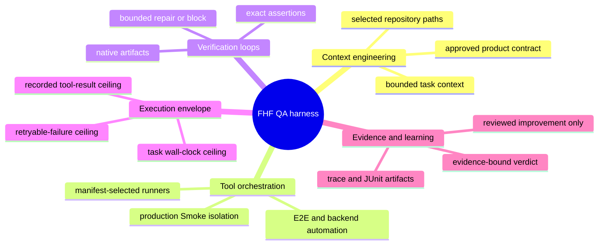
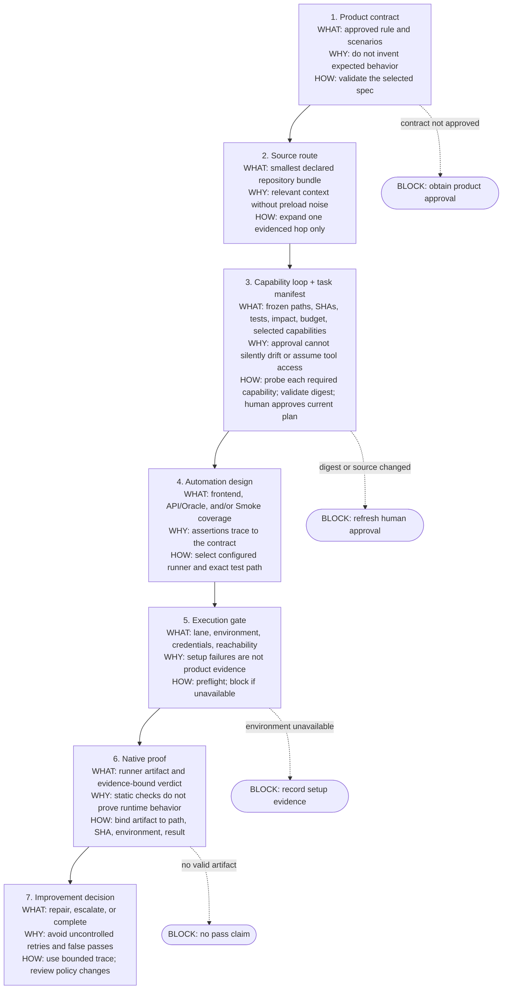
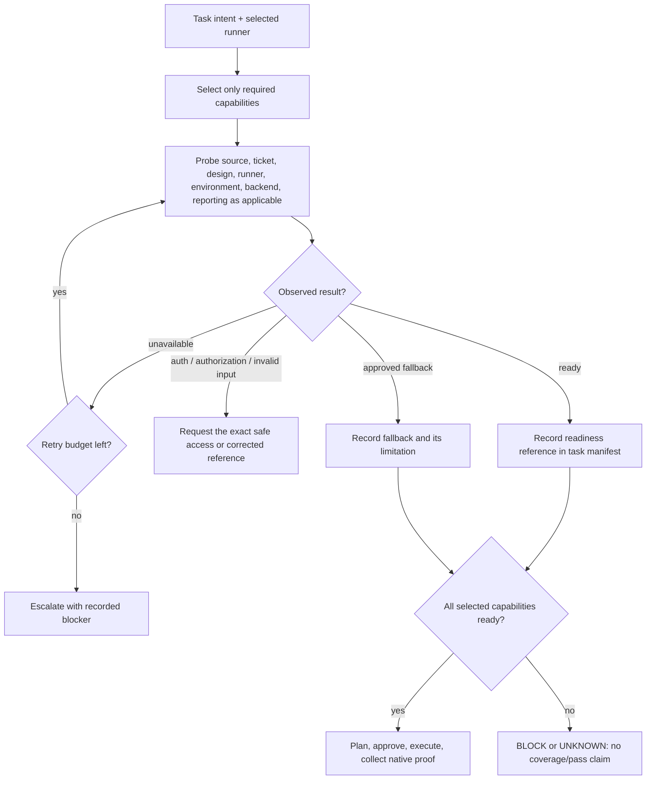
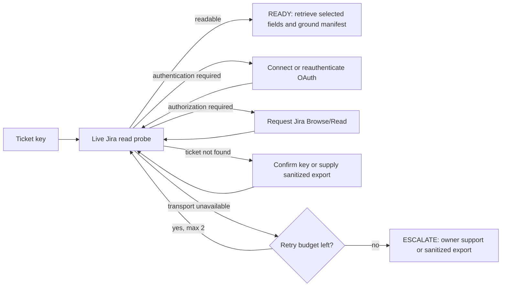
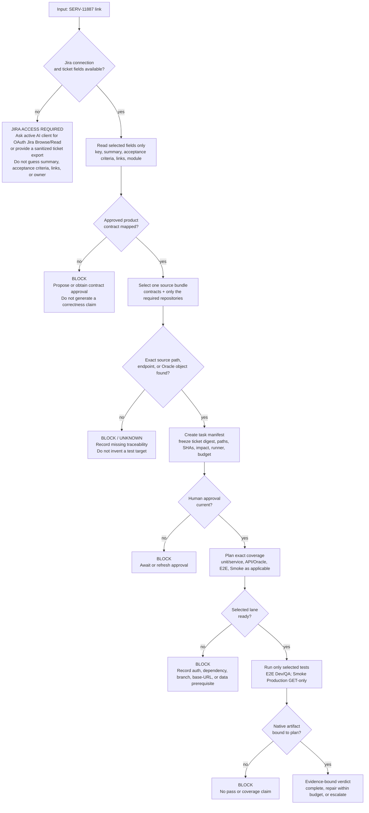
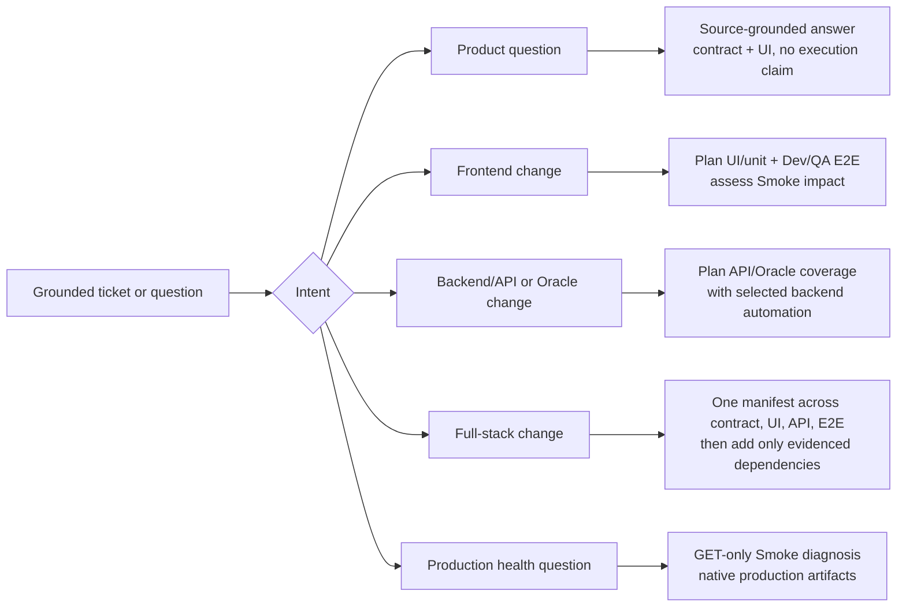
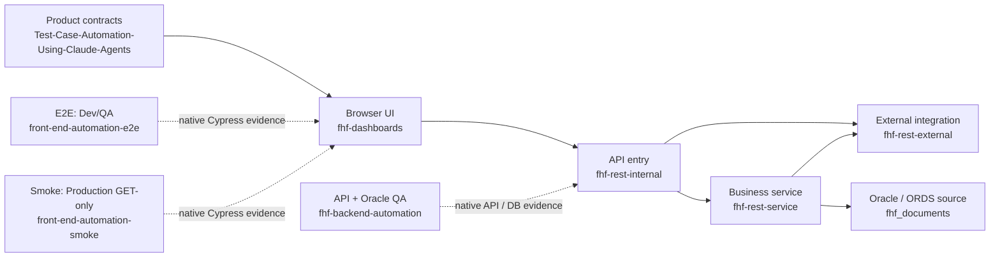
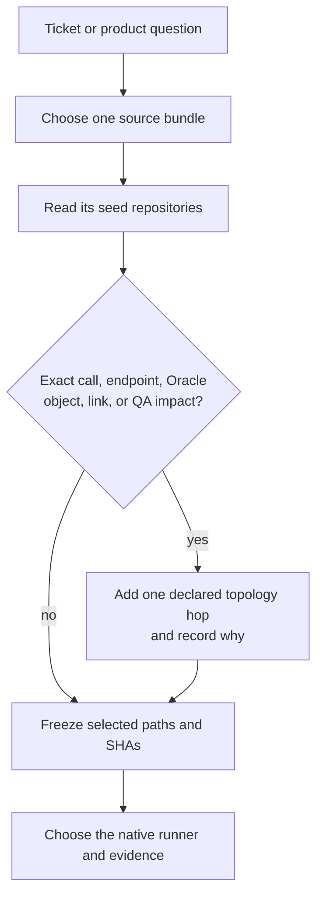
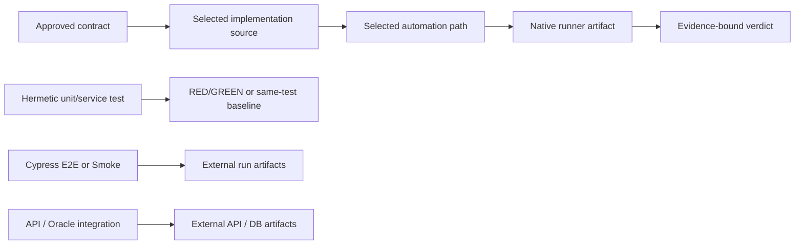

# FHF Repository Routing

Use this page to select the smallest source set for a QA task. It is a view of
`config/qa-control-plane.json` (`productTopology`, `sourceBundles`, and runners), not a second
catalog and not a permission grant.

## Configuration map

The map uses a small, verifiable task map and real execution feedback instead of a large static
instruction set or an unbounded agent loop. FHF applies that approach through existing contracts,
manifests, native artifacts, and fail-closed guards.

## Configure in this order

| Configuration step | Canonical location |
|---|---|
| Product contract and scenarios | `Test-Case-Automation-Using-Claude-Agents/specs` |
| Repository graph and source bundles | `productTopology` in `config/qa-control-plane.json` |
| Task freeze, approval, and budget | `engineering.taskProtocol` + `.harness/task-protocol.mjs` |
| Runner choice and proof mode | `engineering.executionRunners` |
| Guardrails and bounded repair | `engineering.harness` + `engineering.loops` |
| Consumer projection and drift verification | `loader-templates.mjs`, `sync-loader-shims.mjs`, `check-loader-drift.mjs` |

## Capability loop

Each task selects only the capabilities it needs. Every selected capability is an explicit
`plan.capabilities` record with its subject and observed readiness evidence. A configured connector is
only a declaration—not proof that Jira, Figma, Cypress Cloud, or TestRail can be used.

| Capability | Selected when | Ready proof | If not ready |
|---|---|---|---|
| `source-grounding` | Every coverage claim | Approved contract and exact source at frozen revision | Block; do not infer behavior |
| `jira-ticket-read` | Ticket-grounded work | Active client reads selected ticket | OAuth/permission request or sanitized export |
| `figma-design-read` | Visual/design acceptance | Selected Figma reference or approved versioned export | Block visual assertion as UNKNOWN |
| `cypress-cli` | E2E or Smoke execution | Profile, runtime, and base-URL preflight | Repair local setup; no browser-pass claim |
| `cypress-cloud-diagnostics` | Cloud replay/triage | Read-only run metadata | Use JUnit/Mochawesome only when Cloud is not task-required |
| `execution-environment` | Any executable runner | Runner-specific preflight | Request permitted access or record setup block |
| `backend-api-oracle` | API/Oracle proof | Manifest-bound Dev/QA backend preflight | Mark backend evidence UNKNOWN |
| `testrail-read-report` | Case lookup or requested reporting | Selected TestRail target read | Use native artifacts only if TestRail is not task-required; uploads need approval |

## Ticket walkthrough: `SERV-11887`

This is a dry-run example only. The ticket body has not been read, no manifest is created, and no
source, automation, Jira, or environment is changed.

The access doctor records only the outcome category, attempt count, and timestamp in ignored local
runtime state. It never stores a ticket body, credentials, cookies, token, or OAuth code. A configured
connector is still `BLOCKED` until a live read is recorded; the loop determines the next required input.

### What happens at each yes path

| Decision | If yes | If no |
|---|---|---|
| Jira ticket readable | Freeze only relevant ticket facts and links | Run `node .harness/capability-doctor.mjs --capability jira-ticket-read --subject SERV-11887`; connect OAuth Jira Browse/Read in the active AI client or provide a sanitized export. Never provide a credential to the harness. |
| Approved contract mapped | Use its rules as the expected behavior | Stop before test design; contract approval is missing |
| Source trace found | Select exact implementation and automation paths | Record a traceability gap; do not create a speculative test |
| Current human approval | Permit planned automation work only | Manifest is blocked or requires refreshed approval |
| Lane preflight passes | Run the exact selected test command | Record environment/setup evidence, not a product failure |
| Native artifact validates | Attach it to the manifest and issue verdict | No pass, coverage, or release-confidence claim |

In the recipe analogy: the ticket is the order, the approved product contract is the recipe, source
paths are the ingredients, the manifest is the measured prep list, runners are the kitchens, and a
native artifact is the finished dish inspection. If any required ingredient is missing, FHF stops and
labels the result `BLOCKED` or `UNKNOWN`; it does not substitute a guess.

### What this configuration can do

The configuration routes and guards the work. It does not create product requirements, fabricate
source mappings, supply credentials, make a lane reachable, approve the plan, or turn a setup
failure into application-quality evidence.

Cypress owns the browser behavior of `fhf-dashboards`: the screen, its route, and the UI call that screen makes. Pytest owns the REST, service, Oracle, and Python workflow gap that the Cypress spec for the sprint task does not already assert. `qualityAssurance.coverageBoundary` is that split. The sprint task picks the path. A missing manifest asks for the SERV ticket, module, and the remainder. A backend write or pytest waits until the task records the selected non-production path.

## Selection rule

Never preload the catalog, expand solely because a repository looks related, or treat the catalog
as authority for product behavior. Product contracts, source, and native artifacts remain the
authority for intent, implementation, and execution respectively.

## Source bundles

| Task type | Start with | Expand only for |
|---|---|---|
| Product question | Contracts, dashboard UI | matched route, endpoint, Oracle object |
| Frontend change | Contracts, UI, E2E | API call, regression, Smoke impact |
| Backend/API change | Internal API, service, backend QA | third-party call, Oracle contract, UI consumer |
| Full-stack change | Contracts, UI, internal API, E2E | service call, backend coverage, Smoke impact |
| Oracle change | Service, Oracle source, backend QA | API entry or UI consumer |
| Letters workflow | Letters, Python utilities, backend QA | API entry or Oracle contract |
| Repossession workflow | Repossession, Python utilities, backend QA | integration, Oracle contract, UI consumer |
| Agent workflow | Service agents, LLM proof of concept | ORDS contract; template only for structure |

## Catalog

| Repository | Route when the task concerns | First source paths | Evidence / boundary |
|---|---|---|---|
| `Test-Case-Automation-Using-Claude-Agents` | approved product behavior and scenarios | `specs`, `governance`, `scripts/validate-specs.js` | approved spec + validation |
| `fhf-dashboards` | browser UI, routes, UI API calls | `src`, `src/constants/routes.js` | live source; application source read-only |
| `fhf-rest-internal` | authenticated API entry or request routing | `src/main`, `src/test`, `pom.xml` | Java source and tests |
| `fhf-rest-service` | business API, persistence, callbacks | `src/main`, `src/test`, `pom.xml` | Java source and tests |
| `fhf-rest-external` | third-party gateway or external contracts | `src/main`, `src/test`, `pom.xml` | Java source and tests |
| `fhf_documents` | Oracle schemas, ORDS, SQL contracts | `git:HEAD:oracle_firsthelp`, `git:HEAD:tsp` | Git-object inspection on Windows; never execute DDL/DML |
| `fhf-letters` | letter generation or delivery | `main.py`, `generation`, `delivery`, `tests` | Python source and tests |
| `fhf-reposession` | repossession, remarketing, SCRA | `main.py`, `autoims`, `rdn`, `recon`, `scra`, `tests` | Python source and tests |
| `fhf-python-utils` | shared Python domain/data utilities | `commons`, `dao`, `db`, `handler`, `tests` | Python source and tests |
| `fhf-summer-2016` | legacy behavior | `READFIRST.md`, `Django`, `Java`, `Jersey`, `Python` | select an exact subdirectory first |
| `fhf-llm-poc` | legacy AI/document workflow | `agents`, `feature`, `llm`, `processors`, `services`, `tests` | source and tests |
| `fhf-serv-agents` | agent orchestration, features, ORDS adapter | `orchestrator`, `agents`, `features`, `ords`, `tests` | Python source and tests |
| `fhf-serv-template` | agent-service structure only | `TEMPLATE_NEW_FEATURE.md`, `AGENTS_STRUCTURE.md`, `tests` | reference only; not a default runtime dependency |
| `oracle-instantclient-dependencies` | Oracle client build dependency | RPM inventory | infrastructure-only; no application behavior route |
| `fhf-backend-automation` | API, Oracle, backend regression verification | `api`, `db`, `tests`, `pytest.ini` | task-scoped only; native pytest/JUnit/Allure/API/DB evidence |
| `front-end-automation-e2e` | Dev/QA functional, regression, cross-layer UI proof | `CypressFHF/fhf-dashboards/cypress/tests/fhf-dashboard/e2e` | synthetic data, cleanup, native Cypress artifacts |
| `front-end-automation-smoke` | production availability, auth, structure | `CypressFHF/fhf-dashboards/cypress/tests/fhf-dashboard/smoke` | GET-only; native Cypress artifacts; no mutations |

`claude-obsidian` may exist in a local FHF checkout, but it is derived-only retrieval support. It is
outside the product topology, task manifests, runner selection, and execution evidence chain.

## Proof selection

E2E runs only in Dev/QA and may mutate synthetic owned data with cleanup. Smoke runs against
Production and is GET-only. Backend automation requires a current, approved `FHF_ACTIVE_TASK`
manifest and selected paths; it is not enabled by catalog membership alone.

## Design basis

- [OpenAI: Harness engineering](https://openai.com/index/harness-engineering/) — structured
  repository knowledge, agent legibility, and executable feedback loops.
- [Martin Fowler: Harness engineering for coding agent users](https://martinfowler.com/articles/harness-engineering.html)
  — feedforward, feedback, and behavior-oriented harnesses.

These sources inform the harness shape. FHF product contracts, repository source, and native run
artifacts remain the authority for FHF-specific behavior and quality claims.
