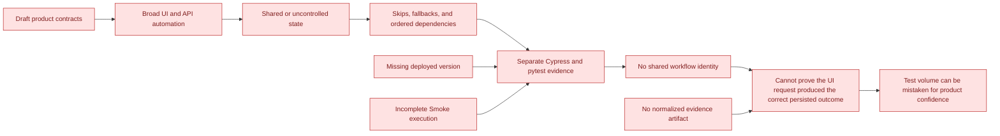
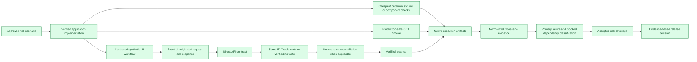

# FHF Product-Quality Improvement Plan

**Owner:** QA and product engineering  
**Status:** Proposed for QA and engineering leadership adoption; estimates require owner approval  
**Audit date:** 2026-08-04

## Review and adoption brief

### Decision requested

Adopt the following as the FHF product-testing strategy:

> Protect approved product risks at the earliest effective layer, and accept a workflow as covered
> only when product intent, application implementation, automation, exact assertions, and
> reproducible execution evidence form one traceable chain.

This document owns sequencing, adoption, and improvement planning. It does not redefine product
behavior or test acceptance. Product intent remains in `Test-Case-Automation-Using-Claude-Agents/
specs/`; acceptance and evidence rules remain in `docs/framework/testing-standards/TESTS.md`; actual
accepted workflow status remains in `docs/planning/coverage/fullstack-chain-risk-matrix.md`.

### Validated baseline

The following facts were rechecked against the current worktree on 2026-08-04:

- 41 active module contracts and all 10 component contracts declare `status: draft`;
- structural inventory remains 47 E2E specs/465 declared tests, 40 Smoke specs/665 declared tests,
  and 33 backend files/432 declared tests;
- static false-confidence signals remain 198 E2E fallback/data-unavailable markers in 17 specs,
  one disabled Smoke suite, and 75 backend `pytest.skip()` calls in 9 files;
- the accepted-chain ledger remains 0 full chains, 1 backend-only row, 6 partial rows, 6 mutation-
  not-accepted rows, and 1 N/A row;
- no E2E, Smoke, or backend build currently publishes the required `qa-run-evidence.json` contract;
- application source still contains 72 test files, while CI has no risk-based coverage threshold;
- the current E2E Cypress config sets global run retries to 0, while historical run 666 reported 11
  passed-after-retry tests, so retry comparisons require the executed config/SHA;
- the E2E UI Coverage critical floor is 50 while Smoke uses 30, despite the root operational
  threshold being 50; leadership must either approve the lane-specific exception or align it;
- backend CI replaces checked-in `pytest.ini` from Secrets Manager, so the executed pytest policy
  must be captured as run provenance rather than inferred from the repository file.

### Current confidence boundary

| Area | Confidence | Review position |
|---|---|---|
| Production mutation safety policy | High | Smoke is explicitly GET-only and prohibits submit, mutation, export, download, upload, and send |
| Automation architecture and structural inventory | High | Config/Commands/Tests, typed API clients, Oracle helpers, and generated inventory are established |
| Native result availability | High | Cypress Cloud/JUnit/Mochawesome and pytest JUnit/Allure/TestRail evidence exist |
| LM Repo/Auction backend contract | Medium-high | The latest backend report showed 48/48 creation, approval, accounting, and denial tests passing |
| Application unit/service protection | Medium | 72 source test files exist, but deterministic workflow composition and coverage thresholds are limited |
| Production Smoke assurance | Medium-low | Started tests provide useful read evidence; the latest run left 13 specs unstarted and one `noTests` |
| E2E mutation assurance | Low | Uncontrolled preconditions, fallback markers, and incomplete cleanup prevent acceptance |
| Cross-module API/Oracle breadth | Low | Structural backend evidence exists only for Ancillary, Loss Mitigation, and UniFi |
| Release comparison and prevention metrics | Low | Deployed versions, normalized evidence, and reviewed defect joins are incomplete |
| Accepted UI to API to DB protection | None yet | No workflow currently satisfies the complete acceptance contract |

Low confidence means the available evidence cannot support a product-protection or release claim;
it does not mean the existing tests have no diagnostic value.

### Problem to solve

### Precise solution

### Strategy principles for adoption

1. **Risk before volume:** prioritize customer, financial, compliance, authorization, and data-
   integrity harm; do not plan from file or test counts.
2. **Approved intent first:** application source verifies implementation but does not replace an
   approved product contract.
3. **Cheapest reliable layer:** use unit/component tests for deterministic logic, API/database tests
   for contracts and persistence, Cypress for real journeys, and Smoke for safe production reads.
4. **One identity through the chain:** UI and backend suites support full-chain acceptance only when
   they deliberately correlate the same controlled scenario.
5. **No silent pass:** missing required data, disabled suites, fallback logging, stubbed mutations,
   and missing prerequisite IDs cannot count as accepted coverage.
6. **State ownership is mandatory:** persistent mutations need a synthetic identity, known baseline,
   prohibited/no-write assertion, and verified cleanup.
7. **Native evidence remains authoritative:** normalized evidence joins Cloud/JUnit/Mochawesome/
   Allure results; it does not replace them.
8. **Unknown is not zero:** missing version, denominator, environment, or result state remains
   `UNKNOWN` until captured.

### Adoption outcome

Adoption means leadership agrees to use approved-scenario evidence, not raw test volume, as the
portfolio coverage unit; accepts the work sequence and estimation gate below; assigns owners for
product approval, data/cleanup, CI provenance, and service reconciliation; and requires release
claims to follow the configured evidence contract.

## Planning basis

Plan from product risk and missing evidence, not `it()`/test/file counts.

- Accepted workflow evidence: `docs/planning/coverage/fullstack-chain-risk-matrix.md`.
- Structural inventory only: `docs/evidence/coverage-computed.json`.
- Product behavior: `Test-Case-Automation-Using-Claude-Agents/specs/`, resolving component and
  common-data inheritance from its mappings.
- Test acceptance: `docs/framework/testing-standards/TESTS.md`.
- Industry risk input: `US-Auto-Finance-Quality-Blueprint.html` (70 scenarios; applicability must be
  confirmed against FHF source/requirements).

The earlier `429.5 SP`, lane test totals, and calendar completion plan are withdrawn as current
commitments. They were derived from structural depth and proposed reuse, not approved scenario
contracts, measured throughput, or data/environment readiness. Preserve them only in repository
history as a historical proposal.

## Current position

| Dimension | Source-audited position | Planning consequence |
|---|---|---|
| Approved product intent | All 41 active module and 10 component contracts are `draft`; shared-data/mapping files may omit status | Product/engineering must approve P0 scenario contracts before automation is called complete |
| Full UI→API→DB protection | 0 of 14 coarse workflow rows accepted | Do not report full-chain coverage or prevention ROI |
| Strongest reusable evidence | LM Repo/Auction creation, approval, accounting, and denial groups: 48/48 passed in the 2026-08-03 backend email | Close the UI identity/cleanup link instead of rebuilding this backend depth; retain exact data and negative-contract review |
| E2E false-green exposure | 198 skip/data-unavailable/fallback markers in 17 specs under the documented static pattern | Remove silent passes before expanding breadth |
| Backend false-green exposure | Static source has 75 `pytest.skip()` calls in 9 Python files. The latest email reports 26 runtime skips, while many of its 50 failures are dependent-state failures after prior tests did not populate IDs | Replace ordered/missing-state dependencies with deterministic scenario setup; report dependent tests as blocked, not independent defects |
| Production Smoke | Run 161: 18 passed specs, 8 failed, 1 `noTests`, 13 timed out without starting; 499 passed, 10 failed, 10 pending among started tests | Restore/retire Checks and make the execution schedule start every spec; the summary counters are not whole-suite assurance |
| Application test distribution | 72 source test files: 40 utilities, 25 services, 5 components, 2 hooks; workflow composition is mainly protected externally | Add source-level tests only for deterministic money/state/access logic with a clear gap |
| Application CI controls | `yarn test` and `yarn build` run; build config tolerates ESLint and TypeScript compile errors. Coverage is configured only for utilities, is not requested by the CI test script, and has no threshold | Make lint/type failures blocking after the existing debt is measured; add risk-targeted coverage only where it protects approved rules |
| Automation CI controls | E2E and Smoke record Chrome/JUnit/Cloud evidence and run structural UI Coverage gates; Smoke has four pre-run static architecture checks while E2E has neither those scripts nor equivalent pre-run commands | Establish one shared owner for equivalent E2E checks; do not copy drift-prone scripts between repositories |
| Cypress execution policy drift | E2E currently has zero global retries; E2E and Smoke critical UI Coverage floors are 50 and 30 respectively; the E2E buildspec can also select Smoke specs on production-mapped branches although the workspace router assigns Smoke to a separate repository | Decide and document the intended retry, UI Coverage, and lane ownership policy; align one canonical source and verify CI behavior |
| Backend runtime-config visibility | CodeBuild replaces the checked-in `pytest.ini` with a Secrets Manager value before execution | Capture the effective non-secret pytest policy and immutable automation/service identity in run evidence |
| Execution evidence | `docs/evidence/execution-history.md` now records E2E 666, Smoke 161, and the 2026-08-03 backend email. E2E: 60/175/142/3 pass/fail/skip/pending and 11 passed after retry. Backend: 220 pass, 50 fail, 12 broken, 26 skip. | Use these as failed-baseline evidence only. Capture deployed app SHA for Cypress and branch/SHA/build/environment for backend before release comparison |
| Historical `7.5%` automation catch rate | The recap divides 8 Automation-labelled defects by 107 defects classified automatable. The arithmetic is correct, but the workspace has no row-level 130-defect export, frozen Jira query/window/timezone, classification rubric, label semantics, first-detection stage, or test/run links. | Retain it as a historical report-derived figure, not current coverage or verified prevention. Recalculate only from reviewed defect rows under the testing-standard evidence contract. |
| Nonfunctional controls | No blocking accessibility, performance, dependency-security, recovery, or observability test was found in the audited package/Vite/buildspec configuration | Confirm applicable product risks and owners first, then add the smallest measurable gate per approved threshold |
| Security | A tracked hard-coded Basic-auth credential was found in `src/services/network.js` | P0 security owner must rotate/revoke, remove it and inspect history; do not print or reuse the value |

Static markers are discovery signals, not failed-test counts. The latest runtime results are now
known, but defect-prevention, CI-frequency, and release-confidence claims remain unknown because the
runs are not correlated to deployed application/backend versions or one controlled workflow ID.

## Observed run-driven priorities

| Priority | Observed evidence | Required exit evidence |
|---|---|---|
| P0 | E2E automation SHA predates the app's removal of `dashboard-item-count`; 71 failures share that missing hook | Every run records deployed app SHA; one owned selector contract is aligned in app and automation; a focused affected spec passes without retry |
| P0 | E2E has 142 skipped tests and repeated empty/missing card, row, invoice, and Assignment preconditions | Deterministic synthetic state per scenario; prerequisite failure blocks only that scenario; no silent/data-dependent pass |
| P0 | Smoke left 13 specs unstarted; one more spec was `noTests` | Every configured Smoke spec starts within the run budget; unstarted/no-test state fails the orchestration gate with an exact reason |
| P0 | Backend has 12 read-timeout broken tests and three explicit latency-threshold failures against the Dev API | Service owner classifies availability/capacity versus test timeout; rerun records build/SHA/environment and demonstrates the agreed threshold. **Implementation gap (2026-08-08):** smoke `test_*_api_health.py` files pass a literal `5` to `assert_response_time` instead of reading from `RESPONSE_TIME_THRESHOLDS` in `tests/conftest.py`; if the dict is updated the smoke gate does not change. `BaseAPIClient.DEFAULT_TIMEOUT = 30` is a class constant — not env-configurable, so Dev and Prod run the same ceiling. Both need to be wired before the agreed threshold claim is meaningful. |
| P0 | Backend APD export returns 422; ACD packet endpoints return 404; ACD/API-DB values disagree | Confirm request/endpoint/data contracts from product and service source; fix the correct owner; prove exact response and same-record DB/no-write result |
| P0 | Backend and Cypress reports expand upstream failures into failed/skipped descendants | Report one primary failure plus dependent blocked tests; make backend setup independent where a scenario is intended to stand alone |
| P1 | Smoke clipboard, customer case comparison, and Doc Repository response selection are source-confirmed oracle defects | Correct the shared command/oracle and run only the three affected GET-only tests in Chrome |
| P1 | Backend email says `Total Suites: 0` while 24 suite summaries total 308 tests and omits run provenance | Report generator emits correct suite count plus run ID, branch, SHA, build ID, environment, start/end, and all status denominators |

## Work sequence

### P0 — Stop false confidence and unsafe state

| Work item | Exit evidence | Owner/dependency |
|---|---|---|
| Product-contract approval gate | the selected P0 scenario is approved in `Test-Case-Automation-Using-Claude-Agents/specs`; status, actor, preconditions, outcome, prohibited outcome, and unknowns are explicit | Product + engineering owner |
| Credential response | credential revoked/rotated, code reference removed, history and dependent systems reviewed | Security + application owner |
| E2E fallback audit | every one of the 17 affected specs either provisions state and asserts, fails with diagnostics, or is explicitly excluded before execution | QA + data owners |
| Backend skip audit | each of the 9 affected Python files has deterministic setup or an explicit non-coverage classification; required DB phases cannot skip after a missing prior ID | Backend QA |
| Production Smoke disabled spec | Checks spec restored with safe deterministic reads or retired with an approved reason and coverage consequence | Smoke owner + product owner |
| Mutation safety gate | no E2E scenario mutates an arbitrary existing record; each persistent workflow records synthetic identity and cleanup result | QA + environment/data owner |
| Execution evidence feed | focused Chrome and backend runs append run identity, lane, result, failure category, and evidence location to the configured history | QA + CI owner |
| Run provenance | Cypress records deployed app SHA; backend records branch/SHA/build/environment; dependent failures are linked to their primary failure | Application, backend, QA, CI owners |
| E2E static-gate parity | E2E runs duplicate-selector, alias, command-reference, and undefined-reference checks from one shared owner before execution | E2E + harness/CI owner |
| Application CI debt baseline | current lint/type failures are measured without suppression; owners approve a ratchet to zero new violations | Application engineering |

### P0 - Make defect prevention and CI evidence reproducible

The existing native reporters are reusable: Cypress already produces Cloud, JUnit, and Mochawesome
evidence; backend Pytest produces JUnit and Allure. The current canonical
`record-execution-evidence.mjs` is manual and records only date/module/lane/run/pass/fail/flake, so
it cannot support release comparison, dependency classification, full-chain correlation, or an
escaped-defect calculation without extension.

| Step | Minimum change | Exit evidence |
|---:|---|---|
| 1 | Freeze the defect population: Jira projects, issue types, created/resolved window, timezone, production-environment rule, valid-defect rule, and rubric version | Saved query definition and a complete row count; pagination proves the last page was fetched |
| 2 | Add explicit issue fields or an approved equivalent record for detection source, first detection stage, module/workflow, impact, root cause, earliest prevention layer, scenario/test ID, CI run, and classification reviewer | One reviewed defect can be reconstructed without interpreting labels or prose |
| 3 | Put stable scenario IDs and acceptance-criteria IDs in Cypress scenario metadata and backend test metadata; preserve native TestRail/Jira IDs where present | Every selected P0 test result maps to one canonical scenario or is explicitly `UNMAPPED` |
| 4 | Extend the canonical evidence recorder once; each lane adapts its existing JUnit/Cloud/Allure output into the testing-standard `qa-run-evidence.json` contract | E2E, Smoke, and backend builds publish the same run identity/status schema while retaining native artifacts |
| 5 | Capture automation SHA from the checkout and deployed application/service immutable version from the deployment, not from a guessed branch name | A failed or passed result is reproducible against exact code versions |
| 6 | Normalize primary failures and blocked descendants without changing native totals | Raw totals reconcile to native reports; one setup failure is not reported as many product defects |
| 7 | Join the sanitized, read-only defect snapshot to CI evidence in the QA control plane; do not make CI write to Jira | Each reviewed defect links to exact scenario/run evidence or an explicit coverage gap |
| 8 | Baseline two equal periods before setting a catch-rate target | Numerator, denominator, completeness, query, window, timezone, rubric and `asOf` are published for both periods |

CI gates evidence completeness and accepted scenario execution. It does not gate on the lagging
automation-discovery percentage, because that percentage depends on later defect intake and human
root-cause review. Jira field creation, Jira writes, and sanitized evidence export remain explicit
owner/approval actions under the QA control-plane policy.

### P1 — Close the nearest full chain; unblock the second

| Slice | Why first | Required exit evidence |
|---|---|---|
| LM invoice approve/deny | The latest backend report shows all 48 Repo/Auction creation/approval/accounting/denial tests passing; UI actions still use uncontrolled state and the latest Cypress runs failed | seeded UI-owned invoice, exact decimal/status request and result, Oracle/accounting correlation, deny/no-write, cleanup |
| APD dealer bulk export | This is blocked, not closure-ready: both administrator and dealer export tests returned 422 instead of 201 and both DB checks skipped for missing export IDs | approved safe email/export sink, corrected request/validation contract, controlled record, 201 result, same backend/DB correlation ID, RBAC/no-write, cleanup |

Do not call either complete until one identity connects the UI and backend evidence. Independent
passing suites are supporting evidence, not a chain.

#### Pilot chain: `loss-mitigation-repo-invoice-approve-01`

The reference implementation of the cross-lane validation split in
`docs/framework/testing-standards/TESTS.md`. Chosen because both halves already have something to
build on: the backend Repo/Auction suites showed 48/48 passing in the 2026-08-03 report, and the UI
invoice specs exist. What is missing is the join, not the tests.

**Business risk.** An approved repossession invoice moves money to a vendor and posts to accounting.
A wrong amount, a wrong approval authority, or a denial that still posts is direct financial loss
plus an audit finding. This is the highest-value chain in the portfolio and the cheapest to close.

**Prerequisite, not negotiable.** `loss-mitigation/invoices.yaml` is currently a draft placeholder
with empty `business_rules`, `fields` and `flows`. Automation cannot establish the intended outcome
until product approves: who may approve at what amount, the exact decimal and rounding rule, the
accounting-date rule, the allowed status transitions, and what a denial must *not* write. Until then
this slice is blocked at the product gate, not at the automation gate.

**Data.** Each lane creates and destroys its own synthetic invoice. Nothing is shared but the
contract. Cypress seeds invoice A through the application's own creation path; pytest seeds invoice B
through the API. Neither reads the other's record.

| # | Assertion | Lane | Detail |
|---:|---|---|---|
| 1 | Approved intent exists and is `approved` | both | read `loss-mitigation/invoices.yaml`; blocked today |
| 2 | Synthetic invoice A created and identifiable | Cypress | uniquely tagged; recorded for cleanup |
| 3 | Approver role can reach the approve control; a non-approver cannot | Cypress | rendered authorization only |
| 4 | Amount over the approval limit disables/blocks submission | Cypress | client-side guard |
| 5 | **Approve emits exactly one request: method, endpoint, payload fields, amount, decision** | Cypress | **the seam** — registered before the click, waited on, asserted |
| 6 | Response status and the error branch as received | Cypress | also asserted independently in pytest |
| 7 | UI shows the approved state and the new status | Cypress | user-visible outcome |
| 8 | Invoice A returned to baseline or removed | Cypress | fixture reset is not cleanup |
| 9 | Synthetic invoice B created via API | pytest | own identity |
| 10 | Same contract as (5) replayed against invoice B | pytest | reads the seam artifact |
| 11 | **Oracle row for B shows the exact approved amount at decimal precision** | pytest | authoritative money oracle |
| 12 | Status and accounting date match the approved rule | pytest | not row existence — field values |
| 13 | Accounting/ledger reconciliation for B | pytest | control total or downstream row |
| 14 | **Denial leaves no accounting write** | pytest | the prohibited outcome |
| 15 | Unauthorized approve is rejected service-side | pytest | not merely hidden in the UI |
| 16 | Duplicate approve is idempotent | pytest | no double post |
| 17 | Invoice B cleaned up | pytest | verified, not assumed |
| 18 | Both halves agree on endpoint, method, payload schema, status, amount | gate | the chain verdict |

**Division of labour.** Cypress owns 2–8, pytest owns 9–17, both read 1, and 18 is the gate. Note
that money correctness sits entirely in pytest: Cypress asserts the displayed value equals the
returned value, and whether that value is *right* is proved in Oracle. This is the split that lets
the two engineers work in parallel without waiting on each other.

**Definition of done.** Row 18 passes for one `chainId`, both halves recorded in
`cypress/handoff/chain-contract/loss-mitigation-repo-invoice-approve-01.json`, both cleanups verified,
and the chain ledger's "Accepted full chain" count moves from 0 to 1 — which then arms ratchet R1
with something real to protect.

**Explicitly out of scope for the pilot.** Auction invoice (same shape, do it second as a
repeatability test of the pattern), the `loss-mitigation → checks` money seam, and any change to the
198 fallback markers. The pilot proves the mechanism on one workflow; it is not a coverage push.

### P1 — Make Promise-to-Pay safe before expanding it

Promise-to-Pay is high financial/customer risk but not ready for closure. First establish:

1. approved cash/card/ACH create, edit, cancel, retry, and duplicate rules;
2. synthetic account and safe Payix/vendor mode;
3. exact amount/date/time-zone/fee/status oracles;
4. UI-originated request/result assertions;
5. Oracle/ledger and downstream reconciliation;
6. failure/no-write/idempotency branches;
7. cleanup.

Only then estimate implementation slices. The current row/modal assertions are insufficient input
for an effort commitment.

### P2 — Risk-ranked workflow closure

| Order | Workflow | Gate before implementation |
|---:|---|---|
| 1 | Insurance state movement and Impound notification | deterministic records for both notification guards and reversible move-back |
| 2 | Checks ingestion/match/decision/posting | controlled non-production OCR/SFTP input and posting reconciliation owner |
| 3 | Titles Release/Re-Registration | approved eligibility/current-version contract and state seed |
| 4 | Custodian import/status/location | confirm whether cross-dashboard location sync is real; independent fixtures, not cross-spec order |
| 5 | Document Repository merge/archive | terminal job/file integrity oracle and cleanup |
| 6 | Remaining LM cascade segments | split and approve independent Assignment/Repo/Skip/Remarketing/Recon transitions |
| 7 | Complaints lifecycle | approved create/status/type/link contract and synthetic cleanup |

Read-only/filter/sort coverage can continue where it protects a changed surface, but it does not
promote a mutation row.

## Product-quality matrix design

For each approved scenario, plan the smallest evidence set that closes the risk:

| Layer | Question | Evidence |
|---|---|---|
| Product | What rule, actor, financial/customer/control harm, and prohibited outcome matter? | approved scenario contract |
| Application | Which component/service/access gate/state owner implements it? | exact source paths and request/state mapping |
| Unit/component | Is deterministic calculation, mapping, validation, or guard logic cheaper to prove at source? | exact boundary assertions |
| Smoke | Can a read-only production check detect deployment/read regressions safely? | GET + response-to-DOM relationship; no customer payload retention |
| E2E | Does the real actor action produce the intended request and user outcome? | controlled UI lifecycle and cleanup |
| API/database | Is the contract persisted exactly and is the prohibited branch no-write? | correlated response/database assertions |
| Integration/reconciliation | Do money, vendor, queue, file, email, reporting, and downstream states agree? | correlation ID and control totals/outcome |
| Nonfunctional | Can security, privacy, accessibility, performance, or recovery failure cause this harm? | targeted control evidence with an owner/threshold |

The blueprint's 70 scenarios enter this matrix only after FHF applicability and implementation are
confirmed. Unimplemented or out-of-scope controls remain labelled, not silently converted into test
backlog.

## Estimation gate

Estimate a slice only when all are known:

- approved scenario and evidence level;
- application/API/database owners and exact interfaces;
- environment and synthetic-data mechanism;
- external-service safe mode;
- cleanup/reconciliation mechanism;
- access roles and selectors;
- smallest runnable acceptance check.

Use measured completed slices to forecast later work. Until at least three comparable slices are
completed, report scope/readiness and blockers—not portfolio dates or story-point precision.

## Quality reporting

Report separately:

- structural inventory;
- accepted scenario evidence by level;
- false-green/disabled/skip debt;
- latest execution result and age;
- escaped defects by first detection stage and preventable stage;
- cleanup/data incidents;
- time from approved contract to accepted evidence.

Historical defect counts in `FHF-QA-Measurable-Impact-Call-Brief.md` remain proposed discussion
evidence. They do not prove automation prevention, ROI, or current coverage without linking each
defect to an approved scenario, first detection stage, and earliest automatable prevention stage.

## Regression-effort evidence workflow

The canonical local workflow is `docs/evidence/regression-effort/README.md`; it operationalizes the
historical baseline in `deliverables/02-regression-effort-and-roi.md` without creating a second
planning source. It is intentionally empty of release claims until the next comparable release
supplies complete observed evidence.

For one frozen, versioned checklist, collect a full manual baseline and a later comparable
automation-assisted release. Freeze scope only after backlog refinement and pre-sprint planning have
resolved additions or changed requirements. QA first classifies every ticket in the sprint as
regression-required, not applicable, deferred, or blocked; regression-required tickets map to
business activities. The release capture records its plan URL, release/task scope, dependency review,
final-build identity, Jira board/sprint snapshot, and the freeze decision. Each checklist activity
must have observed manual person-minutes in the baseline. The later release records each activity as
either residual manual work or an exact automation replacement that names the scenario, test, lane,
passed native run/build, and artifact. It also records human person-minutes for triggering,
monitoring, triaging, and reporting automation.

Run `node scripts/evidence/calculate-regression-effort.mjs <checklist> <baseline> <assisted>` to
produce the local calculation. It fails closed: any missing release-plan provenance, frozen-scope
comparison, checklist item, observation timestamps, residual-manual record, exact passed run/artifact
mapping, or operating activity makes every metric `UNKNOWN`. It never substitutes test counts, UI
coverage, or pipeline elapsed time for labour.
Cost savings and ROI remain `UNKNOWN` until an approved finance loaded-cost method exists.

## Leadership review, feedback, and adoption

### Decisions required

| Decision | Recommended position | Decision owner | Adoption evidence |
|---|---|---|---|
| Coverage unit | Approved scenario with accepted evidence | QA Lead + Product | Written approval of the definition in `TESTS.md` |
| First reference chain | LM Repo/Auction approve/deny | QA Lead + Engineering Manager | Named product, service, data, and automation owners |
| Product-contract gate | Required before accepted workflow automation | Product + Engineering | Selected scenario status changes to `approved` with explicit unknowns resolved or owned |
| Test-data and cleanup ownership | Mandatory for persistent workflows | Engineering Manager | Synthetic lifecycle and cleanup owner recorded for the selected slice |
| Run provenance | Immutable automation and deployed-system versions required | CI/Application/Backend owners | Evidence artifact contains complete version identity |
| Cross-lane evidence contract | Implement once in the canonical harness | QA + CI owner | All three lanes publish reconciling `qa-run-evidence.json` artifacts |
| Smoke completeness | Every configured spec must start or fail orchestration | Smoke + CI owner | No unstarted or `noTests` spec without an approved exclusion |
| Configuration drift | Align or approve explicit lane exceptions | QA Lead + CI owner | Retry, UI Coverage, and repository ownership policies are source-controlled and verified |
| Application CI debt | Ratchet to zero new lint/type violations | Engineering Manager | Baseline and blocking no-regression gate approved |
| Forecasting | Defer portfolio dates until three comparable accepted slices | QA Lead + Engineering Manager | Measured throughput from three completed slices |

### Review questions

**QA Lead**

- Does the accepted-scenario coverage unit reflect how QA will report product protection?
- Are failure, skip, blocked, retry, and cleanup rules strict enough to prevent false greens?
- Is LM Repo/Auction the correct first reference chain based on reusable evidence?

**Engineering Manager**

- Can application, backend, data, and CI owners support the selected slice and its cleanup?
- Can deployments publish immutable application/service versions for release comparison?
- Which current lint/type, selector-contract, service-availability, and orchestration gaps require
  engineering ownership rather than test changes?

**Product and service owners**

- Are the selected actor, preconditions, business outcome, prohibited outcome, and reconciliation
  rules correct?
- Which blueprint risks apply to FHF, which are unimplemented, and which are out of scope?

### Feedback classification

Record feedback as one of:

- **Blocker:** adoption would create product, security, data, or release risk;
- **Required change:** strategy or roadmap correction needed before approval;
- **Accepted condition:** adopt now with a named owner and exit evidence;
- **Future candidate:** useful but not required for the first accepted chain;
- **Editorial:** wording or presentation only.

Do not place product behavior changes only in this review. Approved behavior changes must be applied
to the owning product contract; acceptance changes belong in `TESTS.md`; workflow status changes
belong in the full-chain ledger.

### Review record

| Role | Reviewer | Outcome | Conditions or feedback reference | Date |
|---|---|---|---|---|
| QA Lead | `TBD` | `Pending` | `TBD` | `TBD` |
| Engineering Manager | `TBD` | `Pending` | `TBD` | `TBD` |
| Product owner | `TBD` | `Pending` | `TBD` | `TBD` |
| Application owner | `TBD` | `Pending` | `TBD` | `TBD` |
| Backend/data owner | `TBD` | `Pending` | `TBD` | `TBD` |
| CI/platform owner | `TBD` | `Pending` | `TBD` | `TBD` |

Allowed outcomes are `Adopted`, `Adopted with conditions`, `Revise and re-review`, or `Rejected`.
The QA Lead records the final outcome after required owners have responded.

### Adoption checklist

- [ ] Strategy statement and accepted coverage unit approved
- [ ] First reference workflow approved
- [ ] Product, application, backend/data, automation, and CI owners assigned
- [ ] Product scenario approved with explicit prohibited outcome
- [ ] Synthetic data and verified cleanup mechanism agreed
- [ ] Run provenance and normalized evidence work accepted
- [ ] Smoke completeness and false-green gates accepted
- [ ] Retry, UI Coverage, and lane-ownership drift resolved or explicitly accepted
- [ ] Estimation gate accepted; no unsupported portfolio date or story-point commitment
- [ ] Review outcome and conditions recorded above
